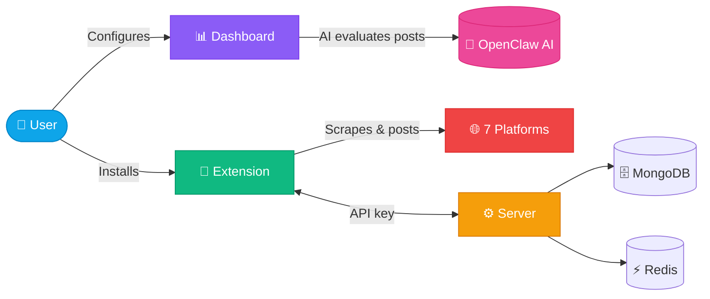
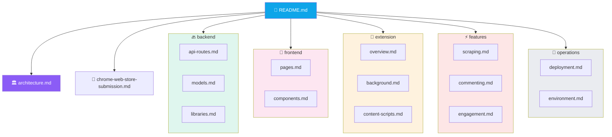
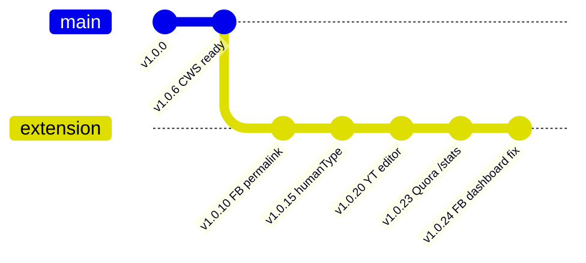

<div align="center">

# 📘 GetMention Documentation

**Complete technical documentation for the GetMention social-engagement SaaS and Chrome extension**


</div>

> [!IMPORTANT]
> **Project:** GetMention by SerpBays · **Working dir:** `/var/www/ai-bot/bot-serp` · **Production:** `http://88.222.214.19:3005` · **Last updated:** 2026-04-14

---

## 🚀 At a Glance



---

## 🧭 Quick Navigation

| I want to… | Read |
|---|---|
| 🏛️ Understand the system end-to-end | [architecture.md](./architecture.md) |
| 🔌 Find an API endpoint | [backend/api-routes.md](./backend/api-routes.md) |
| 🗄️ Change the database schema | [backend/models.md](./backend/models.md) |
| 🛠️ Debug a server utility | [backend/libraries.md](./backend/libraries.md) |
| 🖼️ Edit a dashboard page | [frontend/pages.md](./frontend/pages.md) |
| 🧱 Build or style a component | [frontend/components.md](./frontend/components.md) |
| 🧩 Understand how the extension works | [extension/overview.md](./extension/overview.md) |
| ⚙️ Change the extension service worker | [extension/background.md](./extension/background.md) |
| 🕸️ Fix a platform content script | [extension/content-scripts.md](./extension/content-scripts.md) |
| 🔍 Understand how scraping works | [features/scraping.md](./features/scraping.md) |
| 💬 Understand how commenting works | [features/commenting.md](./features/commenting.md) |
| ❤️ Understand likes / upvotes / reactions | [features/engagement.md](./features/engagement.md) |
| 🏬 Publish to the Chrome Web Store | [chrome-web-store-submission.md](./chrome-web-store-submission.md) |
| 🚢 Deploy to production | [operations/deployment.md](./operations/deployment.md) |
| 🔐 Set up environment variables | [operations/environment.md](./operations/environment.md) |

---

## 🗂️ Documentation Map



---

## 💻 Tech Stack

<table>
<thead>
<tr><th>Layer</th><th>Technology</th><th>Version</th></tr>
</thead>
<tbody>
<tr><td>🏃 Runtime</td><td>Node.js</td><td><code>≥ 20</code></td></tr>
<tr><td>🏗️ Framework</td><td>Next.js (App Router, Turbopack)</td><td><code>16.1.6</code></td></tr>
<tr><td>🔤 Language</td><td>TypeScript</td><td><code>5.9.3</code></td></tr>
<tr><td>⚛️ UI library</td><td>React / React-DOM</td><td><code>19.2.3</code></td></tr>
<tr><td>🎨 Styling</td><td>Tailwind CSS + globals.css</td><td><code>v4</code></td></tr>
<tr><td>🗄️ Database</td><td>MongoDB (via Mongoose)</td><td><code>9.2.1</code></td></tr>
<tr><td>⚡ Cache / rate-limit</td><td>Redis</td><td>server-managed</td></tr>
<tr><td>🔐 Auth</td><td>Clerk</td><td><code>@clerk/nextjs 7.0.4</code></td></tr>
<tr><td>📬 Email</td><td>Resend</td><td><code>6.9.3</code></td></tr>
<tr><td>💳 Billing</td><td>PayPal Subscriptions (REST v2)</td><td>—</td></tr>
<tr><td>🎬 Process manager</td><td>pm2</td><td>process <code>bot-serp</code>, port <strong>3005</strong></td></tr>
<tr><td>🧩 Chrome extension</td><td>Manifest V3</td><td><code>v1.0.24</code></td></tr>
<tr><td>🤖 AI evaluation</td><td>OpenClaw (gateway + CLI fallback)</td><td>—</td></tr>
</tbody>
</table>

See [architecture.md](./architecture.md) for the full component diagram and request flow.

---

## 🌐 Platform Coverage

| Platform | 🔍 Scraping | 💬 Commenting | ❤️ Liking / Upvoting | 🤝 Community join | Notes |
|---|:-:|:-:|:-:|:-:|---|
| 🐦 **Twitter / X** | ✅ | ✅ | ✅ | n/a | Uses `[data-testid="tweetTextarea_0"]`; humanType char-by-char. |
| 🔴 **Reddit** | ✅ | ✅ | ✅ | ✅ auto | shreddit-composer shadow DOM + 4-strategy submit cascade. |
| 🔵 **Facebook (Groups)** | ✅ | ✅ | ✅ | ✅ auto | Permalink extraction via `getSpecificPostUrl()` + global anchor sweep fallback. |
| 🟥 **Quora** | ✅ | ✅ (answers) | ✅ upvote | n/a | q-click-wrapper pointer events. **Stats verification** via `/stats` match. |
| ▶️ **YouTube** | ✅ | ✅ | ✅ | n/a | Ad skip + 20–40 s human-like watch before commenting. |
| 📌 **Pinterest** | ✅ | ✅ | ✅ (heart) | n/a | Comment composer opens via small contenteditable div. |
| 🟣 **Skool** | ✅ | ✅ | ✅ | ✅ auto | Ban/mute/pending detection via `detectSkoolRestriction()`. |

---

## 💰 Pricing Plans

<table>
<tr>
<th>🆓 Free</th>
<th>⭐ Pro</th>
<th>🏢 Business</th>
</tr>
<tr>
<td align="center">
<strong>$0</strong><br/>forever<br/>
</td>
<td align="center">
<strong>$49</strong><br/>/ month<br/>
</td>
<td align="center">
<strong>$149</strong><br/>/ month<br/>
</td>
</tr>
<tr>
<td>
• 1 platform (Twitter)<br/>
• 3 posts/day<br/>
• 5 keywords<br/>
• Manual posting only
</td>
<td>
• 3 platforms<br/>
(Twitter, Facebook, Pinterest, Skool)<br/>
• 15 posts/day/platform<br/>
• 25 keywords<br/>
• Auto-posting + cron
</td>
<td>
• All 7 platforms<br/>
• 50 posts/day/platform<br/>
• 100 keywords<br/>
• Priority support<br/>
• Brand-mention control
</td>
</tr>
</table>

Plans defined in [`src/lib/plans.ts`](../src/lib/plans.ts). Billing via PayPal subscriptions.

---

## 🌿 Branching & Release



| Branch | Purpose |
|---|---|
| `main` | Production branch |
| `extension` | Active working branch (v1.x extension features) |

**Build & deploy:**

```bash
# Build extension
bash scripts/build-extension.sh

# Build + deploy app
npm run build && pm2 restart bot-serp
```

Extension zip is served through `/api/download` (authenticated).

---

## 🗓️ Changelog Highlights

> [!TIP]
> Full history is in git log. These are the commits you most likely need to know about.

| Version | What changed |
|:-:|---|
| **v1.0.24** | Dashboard-approve path now uses specific post URL (Facebook); `replyUrl` updated server-side. |
| **v1.0.23** | Quora `/stats` verification; dashboard shows ✓ Verified badge. |
| **v1.0.22** | DOM-forensic snapshots on YouTube failures. |
| **v1.0.19** | YouTube watch shortened 45–80 s → 20–40 s; platform-aware dashboard-approve timeout. |
| **v1.0.16** | Reddit 4-strategy submit cascade (pointer click + `form.requestSubmit` + Ctrl+Enter + component `submit`). |
| **v1.0.15** | `humanType()` char-by-char typing (Twitter pattern) applied to Reddit. |
| **v1.0.13** | Skool ban/restriction detection; multi-community scraping loop. |
| **v1.0.12** | Facebook global permalink sweep fallback. |
| **v1.0.10** | Facebook specific-post-URL in logs (strips tracking params). |
| **v1.0.6** | Chrome Web Store compliance pass. |

---

<div align="center">

**Built with ❤️ by SerpBays · Questions? [support@serpbays.com](mailto:support@serpbays.com)**

</div>
