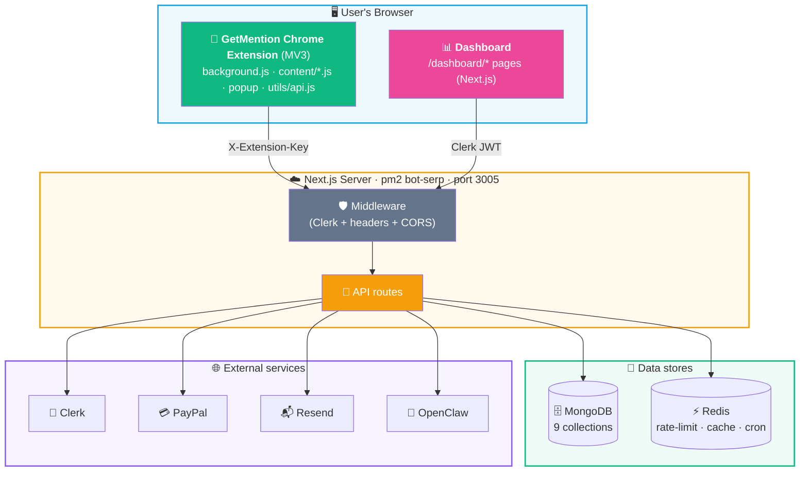
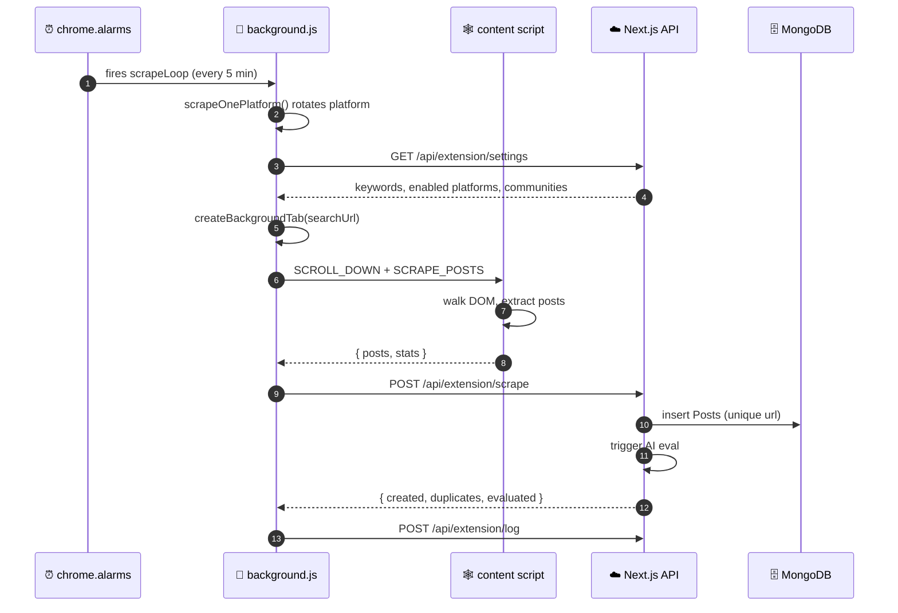
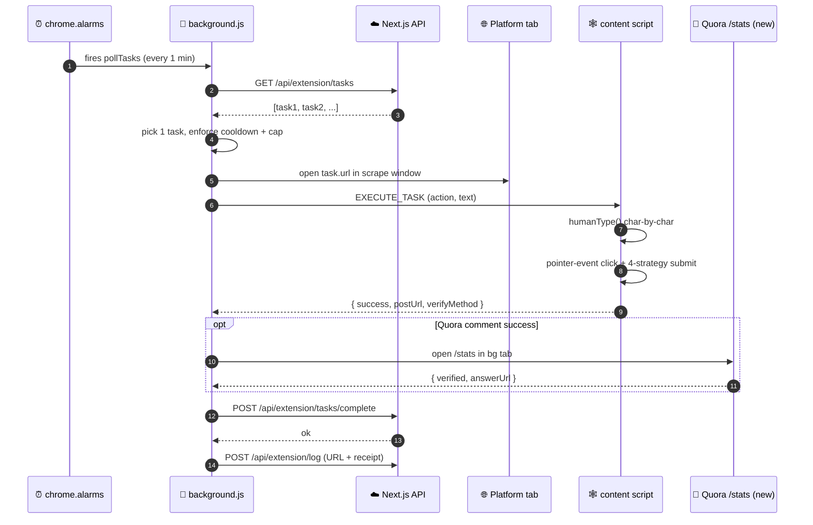
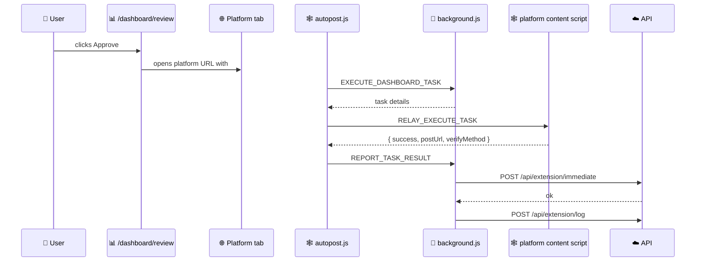
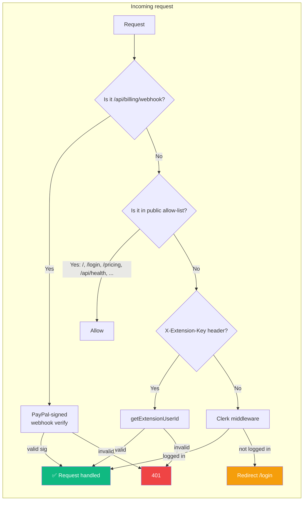
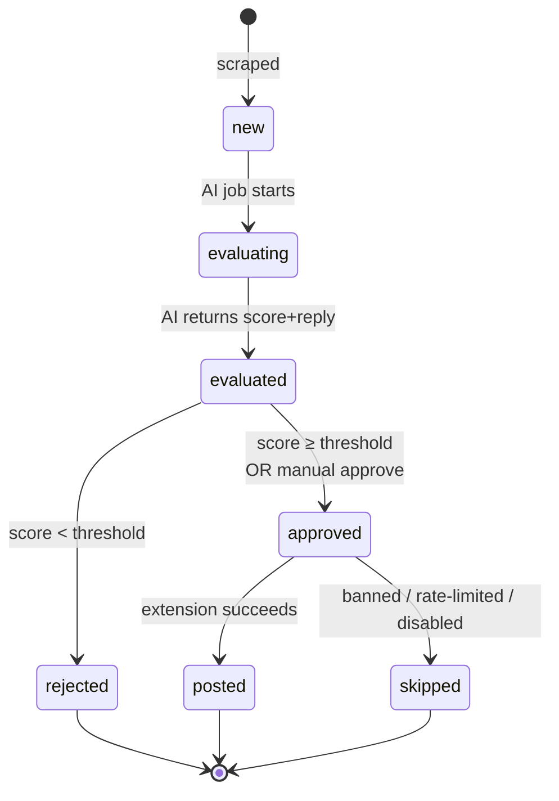
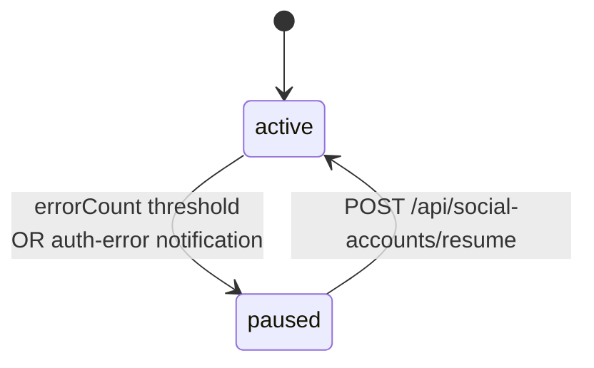
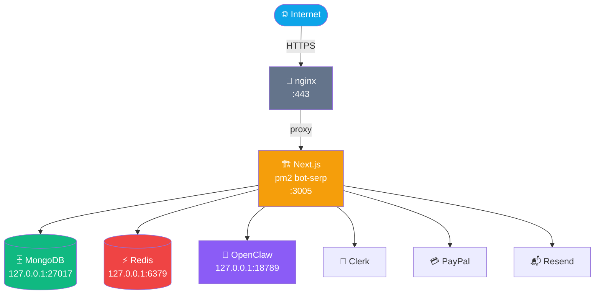

<div align="center">

# 🏛️ System Architecture

**Component design, request flows, data boundaries, and tech stack**


</div>

---

## 1 · Product Summary

> [!IMPORTANT]
> **GetMention is an extension-first SaaS.** The Chrome extension runs inside the user's own browser using their real logged-in sessions. The dashboard provides configuration, AI evaluation, review queues, activity logs, and billing.
>
> **🔒 Privacy guarantee:** No social-media passwords, session cookies, or OAuth tokens are ever stored on GetMention servers. All platform actions happen in the user's browser, authenticated as the user themselves.

---

## 2 · High-Level Component Diagram



---

## 3 · Tech Stack (exact versions)

### 🏃 Application runtime
| Component | Version |
|---|---|
| Next.js (App Router + Turbopack) | **16.1.6** |
| Node.js | ≥ 20 |
| TypeScript | 5.9.3 |
| React / React-DOM | 19.2.3 |
| Tailwind CSS + PostCSS | v4 |

### 🗄️ Backend / data
| Component | Version |
|---|---|
| Mongoose | 9.2.1 |
| `jose` (JWT) | 6.2.0 |
| Redis client | via `src/lib/redis.ts` |
| Resend | 6.9.3 |
| `youtubei.js` | 17.0.1 |

### 🔐 Auth & billing
| Component | Version |
|---|---|
| `@clerk/nextjs` | 7.0.4 |
| `@clerk/themes` | 2.4.57 |
| Billing | PayPal REST v2 Subscriptions |

### 🧩 Chrome extension
| Component | Version |
|---|---|
| Manifest | V3 |
| Extension | **1.0.24** |
| Service worker | `extension/background.js` |

### 🎬 Process / infra
| Component | Version |
|---|---|
| pm2 | process `bot-serp`, port **3005** |
| pm2-logrotate | 3.0.0 |
| nginx | reverse proxy `88.222.214.19` → `:3005` |
| Host | Linux 6.8 (Hostinger VPS) |

---

## 4 · Request & Data Flows

### 4.1 🔍 Scraping cycle (extension → server)



### 4.2 💬 Task execution cycle (server → extension → platform)



### 4.3 ✅ Dashboard approve flow (manual path)



---

## 5 · Authentication Model



| Consumer | Mechanism | Helper |
|---|---|---|
| Dashboard users | Clerk JWT | `getAuthUserId()` in `src/lib/apiAuth.ts` |
| Extension | `X-Extension-Key: gm_…` header, stored hashed in `Settings.extensionApiKey` | `getExtensionUserId()` in `src/lib/extensionAuth.ts` |
| Admin routes | Clerk + `ADMIN_USER_IDS` env | `isAdmin()` in `src/lib/adminAuth.ts` |
| PayPal webhook | PayPal signature verification | `src/app/api/billing/webhook/route.ts` |
| `/api/health` | No auth | Public |

---

## 6 · Data Boundaries (privacy-critical)

```mermaid
flowchart TB
    subgraph DEVICE ["🔒 Stays on the user's device"]
        direction TB
        D1["🔑 Social-media passwords"]
        D2["🍪 Session cookies for x.com, reddit.com, etc."]
        D3["🎫 OAuth tokens for social platforms"]
        D4["💬 Private messages, friends lists, balances"]
    end

    subgraph SERVER ["☁️ Stored on GetMention servers"]
        direction TB
        S1["👤 Clerk identity (name, email)"]
        S2["⚙️ User config (keywords, platforms, brand)"]
        S3["🌐 Public post metadata scraped"]
        S4["🤖 AI-generated replies + scores"]
        S5["📝 Activity logs (TTL 7d), Notifications (TTL 30d)"]
        S6["💳 PayPal subscription ID + status"]
        S7["🔐 Hashed extension API key"]
    end

    style DEVICE fill:#10b98122,stroke:#10b981,stroke-width:2px
    style SERVER fill:#0ea5e922,stroke:#0ea5e9,stroke-width:2px
    style D1 fill:#10b981,color:#fff
    style D2 fill:#10b981,color:#fff
    style D3 fill:#10b981,color:#fff
    style D4 fill:#10b981,color:#fff
```



> [!WARNING]
> This separation is enforced by architecture: the extension never calls `chrome.cookies` or `chrome.storage.session` that would read platform cookies. The server **only** accepts post metadata and action outcomes.

---

## 7 · State Machines

### 7.1 `Post.status` lifecycle



### 7.2 `AccountState.autoPaused`



### 7.3 Extension `dailyCounters` (local)

Kept in `chrome.storage.local`, reset at midnight:

```js
{
  date: "2026-04-14",
  platforms: {
    reddit:    { comments: 3, likes: 7 },
    twitter:   { comments: 5, likes: 12 },
    facebook:  { comments: 2, likes: 0 }
    // ...
  },
  lastCommentAt: 1744610400000
}
```

---

## 8 · Scheduling & Rate Limits

| Layer | Enforcement | Where |
|---|---|---|
| Server API rate limits | Redis sliding window | `src/lib/rateLimit.ts` |
| Per-platform daily caps | `Settings.{platform}DailyLimit` (default 10) | Server + `background.js` |
| Comment cooldown | `activeMinutes / remainingPosts × 0.7–1.3` | `background.js` |
| Cron schedule | `Settings.cronStartHour` / `cronEndHour` / `cronTimezone` | User-configurable |

**Rate limit tiers** (from `src/lib/rateLimit.ts`):

| Tier | Limit |
|---|---|
| `api` | 60 / min |
| `scrape` | 5 / 5 min |
| `post` | 20 / min |
| `auth` | 10 / min |
| `billing` | 10 / min |
| `cookieUpload` | 8 / 15 min |

---

## 9 · External Services

| Service | Purpose | Env vars |
|---|---|---|
| 🔐 **Clerk** | User auth, sign-up, password reset, email verification | `CLERK_SECRET_KEY`, `NEXT_PUBLIC_CLERK_PUBLISHABLE_KEY`, `CLERK_TRUST_HOST` |
| 💳 **PayPal** | Subscriptions (Pro $49, Business $149) | `PAYPAL_CLIENT_ID`, `PAYPAL_SECRET`, `PAYPAL_MODE`, `PAYPAL_WEBHOOK_ID`, `PAYPAL_PLAN_*` |
| 📬 **Resend** | Transactional email (health alerts) | `RESEND_API_KEY`, `RESEND_FROM` |
| 🤖 **OpenClaw** | Post-relevance scoring + reply drafting | `OPENCLAW_HOST`, `OPENCLAW_PORT`, `OPENCLAW_GATEWAY_TOKEN` |
| 🗄️ **MongoDB** | Primary data store (9 collections) | `MONGODB_URI` |
| ⚡ **Redis** | Rate limit, per-user plan cache, cron locks | `REDIS_URL` |

---

## 10 · Deployment Topology



**Deploy command:**

```bash
npm run build && pm2 restart bot-serp
```

Extension zip is built separately (`bash scripts/build-extension.sh`) and served from `/api/download` for authenticated users.

See [operations/deployment.md](./operations/deployment.md) for full details.

---

<div align="center">

**← [Back to index](./README.md)** · **Next: [API routes](./backend/api-routes.md)** →

</div>
