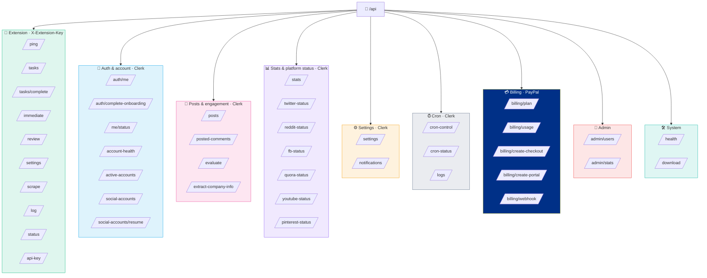
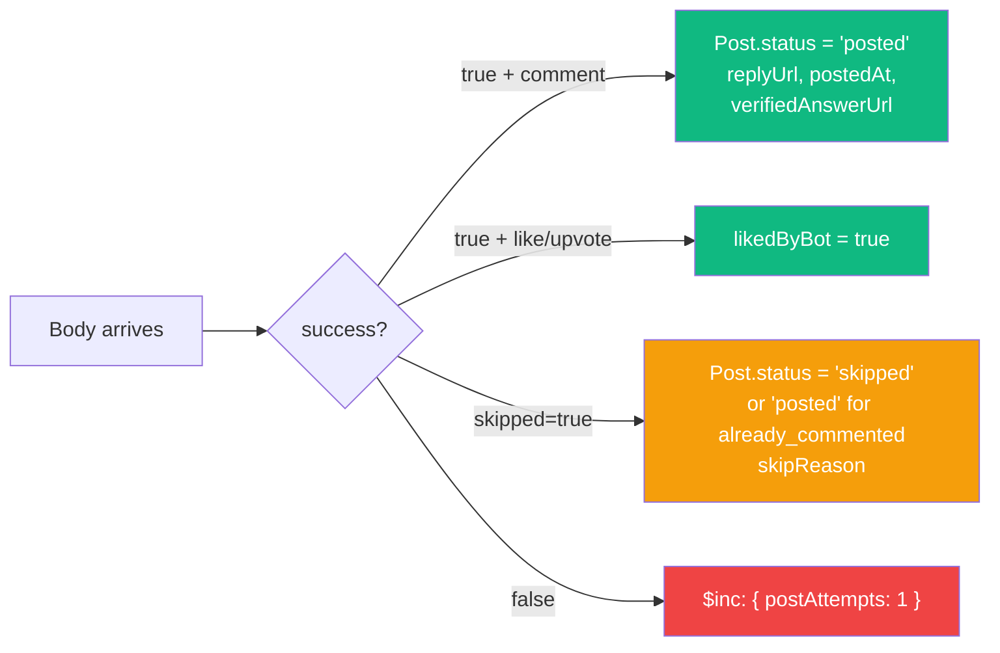
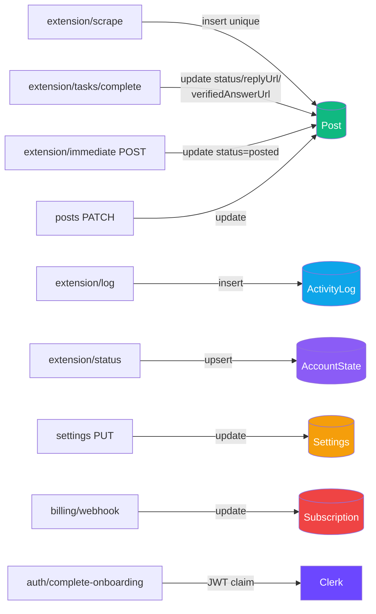
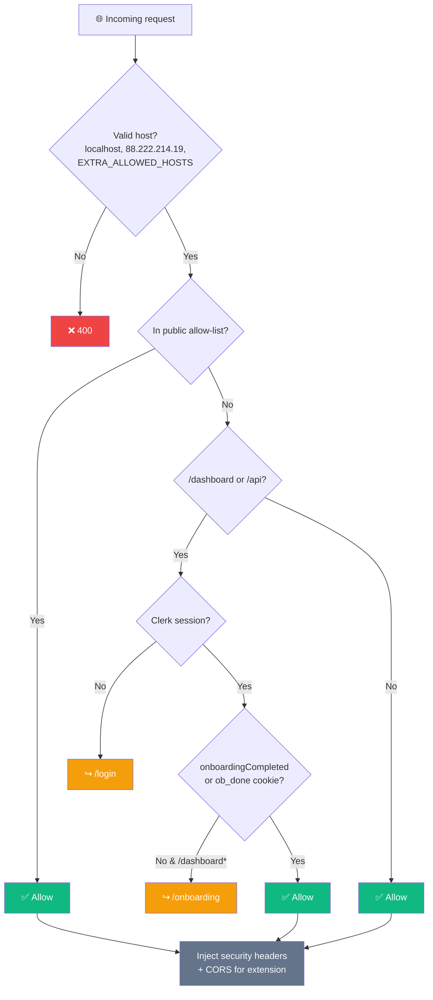

<div align="center">

# 🔌 Backend — API Routes

**Complete inventory of every REST endpoint under `src/app/api/`**


</div>

---

## 🗺️ Route Map



---

## 🔑 Authentication Legend

| Badge | Meaning |
|---|---|
|  | Requires dashboard user session (Clerk JWT) |
|  | Requires extension API key header |
|  | Clerk + `ADMIN_USER_IDS` membership |
|  | PayPal webhook signature verified |
|  | No auth required |

---

## 1 · 🧩 Extension API 

Routes the Chrome extension calls. Reachable without Clerk middleware — see `src/middleware.ts` public allow-list.

| Path | Method | Purpose |
|---|:-:|---|
| `/api/extension/ping` | `GET` | Health check; returns `{ extensionPlatforms, postedByPlatform }` for popup stats. |
| `/api/extension/settings` | `GET` | User's keywords, enabled platforms, limits, prompt template, cron schedule. |
| `/api/extension/tasks` | `GET` | Pending tasks to execute (comments on approved posts + likes + upvotes). |
| `/api/extension/tasks/complete` | `POST` | Report task outcome. |
| `/api/extension/immediate` | `GET` / `POST` | Dashboard-approve flow (single-tab execution). |
| `/api/extension/review` | `GET` / `POST` | Review queue: fetch top evaluated posts; submit manual decisions. |
| `/api/extension/scrape` | `POST` | Submit scraped posts. Deduped by `(userId, url)`. |
| `/api/extension/log` | `POST` | Write activity log (`platform, level, action, message, meta`). |
| `/api/extension/status` | `POST` | Report per-platform login state `{ platform, loggedIn }`. |
| `/api/extension/api-key` | `POST` / `DELETE` |  Generate / revoke extension API key. |

### 🔁 `tasks/complete` body shape

```ts
{
  taskId: string                    // Post._id
  success: boolean
  error?: string                    // on failure
  action: 'comment' | 'like' | 'upvote'
  alreadyCommented?: boolean        // skip-flag
  alreadyLiked?: boolean
  alreadyUpvoted?: boolean
  skipped?: boolean                 // e.g. comments_disabled, banned
  reason?: string                   // skip reason label
  verifyMethod?: string             // editor_cleared, url_changed, state_flipped...
  verifiedAnswerUrl?: string        // Quora /stats match URL
  postUrl?: string                  // the actual post URL after navigation
}
```

**Server-side effect:**



---

## 2 · 🔐 Authentication & account 

| Path | Method | Purpose |
|---|:-:|---|
| `/api/auth/me` | `GET` | Returns Clerk profile for the logged-in user. |
| `/api/auth/complete-onboarding` | `POST` | Marks Clerk JWT claim `onboardingCompleted=true`. |
| `/api/me/status` | `GET` | Lightweight dashboard status (name, plan, cron state). |
| `/api/account-health` | `GET` / `POST` | Account health — per-platform `healthScore`, pause states, recent errors. |
| `/api/active-accounts` | `GET` | List of connected social accounts. |
| `/api/social-accounts` | `GET` / `DELETE` / `PATCH` | Add / remove / toggle a social account. |
| `/api/social-accounts/resume` | `POST` | Clears `autoPaused=true` on an account. |

---

## 3 · 📝 Posts & engagement 

| Path | Method | Purpose |
|---|:-:|---|
| `/api/posts` | `GET` | Paginated, filtered list of Posts (status, platform, score, date). |
| `/api/posts` | `PATCH` | Approve / reject / edit a Post. |
| `/api/posted-comments` | `GET` | Successfully-posted comments with engagement metrics. |
| `/api/evaluate` | `POST` | Run AI evaluation on a Post (OpenClaw). |
| `/api/extract-company-info` | `POST` | Parse `companyName` + `companyDescription` from free-text (onboarding). |

---

## 4 · 📊 Stats & per-platform status 

| Path | Method | Purpose |
|---|:-:|---|
| `/api/stats` | `GET` | Aggregated stats (posted count, platform breakdown). |
| `/api/twitter-status` | `GET` | Last Twitter run + health + engagement summary. |
| `/api/reddit-status` | `GET` | Same for Reddit. |
| `/api/fb-status` | `GET` | Same for Facebook. |
| `/api/quora-status` | `GET` | Same for Quora. |
| `/api/youtube-status` | `GET` | Same for YouTube. |
| `/api/pinterest-status` | `GET` | Same for Pinterest. |
| `/api/twitter-engagement` | `GET` | Likes / retweets / replies on bot-posted tweets. |
| `/api/twitter-communities` | `GET` / `POST` | Manage Twitter community IDs. |

---

## 5 · ⚙️ Settings & notifications 

| Path | Method | Purpose |
|---|:-:|---|
| `/api/settings` | `GET` | Returns the Settings doc. |
| `/api/settings` | `PUT` | Updates Settings; enforces plan limits via `checkPlanLimit()`. |
| `/api/notifications` | `GET` / `PATCH` | Fetch notifications; mark read. |

---

## 6 · ⏰ Cron & logs 

| Path | Method | Purpose |
|---|:-:|---|
| `/api/cron-control` | `GET` / `POST` | Toggle `Settings.autoPostingPaused`. |
| `/api/cron-status` | `GET` | Per-platform cron lock + last run status. |
| `/api/cron-log` | `GET` | Legacy per-platform activity log. |
| `/api/logs` | `GET` | User's activity feed (info / warn / error / success). Feeds dashboard logs + popup recent activity. |

---

## 7 · 💳 Billing 

| Path | Method | Auth | Purpose |
|---|:-:|:-:|---|
| `/api/billing/plan` | `GET` | Clerk | Current plan + limits + subscription status. |
| `/api/billing/usage` | `GET` | Clerk | Feature-usage snapshot vs. plan limits. |
| `/api/billing/create-checkout` | `POST` | Clerk | Creates a PayPal subscription approval URL. |
| `/api/billing/create-portal` | `POST` | Clerk | Returns the PayPal self-service cancel/upgrade link. |
| `/api/billing/webhook` | `POST` | PayPal sig | Handles `BILLING.SUBSCRIPTION.*` events → updates Subscription doc. |

**Required env:** `PAYPAL_CLIENT_ID`, `PAYPAL_SECRET`, `PAYPAL_MODE`, `PAYPAL_WEBHOOK_ID`, `PAYPAL_PLAN_PRO`, `PAYPAL_PLAN_PRO_YEARLY`, `PAYPAL_PLAN_BUSINESS`, `PAYPAL_PLAN_BUSINESS_YEARLY`.

---

## 8 · 👑 Admin 

| Path | Method | Purpose |
|---|:-:|---|
| `/api/admin/users` | `GET` | List all users, post counts, subscriptions. |
| `/api/admin/users/[userId]` | `GET` | Single user details + cascade-delete helper. |
| `/api/admin/stats` | `GET` | Platform-wide stats (total posts, users, revenue). |

> Admin identity is established by `ADMIN_USER_IDS` env (comma-separated Clerk user IDs).

---

## 9 · 🛠️ System

| Path | Method | Auth | Purpose |
|---|:-:|:-:|---|
| `/api/health` | `GET` | Public | Liveness check. Returns `{ ok: true }`. |
| `/api/download` | `GET` | Clerk | Returns the latest extension zip. |

---

## 10 · 🔗 Route ↔ Model touch points



---

## 11 · 🛡️ Middleware behavior

**File:** `src/middleware.ts`



**Public allow-list** (no auth required):
`/`, `/login(.*)`, `/signup(.*)`, `/pricing`, `/terms`, `/privacy`, `/api/billing/webhook`, `/api/health`, `/api/extension/ping`, `/api/extension/tasks(.*)`, `/api/extension/settings`, `/api/extension/status`, `/api/extension/scrape`, `/api/extension/log`, `/api/extension/immediate`.

**Security headers injected on all responses:**

```
X-Frame-Options: DENY
X-Content-Type-Options: nosniff
Referrer-Policy: strict-origin-when-cross-origin
Permissions-Policy: camera=(), microphone=(), geolocation=()
```

**CORS:** `Access-Control-Allow-Origin: *` on `/api/extension/*` only.

---

## 12 · ⚡ Rate Limits

Server-side limits from `src/lib/rateLimit.ts` (Redis sliding window):

| Tier | Limit | Applied to |
|---|---|---|
|  | 60 / min | `/api/logs`, `/api/stats`, `/api/posts`, dashboard reads |
|  | 5 / 5 min | `/api/extension/scrape` |
|  | 20 / min | `/api/extension/tasks/complete`, `/api/extension/immediate` POST |
|  | 10 / min | `/api/auth/*` |
|  | 10 / min | `/api/billing/create-checkout`, `/api/billing/create-portal` |
|  | 8 / 15 min | Legacy endpoints |

> 429 responses include a `Retry-After` header.

---

<div align="center">

**← [Architecture](../architecture.md)** · **[Back to index](../README.md)** · **Next: [Models](./models.md)** →

</div>
