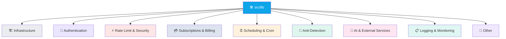
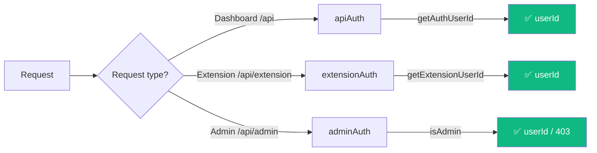

# 🛠️ Backend — Library Utilities

**29 utility modules in `src/lib/`**

---

## 🗂️ Library Groups

---

## 1 · 🏗️ Core Infrastructure

| File | Exports / Responsibility |
|---|---|
| **`mongodb.ts`** | Mongoose connection singleton with caching. Uses `MONGODB_URI`. Smaller pool size when `WORKER_PROCESS` env is set. |
| **`redis.ts`** | IORedis singleton for rate limiting, caching, cron locks. Uses `REDIS_URL`. |
| **`logger.ts`** | Structured JSON logging (`debug` / `info` / `warn` / `error`). Respects `LOG_LEVEL` env. |

---

## 2 · 🔐 Authentication

| File | Exports / Responsibility |
|---|---|
| **`apiAuth.ts`** | `getAuthUserId(req)` — enforces Clerk JWT; returns `userId` or a 401 NextResponse. Used by every dashboard API route. |
| **`extensionAuth.ts`** | `getExtensionUserId(req)` — validates `X-Extension-Key` header against `Settings.extensionApiKey`. Returns `userId` or 401. |
| **`adminAuth.ts`** | `isAdmin(userId)`, `getAdminUserId(req)` — checks `ADMIN_USER_IDS` env (comma-separated Clerk IDs). |

---

## 3 · ⚡ Rate Limiting & Security

| File | Exports / Responsibility |
|---|---|
| **`rateLimit.ts`** | Redis sliding window. 6 tiers: `api` 60/min, `scrape` 5/5min, `post` 20/min, `auth` 10/min, `billing` 10/min, `cookieUpload` 8/15min. |
| **`cookieUploadGuard.ts`** | Enforces rate limit + 200 KB payload cap on cookie uploads (legacy admin endpoints). |
| **`contentSafety.ts`** | Spam detection, quality scoring, duplicate checking before posting. |
| **`validateComment.ts`** | Validates comments aren't error dumps, code snippets, or stack traces. |

---

## 4 · 💳 Subscriptions & Billing

| File | Exports / Responsibility |
|---|---|
| **`subscription.ts`** | `getUserPlan(userId)` with Redis cache (60 s TTL). Internal bypass via `INTERNAL_USER_IDS` env → Business tier. |
| **`plans.ts`** | Plan definitions (Free / Pro / Business) + limits. PayPal plan IDs come from env. |
| **`paypal.ts`** | PayPal OAuth2 token caching, subscription API calls. Env: `PAYPAL_CLIENT_ID`, `PAYPAL_SECRET`, `PAYPAL_MODE`. |
| **`featureGate.ts`** | `checkPlanLimit(userId, feature)` — used by `/api/settings` PUT, `/api/run-cron`, etc. |

---

## 5 · ⏰ Scheduling & Cron

| File | Exports / Responsibility |
|---|---|
| **`schedule.ts`** | Timezone-aware helpers: `getTodayStartUTC()`, `getHourInTimezone(timezone)` for per-user schedules. |
| **`cronState.ts`** | Redis-backed per-(userId, platform) cron state tracker: locks, status, logs. |

---

## 6 · 🤖 Automation Anti-Detection

| File | Exports / Responsibility |
|---|---|
| **`antiBan.ts`** | `humanDelay()`, `humanSleep()` — jittered cooldowns, account age-based limits. |
| **`browserPath.ts`** | Detects local Chromium/Chrome for Playwright. Supports `CHROMIUM_PATH` env override.  |
| **`humanize.ts`** | Browser fingerprinting (random timezones, Chrome launch args); hardcoded platform daily limits.  |
| **`browserSemaphore.ts`** | Semaphore for limiting concurrent browser instances.  |

> [!NOTE]
> Files marked **legacy** relate to the previous Playwright-based server-side automation. The extension-first architecture doesn't use them, but they're still imported by `/api/extension/scrape` and `/api/evaluate` and haven't been fully removed yet.

---

## 7 · 🧠 AI & External Services

| File | Exports / Responsibility |
|---|---|
| **`openclaw.ts`** | Call OpenClaw AI service (HTTP → CLI fallback) for post relevance scoring + reply generation. Reply style pools: insight, follow-up, validation, experience, disagree. Env: `OPENCLAW_HOST`, `OPENCLAW_PORT`, `OPENCLAW_GATEWAY_TOKEN`. |
| **`twitterHttp.ts`** | Twitter cookie-based HTTP layer (uses `TWITTER_*` env).  |

---

## 8 · 📋 Logging & Monitoring

| File | Exports / Responsibility |
|---|---|
| **`activityLog.ts`** | `logActivity({ userId, platform, level, action, message, meta })`, `notifyAuthError()` (deduped auth alerts). |
| **`emailNotifier.ts`** | Sends emails via Resend (cookie-expiry alerts). Env: `RESEND_API_KEY`, `RESEND_FROM`, `NEXT_PUBLIC_APP_URL`. |
| **`accountHealth.ts`** | Tracks post success rate and per-account health score. |
| **`debugScreenshot.ts`** | Playwright screenshot utility for debugging.  |

---

## 9 · 🧰 Other

| File | Exports / Responsibility |
|---|---|
| **`apiBase.ts`** | Frontend API base URL config (`NEXT_PUBLIC_API_BASE` env or same-origin). |
| **`cleanup.ts`** | Data cleanup utilities for archive/purge of old data. |
| **`types.ts`** | Shared TypeScript interfaces: `IPost`, `ISettings`, `SocialAccount`, `AIEvaluation`, `PostStatus` enum. |

---

## 🧩 Services Layer (`src/services/`)

Data-access abstraction over the models. Index: `src/services/index.ts` (barrel export).

| File | Role |
|---|---|
| **`settingsService.ts`** | `getSettings()`, `updateSettings()`, `getSocialAccounts()` |
| **`postService.ts`** | `createPost()`, `updatePost()`, `getPost()`, `getPostStats()`, `getRecentPosted()` |
| **`subscriptionService.ts`** | `getSubscription()`, `updateSubscription()`, `createSubscription()` |
| **`notificationService.ts`** | `getNotifications()`, `createNotification()`, `markRead()`, `hasRecentNotification()` (24h dedupe) |
| **`activityLogService.ts`** | `getActivityLogs()` — fetches logs for dashboard/debugging |

---

## 🗑️ Legacy Cleanup Candidates

> [!WARNING]
> The following are imports of the **old Playwright-based server-side automation architecture**, replaced by the extension. Safe-to-remove list pending verification:

- `browserPath.ts`, `browserSemaphore.ts`, `humanize.ts`
- `antiBan.ts` (partial — some helpers still used by extension logic)
- `debugScreenshot.ts`
- `twitterHttp.ts`
- `cookieUploadGuard.ts` (legacy cookie endpoints)

These files account for ~27 MB of on-disk weight (including `profiles/` directory that stores per-user browser profiles).

---

**← [Models](./models.md)** · **[Back to index](../README.md)** · **Next: [Frontend / Pages](../frontend/pages.md)** →

