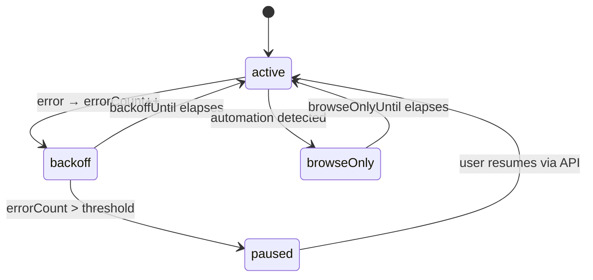
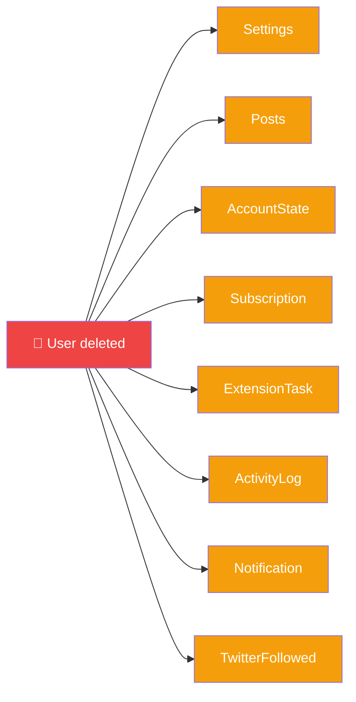

<div align="center">

# 🗄️ Backend — MongoDB Models

**9 Mongoose schemas defined in `src/models/`**


</div>

---

## 🧬 Collection Map

```mermaid
erDiagram
    User ||--|| Settings : "1:1"
    User ||--o{ Post : "has many"
    User ||--o{ AccountState : "per platform"
    User ||--|| Subscription : "1:1"
    User ||--o{ ExtensionTask : "has many"
    User ||--o{ ActivityLog : "writes"
    User ||--o{ Notification : "receives"
    User ||--o{ TwitterFollowed : "tracks"
    Post ||--o{ ExtensionTask : "generates"
    Post ||--o{ ActivityLog : "generates"

    User { string clerkId PK }
    Settings { string userId PK, string[] keywords, object cronSchedule }
    Post { string userId, string url, string status, number aiRelevanceScore }
    AccountState { string userId, string platform, number healthScore, boolean autoPaused }
    Subscription { string userId PK, string paypalSubscriptionId, string plan, string status }
    ExtensionTask { string userId, string postId, string action, string status }
    ActivityLog { string userId, string platform, string level, string message }
    Notification { string userId, string type, boolean read }
    TwitterFollowed { string userId, string targetHandle, boolean isFollowing }
```

---

## 1 · 👤 `User` — `src/models/User.ts`

**Purpose:** Thin wrapper around Clerk identity. Stores only the Clerk user ID for relational joins; all profile data (name, email) lives in Clerk.

```ts
{
  clerkId: String     // unique, indexed
  createdAt: Date
}
```

| Field | Type | Notes |
|---|---|---|
| `clerkId` | String | **Unique index** |
| `createdAt` | Date | Auto |

**Key method:** `cascadeDeleteUser(clerkId)` — deletes all related docs across **Post, Settings, Subscription, AccountState, ActivityLog, Notification, TwitterFollowed**.

---

## 2 · ⚙️ `Settings` — `src/models/Settings.ts`

**Purpose:** Per-user configuration for all platforms (keywords, thresholds, brand info, cron schedule, social accounts).

```ts
{
  userId: String                  // unique
  companyName: String
  companyDescription: String
  keywords: [String]              // global fallback
  platforms: [String]             // ['twitter', 'reddit', ...]
  socialAccounts: [SocialAccount] // embedded
  promptTemplate: String          // custom AI reply prompt
  cronTimezone: String
  cronStartHour: Number
  cronEndHour: Number
  cronIntervalMinutes: Number
  autoPostingPaused: Boolean
  extensionApiKey: String         // hashed

  // Per-platform (repeat for twitter/reddit/facebook/quora/youtube/pinterest/skool):
  twitterKeywords: [String]
  twitterDailyLimit: Number       // default 10
  twitterAutoPostThreshold: Number // 0-100
  twitterBrandMentionRate: Number // max N brand mentions per day
  twitterCooldownMinutes: Number

  // ...repeated for all 7 platforms

  // Facebook-specific:
  facebookGroups: [String]
  // Skool-specific:
  skoolCommunities: [String]
}
```

**Index:** `userId` (unique).

> [!TIP]
> Each platform has its own `{platform}DailyLimit`, `{platform}AutoPostThreshold`, `{platform}Cooldown` etc. Plan gates enforce maximums via `src/lib/featureGate.ts`.

---

## 3 · 📝 `Post` — `src/models/Post.ts`

**Purpose:** Every scraped post. Lifecycle: scraped → evaluated → approved → posted.

```ts
{
  userId: String
  url: String                    // REQUIRED; unique per user
  platform: String               // default 'facebook'
  author: String
  content: String                // REQUIRED
  scrapedAt: Date
  status: 'new' | 'evaluating' | 'evaluated' |
          'approved' | 'rejected' | 'posted' | 'skipped'
  skipReason: String             // when status='skipped'

  // AI output
  aiReply: String
  aiRelevanceScore: Number       // 0-100
  aiTone: String
  aiReasoning: String
  keywordsMatched: [String]

  // Engagement tracking (twitter)
  likeCount: Number
  retweetCount: Number
  replyCount: Number
  bookmarkCount: Number
  viewCount: Number

  // Bot action flags
  likedByBot: Boolean
  botReaction: String            // 'Like' | 'Love' | 'Care' | ... (FB)
  sharedByBot: Boolean
  retweetedByBot: Boolean
  bookmarkedByBot: Boolean
  crosspostedByBot: Boolean
  pinterestHeartLiked: Boolean
  subscribedByBot: Boolean

  // Content meta
  isShort: Boolean               // YT shorts flag
  editedReply: String
  replyUrl: String               // where the bot's comment lives
  verifiedAnswerUrl: String      // Quora /stats match
  verifiedAt: Date
  evaluatedAt: Date
  approvedAt: Date
  postedAt: Date
  postedByAccount: String        // 'extension' | 'extension-manual'

  // Reply monitoring
  botReplyEngagement: {
    likes: Number,
    replies: Number,
    lastChecked: Date
  }
  botReplyReplies: [{
    author: String,
    content: String,
    scrapedAt: Date
  }]

  // Follow-up system
  followUpStatus: 'none' | 'pending' | 'posted' | 'skipped'
  followUpText: String
  followUpPostedAt: Date
  monitorUntil: Date

  isOriginalTweet: Boolean
  postAttempts: Number
  evaluationAttempts: Number
  ttlExpireAt: Date              // TTL auto-delete
}
```

### 📈 Indexes

| Index | Purpose |
|---|---|
| `(userId, url)` **unique** | Dedupe scraped posts |
| `status` | Fast filter by status |
| `aiRelevanceScore` desc | Sort review queue |
| `scrapedAt` desc | Recent-first listings |
| `(platform, postedByAccount, postedAt)` | Posted-comments list |
| `(platform, status, postedAt)` | Per-platform stats |
| `(userId, platform, status)` | User dashboard |
| `(userId, postedAt)` desc | User activity timeline |
| `ttlExpireAt` TTL | Auto-cleanup |

---

## 4 · 🛡️ `AccountState` — `src/models/AccountState.ts`

**Purpose:** Operational state per-(user, platform). Replaced the old `BrowserCookie` model (extension-first architecture doesn't need server-side cookies).

```ts
{
  userId: String
  platform: String               // 'twitter' | 'reddit' | ...
  username: String
  displayName: String
  accountId: String              // platform-side ID

  // Health tracking
  errorCount: Number
  backoffUntil: Date             // exponential backoff
  totalPosts: Number
  totalErrors: Number
  healthScore: Number            // 0-100
  autoPaused: Boolean
  lastPostedAt: Date

  // Anti-detection (tiered blocking)
  automationBlockCount: Number
  automationBlockedAt: Date
  browseOnlyUntil: Date

  // Misc
  proxyUrl: String
  assignedTimezone: String
}
```

**Index:** `(userId, platform)` compound.



---

## 5 · 💳 `Subscription` — `src/models/Subscription.ts`

**Purpose:** PayPal subscription tracking.

```ts
{
  userId: String                 // unique
  paypalSubscriptionId: String   // sparse unique
  paypalPayerId: String
  plan: 'free' | 'pro' | 'business'
  status: 'active' | 'past_due' | 'canceled' |
          'trialing' | 'incomplete'
  currentPeriodStart: Date
  currentPeriodEnd: Date
  cancelAtPeriodEnd: Boolean
}
```

**Indexes:** `userId` (unique), `paypalSubscriptionId` (sparse unique).

---

## 6 · 🎯 `ExtensionTask` — `src/models/ExtensionTask.ts`

**Purpose:** Task queue for the extension worker.

```ts
{
  userId: String
  postId: ObjectId              // ref Post
  platform: String
  action: 'comment' | 'like' | 'follow' |
          'retweet' | 'bookmark' | 'upvote'
  url: String
  text: String                  // comment body
  status: 'pending' | 'dispatched' | 'completed' |
          'failed' | 'skipped'
  result: {
    success: Boolean,
    error: String,
    completedAt: Date
  }
  dispatchedAt: Date
  expiresAt: Date               // TTL 24h
}
```

**Indexes:** `(userId, status)` compound, TTL on `expiresAt`.

---

## 7 · 📋 `ActivityLog` — `src/models/ActivityLog.ts`

**Purpose:** Timestamped user activity feed. Surfaced in `/dashboard/logs` and extension popup.

```ts
{
  userId: String
  platform: String
  level: 'info' | 'warn' | 'error' | 'success'
  action: String                // 'scrape_start' | 'post' | ...
  message: String
  meta: Mixed                   // flexible { url, verifyMethod, ... }
  createdAt: Date               // TTL 7 days
}
```

**Indexes:** `userId`, `(userId, platform, createdAt)` compound, TTL 7 days.

---

## 8 · 🔔 `Notification` — `src/models/Notification.ts`

**Purpose:** User-facing alerts (cookie expiry, auth errors, account removals).

```ts
{
  userId: String
  type: 'cookie_expired' | 'cookie_expiring_soon' |
        'account_removed' | 'not_connected' | 'info'
  platform: String
  accountId: String
  title: String
  message: String
  read: Boolean
  actionUrl: String
  actionLabel: String
  createdAt: Date               // TTL 30 days
}
```

**Indexes:** `userId`, `(userId, read, createdAt)` compound, TTL 30 days.

> [!NOTE]
> `notificationService.hasRecentNotification()` dedupes — max 1 notification per type per platform per 24 h.

---

## 9 · 🐦 `TwitterFollowed` — `src/models/TwitterFollowed.ts`

**Purpose:** Track Twitter accounts the bot followed (analytics + unfollow-later).

```ts
{
  userId: String
  targetHandle: String
  followedAt: Date
  unfollowedAt: Date
  isFollowing: Boolean
}
```

**Indexes:** `(userId, targetHandle)` unique, `(userId, isFollowing, followedAt)` compound.

---

## 🔄 Cascade Delete

When a user is deleted (via `User.cascadeDeleteUser()`):



---

<div align="center">

**← [API Routes](./api-routes.md)** · **[Back to index](../README.md)** · **Next: [Libraries](./libraries.md)** →

</div>
