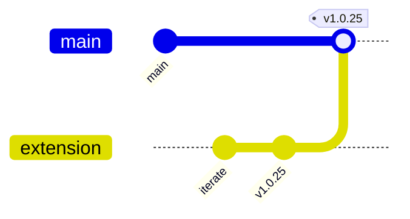

<div align="center">

# 🌱 Contributing

**Branch workflow, commit style, release process**


</div>

---

## 🌿 Branch Strategy



| Branch | Purpose |
|---|---|
| `main` | Production. Only merged into when a batch of `extension` commits has been validated. Tagged with extension versions. |
| `extension` | Active development. Every extension fix goes here first. |
| Feature branches | Optional; short-lived (hours to days). Rebased onto `extension` before merge. |

---

## 📝 Commit Style

Format: `<type>: <summary>`

**Types:**

| Type | When |
|---|---|
| `feat:` | New feature or substantial capability |
| `fix:` | Bug fix |
| `chore:` | Config, deps, URL changes, script updates |
| `docs:` | Documentation only |
| `refactor:` | Code reorganization without behavior change |
| `test:` | Test-only changes |
| `style:` | Formatting, typo fixes |

**Examples** (from actual repo history):
```
feat: extension v1.0.24 — reliable commenting + Quora /stats verification
fix: detect Facebook comment rejections and shadow removals
chore: switch to Hostinger dev server URL + make server-URL configurable in popup
docs: complete documentation set — backend, frontend, extension, features, ops
```

### Subject line
- ≤ 72 chars
- Imperative mood ("add X", not "added X")
- Version in subject for extension bumps: `feat: extension v1.0.XX — <what-changed>`

### Body
- Optional but encouraged for non-trivial commits
- Explain **why**, not just **what** (diff shows what)
- Bullet lists welcome for multi-item commits

### Footer (automatic)
All AI-assisted commits append:
```
Co-Authored-By: Claude Opus 4.6 (1M context) <noreply@anthropic.com>
```

---

## 🚀 Release Workflow (extension)

### 1 · Bump version
```bash
# In extension/manifest.json
"version": "1.0.XX",
```

### 2 · Build the zip
```bash
bash scripts/build-extension.sh
```

Outputs `extension-builds/getmention-latest.zip`.

### 3 · Commit & push
```bash
git add -A
git commit -m "feat: extension v1.0.XX — <what-changed>"
git push origin extension
```

### 4 · Deploy app changes
```bash
npm run build && pm2 restart bot-serp --update-env
```

### 5 · Reload extension locally
`chrome://extensions` → GetMention → **Reload**. Version badge in popup should update.

### 6 · (When stable) merge to main
```bash
git checkout main
git merge extension --ff-only   # extension should already be ahead of main
git tag v1.0.XX
git push origin main --tags
```

---

## 🏗️ Writing Code

### Style
- **TypeScript strict mode** is on
- 2-space indent
- Single quotes, no semicolons dropping (follow existing style in target file)
- Prefer named exports over default
- **No unnecessary comments** — only explain WHY, not WHAT

### Where to put new code

| Type | Location |
|---|---|
| New API route | `src/app/api/<path>/route.ts` |
| Route helper | `src/lib/<name>.ts` |
| New model | `src/models/<Name>.ts` + add to `cascadeDeleteUser()` in `User.ts` |
| Service-layer function | `src/services/<name>Service.ts` |
| React component | `src/components/<Name>.tsx` |
| Dashboard page | `src/app/dashboard/<path>/page.tsx` |
| Extension content script | `extension/content/<platform>.js` |
| Utility for extension | `extension/utils/<name>.js` |

### Imports
Use path alias `@/`:
```ts
import { getAuthUserId } from '@/lib/apiAuth';
import Post from '@/models/Post';
```

### Add an env var
1. Reference in code: `process.env.NEW_VAR`
2. Document in [operations/environment.md](./operations/environment.md)
3. Ask owner to add it to `.env.local` on the server

---

## 🧪 Testing

> [!NOTE]
> There is no automated test suite at this time. Until one exists, the testing checklist below is the standard for any change.

### For backend / API changes
- [ ] Manual test: hit the endpoint via `curl` or the dashboard
- [ ] `npm run build` succeeds with no new warnings
- [ ] Check `/dashboard/logs` for error spikes after deploying

### For extension changes
- [ ] Build the zip, reload in `chrome://extensions`
- [ ] Run one manual scrape cycle (click "Scrape now" in popup)
- [ ] Run one manual approve from `/dashboard/review`
- [ ] Check service-worker console for errors

### For UI changes
- [ ] Visually verify on desktop (1440px+)
- [ ] Check mobile responsiveness
- [ ] Toggle light/dark theme
- [ ] Toggle OS reduced-motion setting — animations should stop

### For AI / scoring changes
- [ ] Evaluate 5–10 sample posts manually
- [ ] Check score distribution is reasonable
- [ ] Check reply style variety (not repetitive)

---

## 🔒 Security Checklist (before merging)

- [ ] No secrets committed (`git log -p | grep -E "sk_|pk_|secret"`)
- [ ] New API routes have auth (Clerk or X-Extension-Key)
- [ ] Rate limit applied to any endpoint that writes data
- [ ] User-scoped queries (`{ userId }` in every `findOne`/`find`)
- [ ] Extension's `manifest.json` has no wildcard host permissions
- [ ] CORS origin is NOT `*` for anything except `/api/extension/*`
- [ ] Input validation on all `req.body` parsing

---

## 🚨 Destructive Operations Never

**Without explicit user request**, contributors must NOT:
- `git push --force` on `main` or `extension`
- `git reset --hard` on shared branches
- Drop Mongo collections or indexes
- `redis-cli FLUSHDB` in production
- Delete users via `cascadeDeleteUser()`
- Modify pm2 processes belonging to other projects on the VPS

---

## 🧹 Code Cleanup Priorities

Known dead code that should eventually be removed (see [backend/libraries.md](./backend/libraries.md#-legacy-cleanup-candidates)):

| File | Status |
|---|---|
| `src/lib/humanize.ts` | Only `getWarmupStatus` is used; rest is pre-extension Playwright |
| `src/lib/browserSemaphore.ts` | Unused |
| `src/lib/antiBan.ts` | Mostly moved to extension |
| `src/lib/browserPath.ts` | Playwright helper, unused |
| `src/lib/cookieUploadGuard.ts` | Legacy cookie upload flow |
| `src/lib/twitterHttp.ts` | Server-side Twitter client, replaced by extension |
| `profiles/` + `src/profiles/` | Old per-user Playwright profile dirs (~23 MB) |
| `public/app.js`, `dashboard.html`, `styles.css` | Pre-Next.js SPA remnants |
| `Dockerfile`, `docker-compose.yml` | Unused (we deploy via pm2, not Docker) |

Before removing, grep the whole repo to confirm truly no imports exist.

---

## 🎓 Onboarding a New Dev

1. Read [getting-started.md](./getting-started.md) — 15 min to running locally
2. Read [architecture.md](./architecture.md) — 15 min for mental model
3. Read the doc for whichever layer they'll touch (backend / frontend / extension)
4. Pair-program on one small fix end-to-end (scrape → evaluate → post → verify) — ~1 hour
5. Assign a small starter issue (e.g., "add a missing index", "fix a typo", "add a new log line")

---

## 🗣️ Communication

- **Issues** — open on GitHub with the Issue template (logs + browser + extension version)
- **Security concerns** — email `security@serpbays.com` privately, do NOT file a public issue
- **Urgent prod** — ping the maintainer on the team channel

---

<div align="center">

**[Back to index](./README.md)**

</div>
