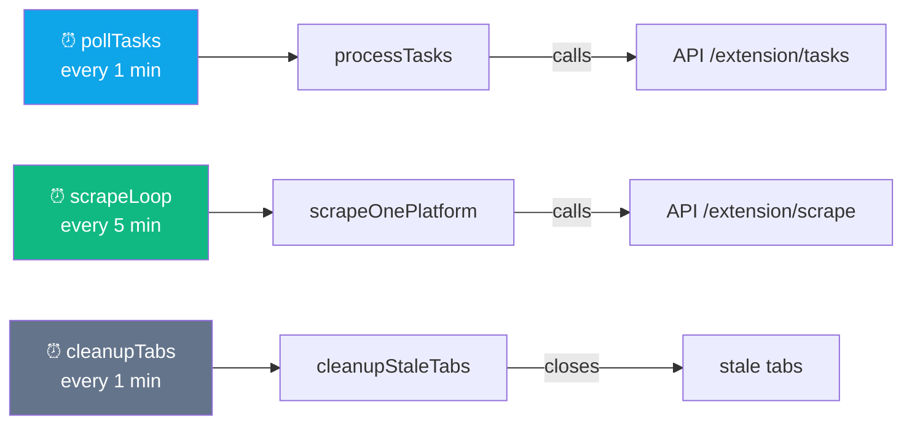
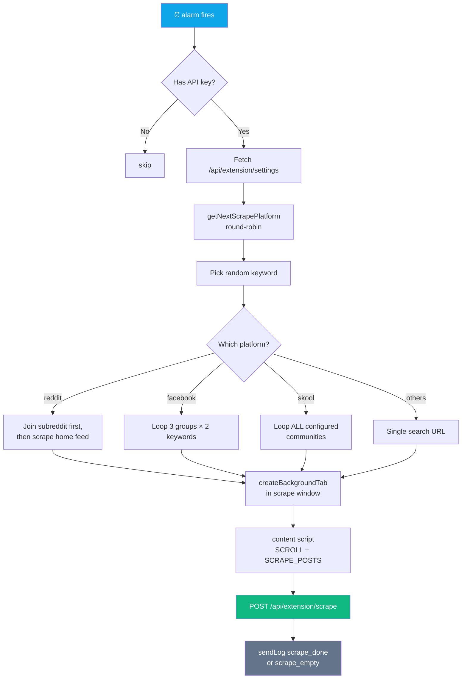
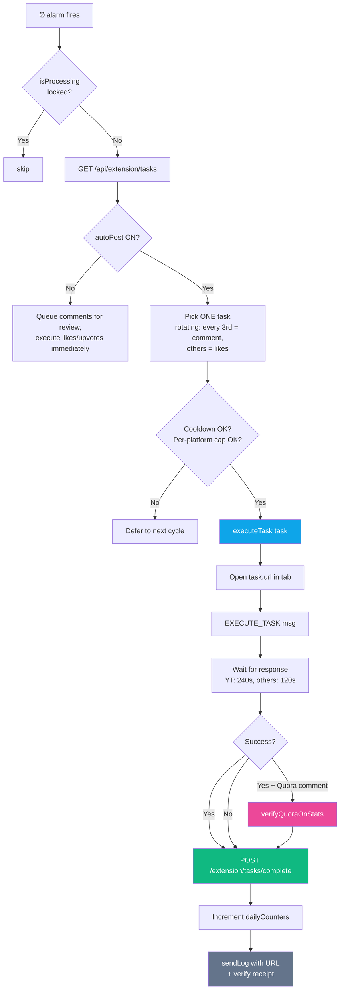
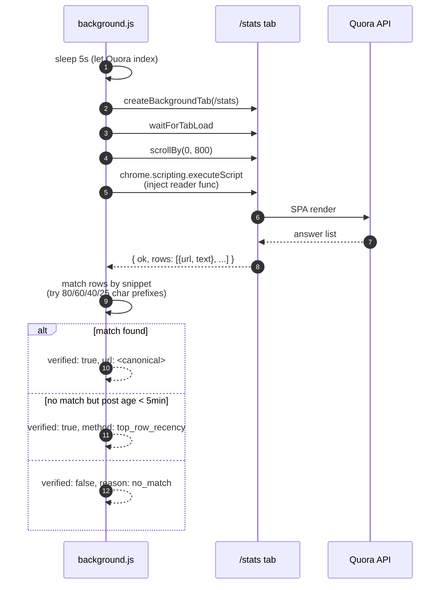
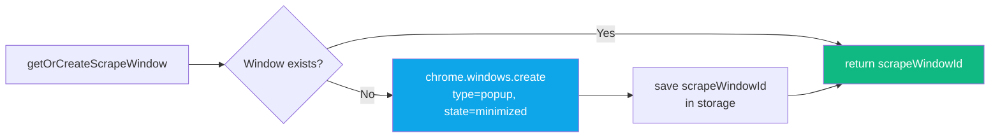
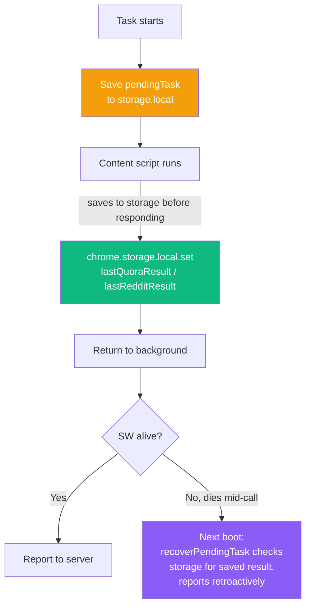

<div align="center">

# ⚙️ Extension — Background Service Worker

**`extension/background.js` — ~1,724 lines of orchestration**


</div>

---

## 🎬 Three Alarms Drive Everything



All three are `chrome.alarms.create()` — MV3 replacement for `setInterval` since service workers are short-lived.

---

## 🧠 State Management

### In-memory (per service-worker lifetime)

| Variable | Purpose |
|---|---|
| `isProcessing` | Lock for `processTasks()` to avoid concurrent runs. Safety valve auto-releases after 210 s. |
| `isProcessingSince` | Timestamp for the safety valve. |
| `isScraping` | Lock for `scrapeOnePlatform()`. |
| `extensionTabs` (Set) | Tabs the extension opened, so they can be force-closed after timeout. |
| `scrapeWindowId`, `scrapeWindowLock` | ID of the **persistent minimized popup window** used for background scraping (workaround for Chrome throttling unfocused tabs). |
| `serverPlatformLimits` | Per-platform comment limits from server, synced each task cycle. |
| `processedTasks` (Set) + `processedTasksDate` | Dedup cache; reset daily. |

### `chrome.storage.local` (persistent)

| Key | Shape |
|---|---|
| `dailyCounters` | `{ date, platforms: { [p]: { comments, likes } }, lastCommentAt }` — reset at midnight local time |
| `pendingTask` | `{ id, action, platform, url, startedAt }` — recovery hook if SW dies mid-task |
| `lastQuoraResult` | `{ success, url, verifyMethod, timestamp }` — saved by content script before SW death |
| `lastRedditResult` | Same pattern for Reddit |
| `reviewQueue` | Posts awaiting manual review (auto-post off mode) |

### `chrome.storage.sync` (persistent, synced across devices)

| Key | Purpose |
|---|---|
| `apiKey` | User's extension API key (`gm_...`) |
| `serverUrl` | Default `http://88.222.214.19:3005` |
| `autoPost` | Master toggle (bool) |

---

## 🔍 `scrapeOnePlatform()` — Rotation Orchestrator



### Per-platform scraping specifics

| Platform | Scrape strategy |
|---|---|
| **Twitter** | Opens `https://x.com/search?q={keyword}&src=typed_query&f=live` |
| **Reddit** | Joins 1 random subreddit first, then scrapes home feed (shows posts from ALL joined communities) |
| **Facebook** | Up to 3 groups × 2 keywords per cycle → `/groups/{gid}/search/?q={keyword}`. New: **global anchor sweep** fallback if per-item scan finds 0 posts |
| **Quora** | `/search?q={keyword}&type=question` |
| **YouTube** | `/results?search_query={keyword}` |
| **Pinterest** | `/search/pins?q={keyword}` |
| **Skool** | **Every configured community per cycle**; auto-joins via `JOIN_COMMUNITY` message |

---

## 💬 `processTasks()` — Task Execution Loop



### Cooldown math

```js
activeMinutes = (cronEndHour - cronStartHour) * 60
remainingPosts = dailyLimit - commentsToday
targetGap = activeMinutes / remainingPosts
actualGap = targetGap * (0.7 + Math.random() * 0.6)  // 70-130% jitter
```

Default with 10h active × 10 posts = 60 min gap. Jitter gives 42–78 min spacing.

---

## ✅ `verifyQuoraOnStats()` — Answer Verification

**New in v1.0.23.** After a successful Quora comment, confirms the answer is actually published by matching it on `https://www.quora.com/stats`.



Returns `{ verified, method, url }` which the caller attaches to the task result as `verifiedAnswerUrl` and `verifyMethod`.

---

## 🪟 Tab & Window Management

### Persistent minimized scrape window

> [!IMPORTANT]
> Chrome throttles `setTimeout`, animations, and DOM polling in unfocused tabs. To scrape in the background without slowing down, the extension keeps a **dedicated minimized popup window** and creates its tabs there.



### `createBackgroundTab(url)`
- Creates tab in scrape window, marks `autoDiscardable: false`
- Cleans orphaned `about:blank` tabs in the window
- Returns tab handle

### `cleanupStaleTabs()`
- Runs every 1 min
- Removes tabs that don't respond to a ping within 60 s (catches tabs where the content script died)

### `waitForTabLoad(tabId)`
- Listens to `chrome.tabs.onUpdated` until `status === 'complete'`
- Fallback timeout 30 s
- Returns

---

## 📨 Message Types (dispatcher)

`background.js` handles these `chrome.runtime.onMessage` types:

| Type | From | Purpose |
|---|---|---|
| `FORCE_POLL` | popup | Trigger `processTasks()` immediately |
| `FORCE_SCRAPE` | popup | Trigger `scrapeOnePlatform()` immediately |
| `EXECUTE_DASHBOARD_TASK` | autopost.js | Fetch task details for dashboard-approve path |
| `RELAY_EXECUTE_TASK` | autopost.js | Relay `EXECUTE_TASK` to platform content script in same tab |
| `REPORT_TASK_RESULT` | autopost.js | Report dashboard-approve outcome to server |
| `JOIN_SUBREDDIT` | reddit.js | Request subreddit join |
| `JOIN_GROUP` | facebook.js | Request group join |
| `JOIN_COMMUNITY` | skool.js | Request community join |

---

## 🚨 Error Recovery

### Service-worker death during a task



`recoverPendingTask()` runs on `onStartup` and `onInstalled` — if `pendingTask` exists and matches a stored result, it reports to the server even though the original SW died.

---

## ⏱️ Timeouts

| Operation | Timeout |
|---|---|
| Task execute (YouTube) | **180 s** |
| Task execute (other platforms) | **120 s** |
| Sendmessage ACK | **170 s** |
| Dashboard-approve relay (YouTube) | **170 s** |
| Dashboard-approve relay (others) | **90 s** |
| waitForTabLoad | **30 s** |
| cleanupStaleTabs ping | **60 s** |
| forceClose scrape tab | **45 s** |
| Quora `/stats` verify tab | **30 s** |

---

<div align="center">

**← [Overview](./overview.md)** · **[Back to index](../README.md)** · **Next: [Content Scripts](./content-scripts.md)** →

</div>
