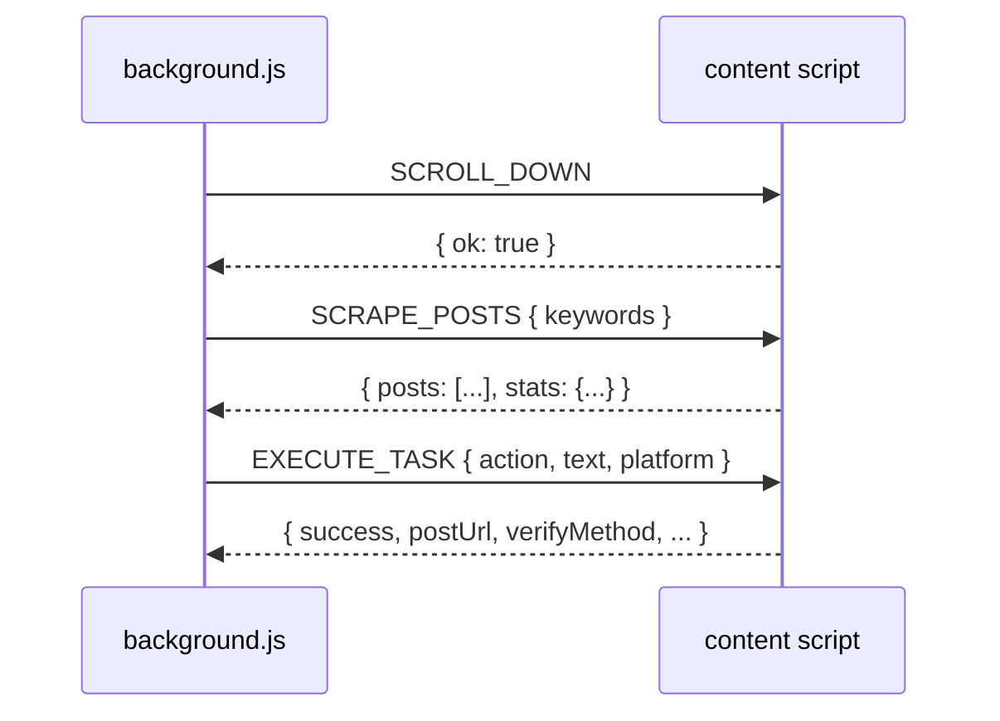
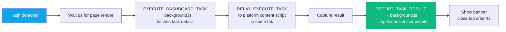
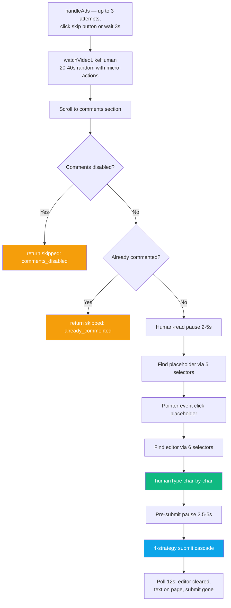
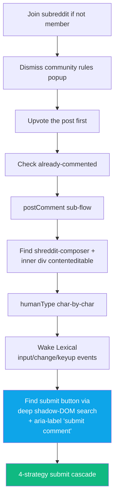
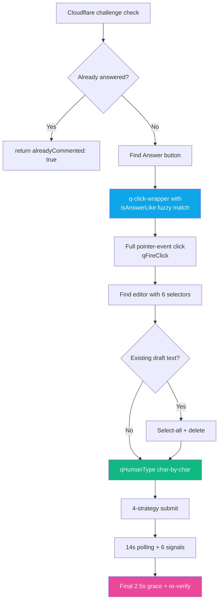
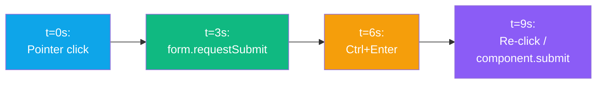

<div align="center">

# 🕸️ Extension — Content Scripts

**Per-platform DOM automation scripts**


</div>

---

## 📜 Script Inventory

| Script | URL match | Lines | Exports |
|---|---|---:|---|
| `autopost.js` | All matched hosts | 122 | Dashboard-approve relay |
| `twitter.js` | x.com, twitter.com | 276 | `postReply`, `likePost`, `scrapePosts` |
| `youtube.js` | youtube.com | 592 | `postComment`, `likeVideo`, `scrapePosts` |
| `facebook.js` | facebook.com | 622 | `postComment`, `likePost`, `joinGroup`, `scrapePosts` |
| `reddit.js` | reddit.com, old.reddit.com | 871 | `commentWithUpvote`, `upvotePost`, `joinSubreddit`, `scrapePosts` |
| `quora.js` | quora.com | 521 | `postAnswer`, `upvoteAnswer`, `scrapePosts` |
| `pinterest.js` | pinterest.com | 246 | `postComment`, `likePin`, `scrapePosts` |
| `skool.js` | skool.com | 577 | `postComment`, `likePost`, `joinCommunity`, `scrapePosts` |

---

## 🤝 Common Message Contract

Every platform script listens for these `chrome.runtime.onMessage` types:



---

## 🔄 `autopost.js` — Dashboard Approve Relay

Shared across every platform. Detects `#gm_task=<id>` in URL hash or query, then:



**Platform-aware timeout:** 170 s for YouTube, 90 s for all others.

**Propagates `postUrl`** — if the platform content script captured a specific post URL, it's sent back so the dashboard log shows the actual post, not the group/feed URL.

---

## 🐦 `twitter.js`

### `postReply(text)`
1. Dismiss modals (Sign-up, Log-in, notifications pop-ups)
2. Check already-commented by scanning reply chain for own handle
3. Find reply box: `[data-testid="tweetTextarea_0"]`
4. **humanType char-by-char** via `execCommand('insertText')`
5. Find post button: try testids in priority: `tweetButtonInline`, `tweetButton`, `tweetButton-Reply`, `replyButton`, etc. Then fallback to text match "Post" / "Reply" within composer.
6. If no button → Ctrl+Enter on reply box
7. Verify: reply box cleared OR snippet found on page

### `likePost()`
Click `[data-testid="like"]` → verify `[data-testid="unlike"]` present.

### `scrapePosts(keywords)`
Scrapes `article[data-testid="tweet"]` cards — title, author, URL.

---

## ▶️ `youtube.js`

### `postComment(text)`



**Ad handling:**
```js
// Detect: .ad-showing, .ytp-ad-player-overlay, .ytp-ad-text
// Skip: .ytp-ad-skip-button, .ytp-ad-skip-button-modern, text "Skip Ad"
// Non-skippable: wait 3s and re-check
```

**DOM-forensic snapshot on failure** (new in v1.0.22): when editor not found, error includes JSON snapshot of which `ytd-*` elements exist, contenteditable count, role=textbox count, scroll position, so next fix has exact DOM info instead of guesses.

### `likeVideo()`
Find like button via 6 selectors, check `aria-pressed="true"` for already-liked, click, verify.

---

## 🔵 `facebook.js`

### `getSpecificPostUrl()` (v1.0.10 key helper)
Extracts the actual post permalink from the current page. 3 strategies:
1. If browser URL is already a `/posts/` or `/permalink/` URL → use it
2. Scan timestamp `<abbr>`/`<time>` inside post anchors (canonical permalink wrapper)
3. First `/posts/`, `/permalink/`, or `/share/p/` anchor on page

**Strips** tracking params (`__cft__`, `__tn__`) — they leak session info and bloat URLs. Preserves `comment_id=` when present.

### `postComment(text)`
1. Check group membership (if on group page)
2. Check already-commented by own-name match
3. Find comment editor (contenteditable with aria-label "comment", Lexical, plaintext-only, or any contenteditable)
4. Force-mount editor by clicking "Write a comment" placeholder if not yet visible
5. humanType
6. Press Enter to submit
7. Verify: editor cleared OR snippet on page
8. Return `postUrl: getSpecificPostUrl()` for log

### `scrapePosts(keywords)`
Walks `[role="article"]` + other wrappers. **Global anchor sweep fallback** (v1.0.12) — if 0 posts found, scan ALL `<a>` tags across page for post-permalink pattern and walk up to nearest post container.

---

## 🔴 `reddit.js`

### `commentWithUpvote(text)` (called by `action: 'comment'`)



### 4-strategy submit cascade (v1.0.16)

| Time | Strategy | Why |
|:-:|---|---|
| **t=0s** | Pointer-event click (pointerover → pointerenter → mouseover → pointerdown → mousedown → focus → pointerup → mouseup → click → native click) | Reddit's React wires handlers to pointer events, not click |
| **t=2s** | `form.requestSubmit()` | W3C-spec way to submit; triggers `onSubmit` even if button click didn't fire |
| **t=5s** | Ctrl/Cmd+Enter on editor + document | No DOM dependency; Reddit's own keyboard shortcut |
| **t=8s** | `shreddit-composer.submit()` + `dispatchEvent('submit')` | Web-component method call |
| **t=11s** | Re-click submit | Covers race conditions |

**Plus:** 15 s polling for 6 signals (URL change, editor removed, editor cleared, submit gone, text on page, snippet in `shreddit-comment` shadow DOM).

**Rejection toast detection:** scans page for Reddit's specific rejection phrases — "doing that too much" → `rate_limited`, "something went wrong" → `reddit_error`, "submission has been filtered" → `spam_filter`, "must have at least" → `karma_gate`.

### `upvotePost()`

Similar multi-strategy:
1. Deep shadow-DOM walk for `shreddit-vote-button`
2. Pointer-event click
3. Inner shadow-root button retry at t=2s
4. 'a' keyboard shortcut at t=4s
5. 6 s state-flip polling

---

## 🟥 `quora.js`

### `postAnswer(text)`



### `alreadyAnsweredByMe(snippet)`
3 detection strategies:
1. Our snippet already visible on page
2. Our profile name appears in an answer author link
3. "Edit your answer" / "Your answer" button is visible

### `/stats` verification (handled by background)
After success, background opens `/stats` → reader script scans answer rows → matches by snippet (80/60/40/25 char tolerance) or recency → returns canonical URL.

### `upvoteAnswer()`
1. Find upvote button via `aria-label` or text regex
2. Check `isAlreadyUpvotedQuora`
3. Real mouse events (pointer sequence)
4. 6 s polling for state change

---

## 📌 `pinterest.js`

### `postComment(text)`
1. Find comment trigger (small contenteditable div, height < 50 px) or "Add a comment" button
2. Click to open composer
3. Find contenteditable input
4. Paste via `ClipboardEvent` (Pinterest accepts paste events reliably)
5. Click submit button

### `likePin()`
Click heart icon, verify filled state.

### `scrapePosts(keywords)`
Walks pin cards, extracts pin title, author, URL.

---

## 🟣 `skool.js`

### `detectSkoolRestriction()` (v1.0.13 key helper)
Scans page text for restriction phrases **before** trying to post:

```js
const checks = [
  ['you are not a member',          'not_member'],
  ['join this community to',        'not_member'],
  ['you can\'t comment',            'restricted'],
  ['commenting is disabled',        'comments_disabled'],
  ['you have been banned',          'banned'],
  ['pending approval',              'pending_approval'],
  ['muted in this community',       'muted'],
  // ...
];
```

Returns one of: `not_member`, `banned`, `muted`, `restricted`, `comments_disabled`, `pending_approval`, or empty.

### `postComment(text)`
1. Pre-check restriction → return `{ skipped: true, reason }` if any
2. Click "Reply" button to open editor
3. Find editor: `.tiptap.ProseMirror.skool-editor` (TipTap) or fallback selectors
4. humanType
5. Submit via keydown Enter + button click
6. Post-check restriction if editor not found

### `joinCommunity()`
Click Join button (5 text variants: "Join", "Join Community", "Join for Free", "Join Group", "Request to Join").

### `scrapePosts(keywords)`
Walks Skool post cards; returns `{ posts, stats }`.

---

## 🎨 Shared Patterns

### `humanType(el, text)` — the universal typing primitive

```js
async function humanType(el, text) {
  el.focus();
  for (const ch of text) {
    document.execCommand('insertText', false, ch);
    await sleep(30 + Math.random() * 60);         // 30-90ms per char
    if ('.!?,;:'.includes(ch)) {
      await sleep(120 + Math.random() * 220);     // extra pause after punctuation
    }
  }
}
```

**Why per-char:** Each `execCommand('insertText')` fires real `beforeinput` + `input` events that Lexical/React treat as genuine user typing, flipping the "dirty" flag and enabling the submit button. One-shot insertion often doesn't.

### Pointer-event click cascade — the universal click primitive

```js
async function fireClick(el) {
  const r = el.getBoundingClientRect();
  const opts = { bubbles: true, cancelable: true, view: window,
                 clientX: r.left + r.width/2, clientY: r.top + r.height/2,
                 button: 0, pointerId: 1, pointerType: 'mouse', isPrimary: true };
  el.dispatchEvent(new PointerEvent('pointerover', opts));
  el.dispatchEvent(new PointerEvent('pointerdown', opts));
  el.dispatchEvent(new MouseEvent('mousedown', opts));
  el.focus();
  el.dispatchEvent(new PointerEvent('pointerup', opts));
  el.dispatchEvent(new MouseEvent('mouseup', opts));
  el.dispatchEvent(new MouseEvent('click', opts));
  el.click(); // backstop
}
```

**Why:** Modern React/Vue apps prefer pointer event handlers over click. Plain `.click()` only fires the click phase.

### Multi-strategy submit cascade

Most platforms escalate through 4 independent paths so at least one succeeds:



---

<div align="center">

**← [Background](./background.md)** · **[Back to index](../README.md)** · **Next: [Scraping feature](../features/scraping.md)** →

</div>
