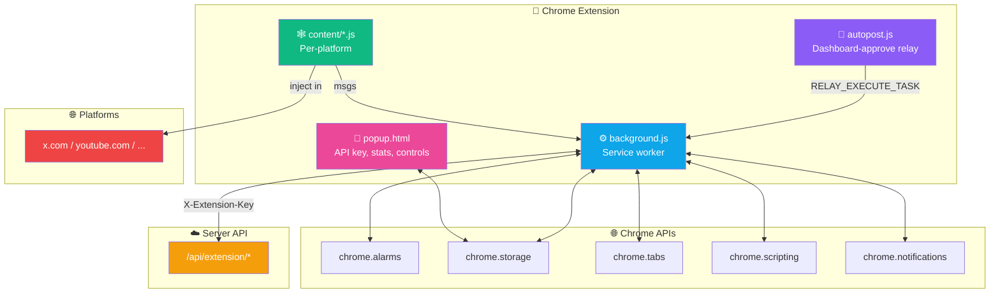
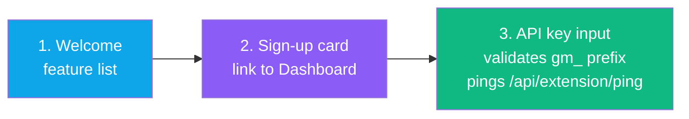
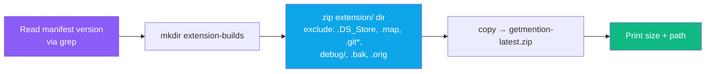

<div align="center">

# 🧩 Extension — Overview

**Manifest V3, architecture, build, popup, and utilities**


</div>

---

## 📁 File Layout

```
extension/
├── manifest.json                  MV3 manifest
├── background.js                  Service worker (~1724 lines)
├── content/
│   ├── autopost.js                Shared dashboard-approve relay (every platform)
│   ├── twitter.js                 276 lines
│   ├── youtube.js                 592 lines
│   ├── facebook.js                622 lines
│   ├── reddit.js                  871 lines
│   ├── quora.js                   521 lines
│   ├── pinterest.js               246 lines
│   └── skool.js                   577 lines
├── popup/
│   ├── popup.html                 310 lines
│   └── popup.js                   340 lines
├── utils/
│   └── api.js                     84 lines — GetMentionAPI client
├── icons/
│   ├── icon16.png, icon48.png, icon128.png
│   └── icon16.svg, icon48.svg, icon128.svg
└── debug/
    └── reddit-probe.js            DEV-ONLY, excluded from build
```

---

## 📜 Manifest Highlights

```jsonc
{
  "manifest_version": 3,
  "name": "GetMention - AI Social Engagement",
  "short_name": "GetMention",
  "version": "1.0.24",
  "description": "AI finds relevant posts across 7 social platforms...",
  "author": "GetMention by SerpBays",
  "homepage_url": "http://88.222.214.19:3005"
}
```

### 🔑 Permissions

| Permission | Why it's required |
|---|---|
| `activeTab` | Read the currently open tab on supported platforms |
| `tabs` | Open a platform tab for scraping/posting in background |
| `scripting` | Inject content scripts (used in `chrome.scripting.executeScript` for Quora `/stats` verification and fallback injection) |
| `storage` | Persist API key & preferences locally (`chrome.storage.sync`) |
| `alarms` | Trigger scrape / poll / cleanup cycles (MV3 replacement for `setInterval`) |
| `notifications` | Alert user when posts await review |

### 🌐 Host Permissions

```
https://x.com/*
https://twitter.com/*
https://www.youtube.com/*
https://www.facebook.com/*
https://www.reddit.com/*
https://old.reddit.com/*
https://www.quora.com/*
https://www.pinterest.com/*
https://in.pinterest.com/*
https://www.skool.com/*
http://88.222.214.19:3005/*
```

> [!WARNING]
> **No wildcard host permissions** — Chrome Web Store rejects `http://*/*` and `https://*/*`. All hosts are explicit.

### 🎬 Content Scripts

Each platform gets **`autopost.js` + its own script** injected at `document_idle`:

| Content script | Matches |
|---|---|
| `autopost.js` + `twitter.js` | `https://x.com/*`, `https://twitter.com/*` |
| `autopost.js` + `youtube.js` | `https://www.youtube.com/*` |
| `autopost.js` + `facebook.js` | `https://www.facebook.com/*` |
| `autopost.js` + `reddit.js` | `https://www.reddit.com/*`, `https://old.reddit.com/*` |
| `autopost.js` + `quora.js` | `https://www.quora.com/*` |
| `autopost.js` + `pinterest.js` | `https://www.pinterest.com/*`, `https://in.pinterest.com/*` |
| `autopost.js` + `skool.js` | `https://www.skool.com/*` |

### 🎨 Icons

16×16, 48×48, 128×128 PNG + SVG. Gradient indigo → cyan (`#6366f1` → `#0ea5e9`).

---

## 🏗️ Architecture Inside the Extension



---

## 🔘 Popup UI

### Onboarding (not-yet-connected)



### Main (connected)

- **Header**: logo, status badge (🟢 Active / 🔴 Offline)
- **Stats Grid** (4 cards):
  - 💬 Comments today
  - ❤️ Likes today
  - ⏳ Next timer (countdown) — or "Now" if ready
  - 🏷️ Brand mentions (`0/2`)
- **Controls**:
  - 🔘 Auto-posting toggle (writes `autoPost` to `chrome.storage.sync`)
  - 🔍 **Scrape Now** → sends `FORCE_SCRAPE` to background
  - 🔄 **Refresh** → sends `FORCE_POLL`
- **Platforms**: per-platform rows with comment count, daily limit, progress bar, like count
- **Recent activity**: fetched from `/api/logs?limit=8`, filtered by `[Extension]` tag, 5 most recent
- **Footer**: Dashboard link, version, Disconnect button

**Data refresh**: `setInterval(loadAll, 30000)` — pulls `/api/extension/settings` and `/api/extension/ping` every 30 s.

---

## 🔌 `utils/api.js` — GetMentionAPI Client

84 lines. All HTTP to the server goes through this module.

| Method | Endpoint |
|---|---|
| `fetchTasks()` | `GET /api/extension/tasks` |
| `completeTask(taskId, result)` | `POST /api/extension/tasks/complete` |
| `fetchSettings()` | `GET /api/extension/settings` |
| `reportStatus(platform, loggedIn)` | `POST /api/extension/status` |
| `submitScrapedPosts(posts)` | `POST /api/extension/scrape` |
| `fetchPingData()` | `GET /api/extension/ping` |
| `sendLog(platform, level, action, message, meta)` | `POST /api/extension/log` (fire-and-forget) |
| `getServerUrl()` | reads `chrome.storage.sync.serverUrl` |
| `getApiKey()` | reads `chrome.storage.sync.apiKey` |

**Auth**: every request carries `X-Extension-Key: <apiKey>` header.

**Default server**: `http://88.222.214.19:3005`.

---

## 🏗️ Build Script

**File:** `scripts/build-extension.sh`



**Usage:**
```bash
bash scripts/build-extension.sh
```

**Output:** `extension-builds/getmention-latest.zip` (served via `/api/download` behind Clerk auth).

> [!NOTE]
> The zip is deliberately <100 KB. Debug files (`extension/debug/`) are excluded so Chrome Web Store review doesn't flag dev-only code.

---

<div align="center">

**← [Components](../frontend/components.md)** · **[Back to index](../README.md)** · **Next: [Background SW](./background.md)** →

</div>
