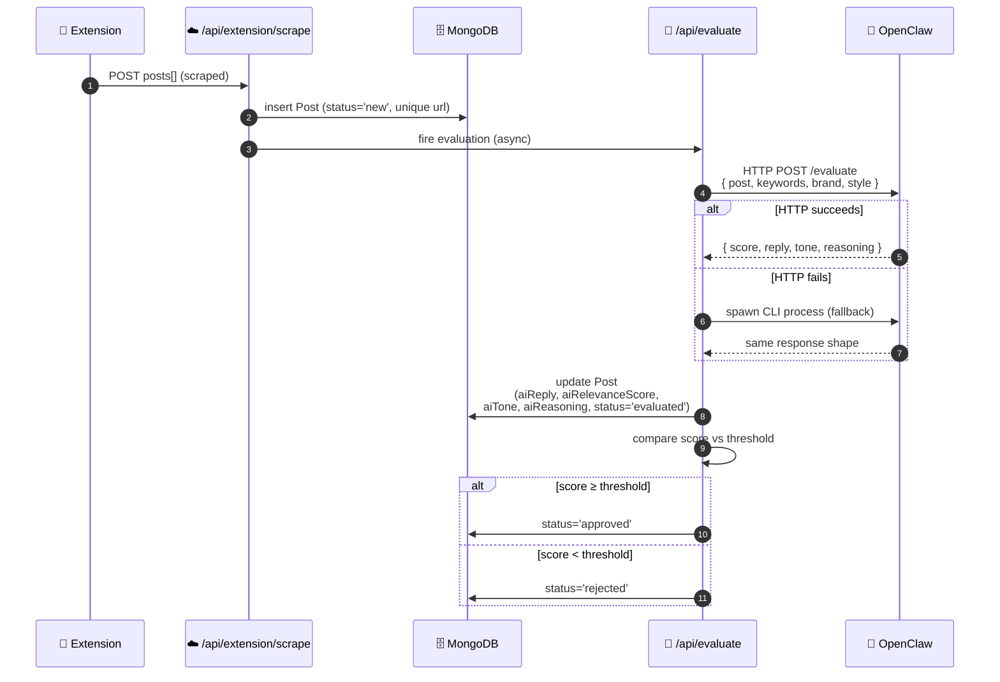
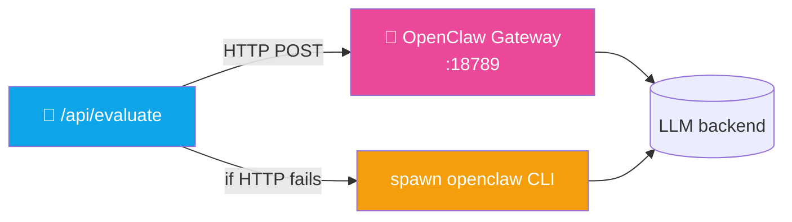

<div align="center">

# 🤖 Feature — AI Evaluation & Reply Generation

**How OpenClaw scores post relevance and drafts replies**


</div>

---

## 🌊 End-to-End Pipeline



---

## 🎯 Relevance Scoring

OpenClaw returns a **0–100 relevance score** considering:

| Signal | Weight |
|---|---|
| Direct keyword match | ~40% |
| Semantic alignment with brand description | ~25% |
| Buying-intent signals ("looking for", "recommend", "suggestions") | ~15% |
| Topic freshness | ~10% |
| Author authority / engagement | ~10% |

**Score bands:**

| Band | Behavior |
|---|---|
| **0–30** | Definitely not our audience → auto-rejected |
| **31–60** | Adjacent topic → requires manual review |
| **61–79** | Relevant → drafts a reply, awaits threshold |
| **80–100** | High-intent → drafts a reply, typically auto-approved |

Threshold is user-configurable per platform via `Settings.{platform}AutoPostThreshold` (default 70).

---

## ✍️ Reply Generation

OpenClaw picks a **reply style** from a pool randomized per post to avoid template fingerprinting:

| Style | Description | Example |
|---|---|---|
| `insight` | Adds a perspective or tip | "Have you tried X? I found it helped when I was in your situation." |
| `follow-up` | Asks a clarifying question | "Interesting take — are you seeing this across all platforms or just X?" |
| `validation` | Affirms the poster's point | "This matches what I've seen. The trick is making it compounding." |
| `experience` | Shares anecdotal context | "Went through the same thing last month — ended up using Y and it worked." |
| `disagree` | Respectfully pushes back (rare) | "I'd actually argue the opposite — here's why it worked for me." |

### Length variation
- 30% → 1 sentence
- 50% → 2–3 sentences
- 20% → 4–5 sentences (only for long-form platforms: Reddit, Quora)

### Tone
Configured via `Settings.promptTemplate`. Default is casual-professional. Users can override per-user.

---

## 🏷️ Brand Mention Cap

> [!IMPORTANT]
> **Default: 1–2 brand mentions / day globally** (configurable via `Settings.{platform}BrandMentionRate`).
>
> The AI explicitly does **not** insert the user's brand name into low-intent replies — only when the post is a clear "looking for X" / "which tool" / "recommendation" query and the score is ≥ 80.

This is the key anti-spam safeguard: most replies are pure natural engagement (insight / validation / experience) without any brand reference.

---

## 🔧 OpenClaw Service Architecture



Implementation: `src/lib/openclaw.ts`

### HTTP gateway (primary)
- Endpoint: `http://${OPENCLAW_HOST}:${OPENCLAW_PORT}/evaluate`
- Auth: `Authorization: Bearer ${OPENCLAW_GATEWAY_TOKEN}` header
- Timeout: 30 s
- Returns JSON

### CLI fallback
- Invoked via Node `child_process.spawn`
- Max concurrent: `MAX_OPENCLAW_CLI` env (default 5) via semaphore
- Slower (~10 × latency) but more robust — survives gateway outages

---

## 📝 OpenClaw Request Shape

```ts
{
  post: {
    url: string,
    platform: string,
    author: string,
    content: string,
  },
  brand: {
    name: string,           // Settings.companyName
    description: string,    // Settings.companyDescription
  },
  keywords: string[],       // Settings.{platform}Keywords
  promptTemplate: string,   // Settings.promptTemplate
  replyStyle: 'auto',       // or a specific style to force
  maxLength: 280,           // platform-aware
}
```

## 📥 OpenClaw Response Shape

```ts
{
  relevant: boolean,              // true if score >= 50
  score: number,                  // 0-100
  suggestedReply: string,
  tone: 'casual' | 'professional' | 'enthusiastic' | ...,
  reasoning: string,              // short explanation, stored for UI
  includesBrandMention: boolean,  // so feature-gate can cap
}
```

---

## 📊 Evaluation Metrics (stored on Post)

| Field | From |
|---|---|
| `aiReply` | `suggestedReply` |
| `aiRelevanceScore` | `score` |
| `aiTone` | `tone` |
| `aiReasoning` | `reasoning` |
| `keywordsMatched` | server-side exact-match check against user keywords |
| `evaluatedAt` | timestamp |
| `evaluationAttempts` | incremented on retry (max 3) |

---

## 🔄 Re-evaluation

A post is re-evaluated when:
- Original evaluation failed (OpenClaw error) AND `evaluationAttempts < 3`
- User manually clicks **Re-evaluate** in `/dashboard/review` (calls `POST /api/evaluate` with `force: true`)

---

## 🧪 Testing Without OpenClaw

If OpenClaw isn't reachable and you still want to develop, set a mock in `.env.local`:

```bash
OPENCLAW_MOCK=true
```

The lib will return a canned response for every post — useful for testing the scraping / posting pipeline without burning real AI calls.

(Not yet implemented as of 2026-04-14 — feature request if needed.)

---

## 🛡️ Safety Layers (in order)

```mermaid
flowchart LR
    A[Scraped post] --> B[Quality check<br/>contentSafety.ts]
    B --> C[Duplicate check<br/>unique url index]
    C --> D[AI eval<br/>score 0-100]
    D --> E[Threshold check<br/>per-platform]
    E --> F[Comment validation<br/>validateComment.ts]
    F --> G[Plan limit check<br/>featureGate.ts]
    G --> H[Brand mention cap<br/>per day]
    H --> I[Rate limit check<br/>per user]
    I --> J[Cooldown check<br/>minutes since last post]
    J --> K[Approved → task queued]

    style A fill:#0ea5e9,color:#fff
    style K fill:#10b981,color:#fff
```



Each of these can veto a post. If a post reaches the queue, it's passed all 10+ safety checks.

---

## 📚 Related Files

| File | Role |
|---|---|
| `src/lib/openclaw.ts` | HTTP + CLI client |
| `src/app/api/evaluate/route.ts` | Evaluation endpoint |
| `src/lib/contentSafety.ts` | Spam/quality pre-filter |
| `src/lib/validateComment.ts` | Comment-is-not-garbage check |
| `src/lib/featureGate.ts` | Plan-based limit enforcement |

---

<div align="center">

**← [Engagement](./engagement.md)** · **[Back to index](../README.md)** · **Next: [Scraping](./scraping.md)** →

</div>
