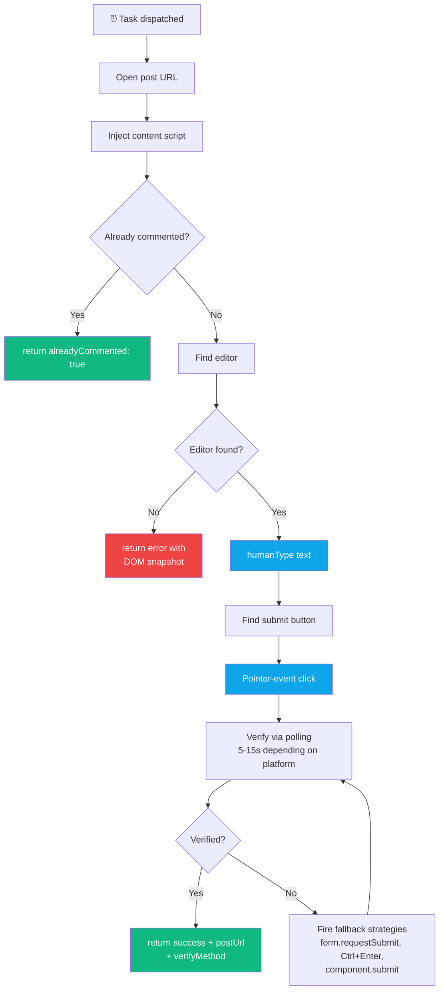
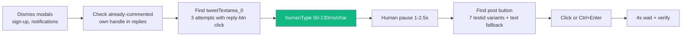
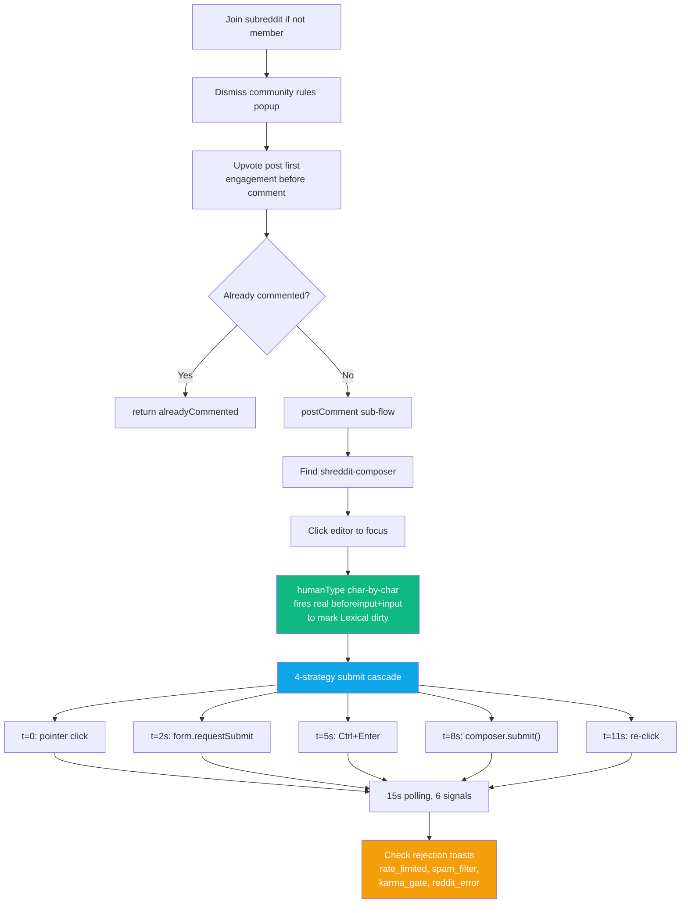
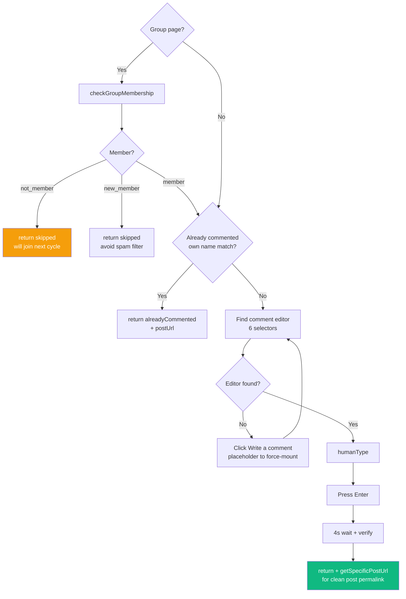
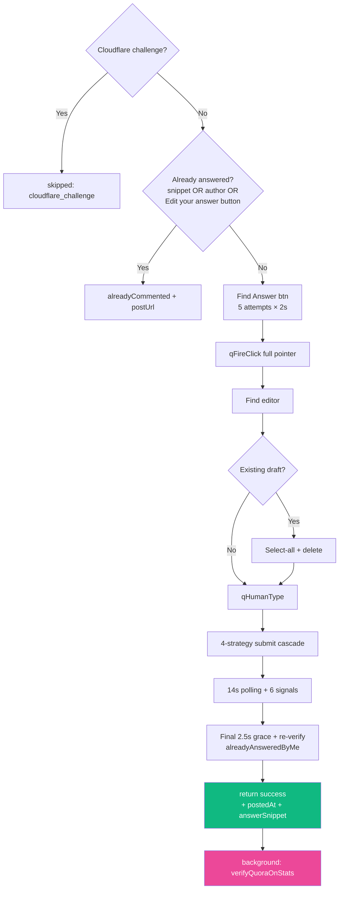
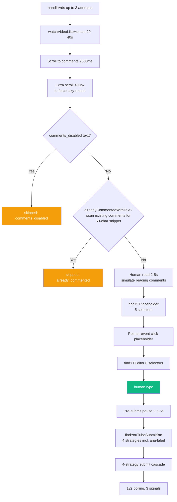
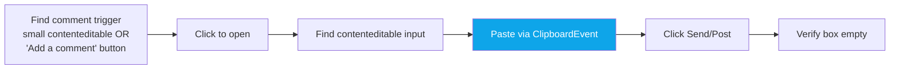
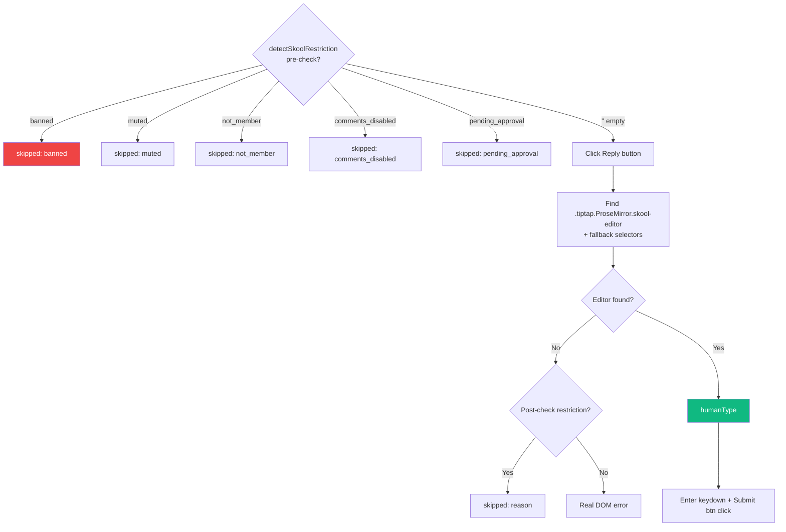

<div align="center">

# 💬 Feature — Commenting

**Per-platform comment posting flow**


</div>

---

## 🌊 Universal Flow



---

## 📋 Per-platform Comparison

| Platform | Editor selector | Submit detection | Verification signals | Fallbacks |
|---|---|---|---|---|
| 🐦 **Twitter** | `[data-testid="tweetTextarea_0"]` | `[data-testid="tweetButtonInline"]` + 6 testid variants | box cleared OR snippet on page | Ctrl+Enter on box |
| 🔴 **Reddit** | `shreddit-composer > div[contenteditable]` (Lexical) | aria-label `"Submit comment"`, deep shadow DOM walk | 6-signal 15 s polling | `form.requestSubmit()` → Ctrl+Enter → composer.submit() |
| 🔵 **Facebook** | `contenteditable="true"` with "comment" aria-label; Lexical or plaintext-only fallback | N/A — press Enter on editor | editor cleared OR snippet on page | click placeholder re-mount, force-mount via fake input |
| 🟥 **Quora** | `div.doc[contenteditable]` + 5 fallback selectors | `findButton(['Post', 'Submit', 'Add Answer'])` | 6-signal 14 s polling + **2.5 s grace + /stats verification** | requestSubmit → Ctrl+Enter → re-click |
| ▶️ **YouTube** | `#contenteditable-root` + 5 fallback selectors | `#submit-button button[aria-label*="omment"]` + 3 fallbacks | 3-signal 12 s polling | requestSubmit → Ctrl+Enter → re-click |
| 📌 **Pinterest** | `[contenteditable="true"][role="textbox"]` | button with text "Send" / "Post" | box empty after click | Paste event + Enter |
| 🟣 **Skool** | `.tiptap.ProseMirror.skool-editor` (TipTap) | Enter keydown or button | box empty | restriction check + paste |

---

## 🎬 Platform-Specific Flows

### 🐦 Twitter — `postReply()`



---

### 🔴 Reddit — `commentWithUpvote()`



**Rejection phrases scanned:**
| Phrase | Returned reason |
|---|---|
| "doing that too much" | `rate_limited` |
| "try again in" | `rate_limited` |
| "please slow down" | `rate_limited` |
| "something went wrong" | `reddit_error` |
| "submission has been filtered" | `spam_filter` |
| "removed by reddit" | `spam_filter` |
| "must have at least" | `karma_gate` |
| "requires you to have" | `karma_gate` |

---

### 🔵 Facebook — `postComment()`



**`getSpecificPostUrl()`** returns the post permalink (not the group URL) so dashboard "View reply" points to the actual comment.

---

### 🟥 Quora — `postAnswer()`



Then in background: opens `/stats` in bg tab, matches by snippet (80 → 60 → 40 → 25 char prefixes), attaches `verifiedAnswerUrl`.

---

### ▶️ YouTube — `postComment()`



**DOM-forensic snapshot** on placeholder/editor not found — JSON of existing `ytd-*` elements, contenteditable count, scrollY etc.

---

### 📌 Pinterest — `postComment()`



Pinterest's contenteditable accepts `ClipboardEvent` paste reliably — no need for per-char typing.

---

### 🟣 Skool — `postComment()`



---

## 🕵️ Verification Signals (Common)

After clicking submit, content scripts poll for any of these signals:

| Signal | What it means |
|---|---|
| `url_changed` | Page redirected to comment permalink (strongest) |
| `editor_removed` | Composer DOM element vanished (modal closed) |
| `editor_cleared` | Text was cleared from editor |
| `submit_gone` | Submit button vanished or `disabled` |
| `text_on_page` | Our snippet is now visible in the post's comment section |
| `text_in_comment` | Snippet appears in a `shreddit-comment` shadow DOM (Reddit-specific) |

For Quora specifically, after all 6 signals check, there's a **final 2.5 s grace period** + `alreadyAnsweredByMe()` re-check, which catches false-negatives where the answer posted but Quora's render lagged.

---

## 📜 Log Output Examples

### Success
```
Commented on reddit (3/25 today) — https://reddit.com/r/GuestPost/comments/.../#comment [verified: editor_cleared]
Commented on quora (5/15 today) — https://quora.com/... [verified: text_on_page] [✓ verified on Quora /stats: snippet_match_60]
Liked on twitter (7/10 today) — https://x.com/user/status/... [verified: unlike_btn_visible]
```

### Skipped
```
Skipped comment on skool (banned) — https://skool.com/theskoolhub/post/... | Skool community restriction: banned — comment composer is hidden by Skool
Skipped comment on youtube (comments_disabled) — https://youtube.com/watch?v=...
Skipped comment on reddit (rate_limited) — https://reddit.com/r/... | Reddit rejected comment: rate limited
Already commentedd on quora — https://quora.com/... [verified: author_match]
```

### Failed
```
Failed comment on reddit — https://reddit.com/r/... | Comment not confirmed after 15s — tried strategies: click,requestSubmit,ctrlEnter,componentSubmit
Failed comment on youtube — https://youtube.com/watch?v=... | YouTube editor not found after placeholder click — DOM: {"placeholder_still_exists":true,"contenteditable_count":0,...}
```

---

<div align="center">

**← [Scraping](./scraping.md)** · **[Back to index](../README.md)** · **Next: [Engagement](./engagement.md)** →

</div>
