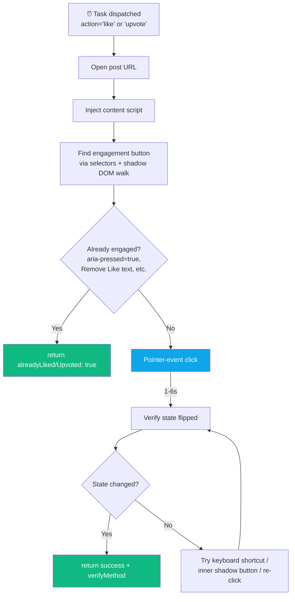
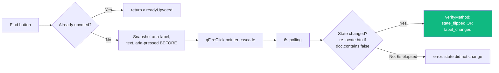

<div align="center">

# ❤️ Feature — Engagement

**Likes, upvotes, reactions, and follows across platforms**


</div>

---

## 🗺️ Engagement Matrix

| Platform | Primary engagement | Selector pattern | Verification |
|---|---|---|---|
| 🐦 Twitter | ❤️ Like | `[data-testid="like"]` | `[data-testid="unlike"]` appears |
| 🔴 Reddit | ⬆️ Upvote | `shreddit-vote-button` (shadow DOM) | `aria-pressed="true"` or `svg[icon-name="upvote-fill"]` |
| 🔵 Facebook | 👍 Reaction | `[aria-label="Like"]` or reaction bar | `[aria-label="Remove Like"]` or `[aria-label*="Unlike"]` |
| 🟥 Quora | ⬆️ Upvote | `button[aria-label*="upvote"]` (not `downvote`) | aria-label or aria-pressed flip |
| ▶️ YouTube | 👍 Like | `button[aria-label*="like this video"]` | `aria-pressed="true"` |
| 📌 Pinterest | ❤️ Heart | Heart icon button | Filled state change |
| 🟣 Skool | 👍 Like | Skool like button | aria-pressed flip |

---

## 🎬 Universal Like/Upvote Flow



---

## 🐦 Twitter — `likePost()`

**Selector:** `[data-testid="like"]`

**Already-liked check:** `[data-testid="unlike"]` present → returns `{ success: true, alreadyLiked: true, postUrl }`.

**Flow:**
```js
likeBtn.click()
await sleep(2000)
const liked = !!document.querySelector('[data-testid="unlike"]')
return { success: liked, verified: liked, verifyMethod: liked ? 'unlike_btn_visible' : '', postUrl }
```

Simple and reliable — Twitter's testid convention has been stable for 3+ years.

---

## 🔴 Reddit — `upvotePost()`

**Most complex engagement flow.** Reddit's upvote button lives in `shreddit-vote-button` shadow DOM and ignores plain `.click()`.

```mermaid
flowchart TB
    OR{old.reddit.com?} -->|Yes| OU[Click .arrow.up, verify .arrow.upmod]
    OR -->|No| DF[deepFindUpvote<br/>walks ALL shadow roots]
    DF --> C[Collect candidates:<br/>button[aria-label*=upvote],<br/>shreddit-vote-button,<br/>button[upvote],<br/>[data-action=upvote]]
    C --> PICK[Pick first, filter isUpvoteCandidate<br/>rejects downvote]
    PICK --> AL{isAlreadyUpvoted?<br/>aria-pressed=true OR<br/>svg[icon-name=upvote-fill]}
    AL -->|Yes| AD[return alreadyUpvoted]
    AL -->|No| FC[fireVoteClick<br/>full pointer+mouse+click sequence]
    FC --> P[6s polling with escalation]
    P --> S1[t=2s: inner shadow-root button retry]
    P --> S2[t=4s: 'a' keyboard shortcut<br/>on document.body]

    style DF fill:#0ea5e9,color:#fff
    style FC fill:#ec4899,color:#fff
    style AD fill:#10b981,color:#fff
```

**`deepFindUpvote()`** recursively walks every `element.shadowRoot` in the DOM tree — Reddit's web components hide the real button inside closed shadow-DOM, out of reach of `document.querySelector`.

**`fireVoteClick(el)`** — full event cascade:
```
pointerover → pointerenter → mouseover → pointerdown → mousedown → focus →
pointerup → mouseup → click → native click()
```

**Verification signals:**
- `state_flipped` — `isAlreadyUpvoted(current)` now returns true
- `svg_filled` — `svg[icon-name="upvote-fill"]` appeared anywhere
- Keyboard fallback (`'a'` key on post) at 4 s

---

## 🔵 Facebook — `likePost()`

**Selectors** (try in order):
```
div[aria-label="Like"][role="button"]
span[aria-label="Like"][role="button"]
[aria-label="Like"]
[data-testid="like_button"]
[role="button"] with aria-label === "Like"  (fallback)
```

**Already-liked:** `[aria-label="Remove Like"]` or `[aria-label*="Unlike"]` or `[aria-pressed="true"][aria-label*="like"]`.

**Reaction bar fallback:** If no dedicated Like button is found, finds `[aria-label*="reaction"]`, takes its first child `[role="button"]`, clicks it.

**Verification:** same aria-label flip check after 2 s wait.

**Returns postUrl** via `getSpecificPostUrl()` so log links to the actual post.

---

## 🟥 Quora — `upvoteAnswer()`

**Selectors:**
- `button[aria-label="upvote"]` or `"upvoted"` (primary)
- `button[aria-label*="upvote this"]` / `"remove upvote"` / `"undo upvote"` (all variants)
- Button text regex: `/^(Upvote|Upvoted)(\s*·?\s*\d+)?$/i`
- Shadow DOM walk (rare on Quora)

**Already-upvoted check (`isAlreadyUpvotedQuora`):**
- `aria-pressed === 'true'`
- aria-label starts with "upvoted"
- Contains "remove upvote" / "undo upvote"
- Text is "Upvoted" exactly

**Flow:**


---

## ▶️ YouTube — `likeVideo()`

**Selectors** (6 fallbacks):
```
button[aria-label*="like this video" i]:not([aria-label*="dislike"])
ytd-toggle-button-renderer button[aria-label*="like" i]:not([aria-label*="dislike"])
#top-level-buttons-computed ytd-toggle-button-renderer:first-child button
like-button-view-model button
#segmented-like-button button
ytd-menu-renderer button[aria-label*="like" i]:not([aria-label*="dislike"])
```

**Already-liked:** `aria-pressed === 'true'`.

**Flow:**
1. `handleAds()` — skip any ads currently playing
2. Scroll to top (like button is near title, above fold)
3. Click
4. Verify `aria-pressed` flipped to `true`

**Note:** No video-watching required for likes (just comments). Was causing 200 s timeouts before v1.0.4 — separated.

---

## 📌 Pinterest — `likePin()`

**Selector:** Heart icon button, typically `button[aria-label*="react" i]` or `[data-test-id*="react"]`.

**Already-liked:** Filled heart SVG state.

**Flow:** Click → verify heart filled.

---

## 🟣 Skool — `likePost()`

Similar to Facebook — scan reaction bar for Like button, click, verify aria-pressed flip. Includes `detectSkoolRestriction()` pre-check.

---

## 🎁 Other Engagement Types (Twitter-only)

Via Twitter content script:

| Action | Selector | Notes |
|---|---|---|
| Retweet | `[data-testid="retweet"]` → confirm modal → `[data-testid="retweetConfirm"]` | Check `[data-testid="unretweet"]` for already-done |
| Bookmark | `[data-testid="bookmark"]` | Check `[data-testid="removeBookmark"]` |
| Follow | `[data-testid*="follow"][data-testid*="-follow"]` | Twitter data-testids vary by logged-in user |

These flags are persisted on the Post model: `retweetedByBot`, `bookmarkedByBot`, `sharedByBot`, and `TwitterFollowed` collection tracks follow events.

---

## 🧮 Daily Engagement Counters

`background.js` maintains `dailyCounters` in `chrome.storage.local`:

```js
{
  date: "2026-04-14",
  platforms: {
    twitter:   { comments: 5, likes: 12 },
    reddit:    { comments: 3, likes: 7 },
    facebook:  { comments: 2, likes: 3 },
    quora:     { comments: 4, likes: 0 },
    youtube:   { comments: 1, likes: 5 },
    pinterest: { comments: 0, likes: 2 },
    skool:     { comments: 0, likes: 0 },
  },
  lastCommentAt: 1744610400000
}
```

Reset at midnight local time. Surfaces in the extension popup as per-platform progress bars.

**Caps** come from `serverPlatformLimits` (sent by server each task cycle) — default 10 per platform per day.

---

## 📜 Log Output

**Success:**
```
Liked on twitter (7/10 today) — https://x.com/user/status/... [verified: unlike_btn_visible]
Upvoted on reddit (3/10 today) — https://reddit.com/r/... [verified: state_flipped]
Upvoted on quora (5/10 today) — https://quora.com/... [verified: label_changed]
Liked on youtube (1/10 today) — https://youtube.com/watch?v=... [verified: aria_pressed]
Already liked on facebook — https://facebook.com/groups/.../posts/... [verified: remove_like_btn]
```

**Failed (warn, not error — low-risk):**
```
Failed like on twitter — https://x.com/user/status/... | Like button not found
Failed upvote on reddit — https://reddit.com/r/... | Upvote clicked but state did not flip after 6s
```

---

<div align="center">

**← [Commenting](./commenting.md)** · **[Back to index](../README.md)** · **Next: [Deployment](../operations/deployment.md)** →

</div>
