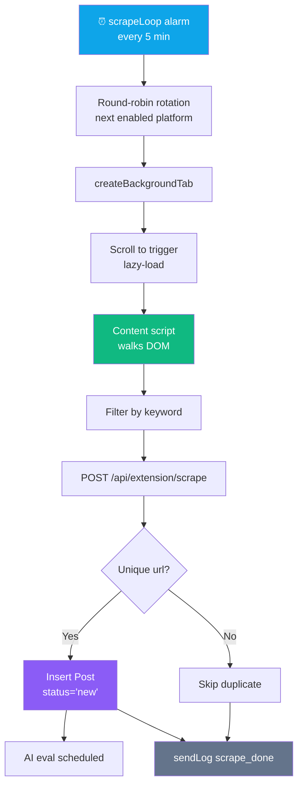
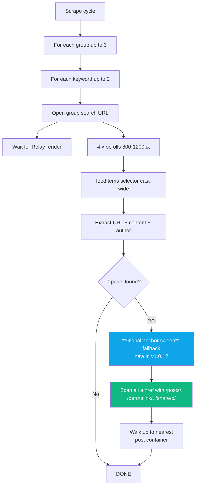
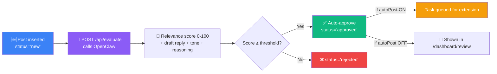

<div align="center">

# 🔍 Feature — Scraping

**How each platform discovers relevant posts**


</div>

---

## 🔄 Scraping Lifecycle



---

## 🐦 Twitter / X

**Search URL:** `https://x.com/search?q={keyword}&src=typed_query&f=live`

**Selector:** `article[data-testid="tweet"]`

**Extracted fields:**
- **URL** — from `<a>` with `/status/` in href
- **Author** — from `<div data-testid="User-Name">` first link
- **Content** — from `<div data-testid="tweetText">`
- **Timestamp** — from `<time datetime="...">`

**Platform tricks:**
- Scroll 3-4 × 1500 px to force SPA to render beyond first 5-10 tweets
- Dismiss any "Sign up" / "Log in" modal that appears during scroll
- Filter out promoted tweets (detected by "Ad" label)

---

## 🔴 Reddit

**Strategy:** Two-phase scrape.

### Phase 1: Join a subreddit (once per cycle)

```mermaid
flowchart LR
    KW[Random keyword] --> SR[Pick 1 random subreddit<br/>from configured list]
    SR --> JOIN[Open /r/{name}]
    JOIN --> J{Join button present?}
    J -->|Yes| CLK[Click Join]
    J -->|No| AJ[Already joined]
    CLK & AJ --> DONE
    style DONE fill:#10b981,color:#fff
```

### Phase 2: Scrape home feed

After joining, the home feed (`https://www.reddit.com/`) shows posts from **all** joined subreddits. This is more reliable than search because Reddit's search results hide posts older than ~24h.

**Selector:** `shreddit-post` (modern Reddit) or `.thing.link` (old Reddit)

**Extracted:** URL, title, author, body text (if present).

**Platform tricks:**
- Supports **both** new and old Reddit (detected via `window.location.hostname`)
- `shreddit-post` elements are inside shadow DOM — we query `document.querySelector('shreddit-post')` which surfaces the element even though its internals are shadow-rooted
- Search URL fallback for keyword scoping: `https://www.reddit.com/search/?q={keyword}&t=day`

---

## 🔵 Facebook (Groups)

**Strategy:** Loop up to 3 groups × 2 keywords per cycle.

**Search URL:** `https://www.facebook.com/groups/{groupId}/search/?q={keyword}`



**Selectors:**
```
[role="article"],
[data-pagelet*="FeedUnit"],
[data-pagelet*="GroupFeed"],
[data-pagelet*="Search"],
[data-ad-preview],
div[class*="userContentWrapper"],
a[href*="/groups/"][href*="/posts/"],
a[href*="/groups/"][href*="/permalink/"]
```

**URL cleanup** (v1.0.10): strips `__cft__`, `__tn__` tracking params; preserves `comment_id` param if present.

**Blacklisted patterns** (not posts, skipped): `/user/`, `/members/`, `/profile.php`, `/about/`, `/events/`, `/admin/`, `/settings/`, `/calendar/`, `/leaderboard/`.

---

## 🟥 Quora

**Search URL:** `https://www.quora.com/search?q={keyword}&type=question`

**Strategy:** Scrape question links; AI decides which to answer.

**Selector:** `a[href]` filtered to Quora question URLs (pattern: starts with `/` after domain, contains `/Question-Title`).

**Platform tricks:**
- On `/answer` page (for scraping unanswered questions user could contribute to), scrolls twice to load more
- **Blacklisted paths**: `/profile/`, `/topic/`, `/search`, `/answer` (unanswered page itself)
- Returns up to 20 questions per scrape

---

## ▶️ YouTube

**Search URL:** `https://www.youtube.com/results?search_query={keyword}`

**Selector:** `ytd-video-renderer`, `ytd-rich-item-renderer`, `ytd-compact-video-renderer`

**Extracted:**
- **URL** — from `#video-title` or `a#video-title-link`
- **Title** — text content
- **Author** — from `#channel-name a`

**Platform tricks:**
- Strip `&` query params — keeps only `v={id}`
- Skip Shorts (content script sets `isShort: true` if detected)
- Keyword filter: `content.includes(kw.toLowerCase())` — case-insensitive substring

---

## 📌 Pinterest

**Search URL:** `https://www.pinterest.com/search/pins?q={keyword}`

**Selector:** Pin cards with `data-test-id="pin"` or `[role="listitem"][role="link"]`

**Extracted:** Pin URL, title/description, creator.

**Platform tricks:**
- Pinterest's infinite-scroll needs 3-4 scrolls to load a batch
- Relative URLs resolved to absolute via `new URL(href, location.origin).href`

---

## 🟣 Skool

**Strategy:** Loop **every** configured community per cycle (new in v1.0.13).

```mermaid
flowchart TB
    C[Scrape cycle] --> LP[For EACH configured<br/>Skool community]
    LP --> OP[Open /{community}/]
    OP --> JC[JOIN_COMMUNITY msg<br/>auto-joins new ones]
    JC --> SC[Scroll to lazy-load]
    SC --> EX[Extract post cards]
    EX --> KM{Keyword match?}
    KM -->|Yes| KEEP[Keep post]
    KM -->|No| DROP[Drop]
    KEEP --> GAP[3-5s pause between communities]
    GAP --> LP

    style JC fill:#0ea5e9,color:#fff
    style KEEP fill:#10b981,color:#fff
```

**Selectors:** Skool uses Next.js — posts are `<div>` cards with `href^="/{community}/post/"` anchors.

**Extracted:** Post URL, title, content (truncated).

**Plus**: `detectSkoolRestriction()` runs on every scrape to log banned/muted communities — doesn't block scraping but marks with `warn` in logs so user knows to review.

---

## 🧩 Content-Script Return Contract

Every `scrapePosts(keywords)` returns:

```ts
{
  posts: Array<{
    url: string;          // unique
    content: string;      // title + body (truncated to 2000 chars)
    author: string;
    platform: string;
  }>,
  stats?: {
    items: number;         // total elements scanned
    noLinks: number;       // items without any anchor
    noUrl: number;         // items with anchors but no post permalink
    shortContent: number;  // items with <10 chars of body
    kwMiss: number;        // items that didn't match any keyword
    dupe: number;          // items already seen this cycle
    ok: number;            // items kept
    sampleHref: string;    // first anchor seen (debug)
    sweptAnchors?: number; // FB: size of global anchor sweep fallback
  }
}
```

---

## 🧠 AI Evaluation Pipeline

Once posts are submitted to `/api/extension/scrape`, each passes through:



**Thresholds** come from `Settings.{platform}AutoPostThreshold` (default 70).

---

## 📊 Scrape Log Format

Each scrape produces a log entry like:

**Success:**
```
Scraped "guest post": 15 found, 3 new, 3 evaluated
```

**Empty with diagnostics:**
```
Facebook 780247143450104 • "link building": no posts found — scanned 41 items:
  32 no-links, 9 no-url, 0 short, 0 kw-miss, 0 dupe;
  sweep:128 viaSweep:0 | sample: https://www.facebook.com/groups/...
```

**Error:**
```
Facebook scrape failed (group 732579348701497): Tab closed mid-load (timeout)
```

---

<div align="center">

**← [Content scripts](../extension/content-scripts.md)** · **[Back to index](../README.md)** · **Next: [Commenting](./commenting.md)** →

</div>
