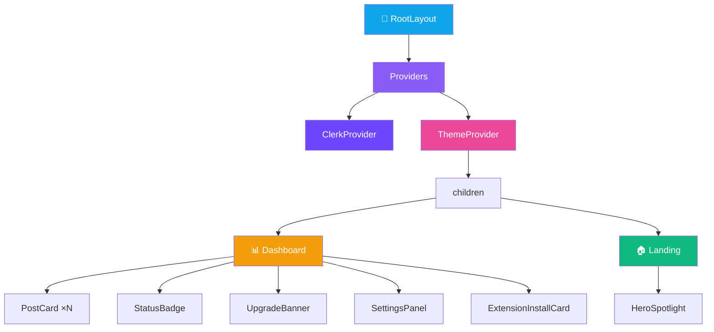
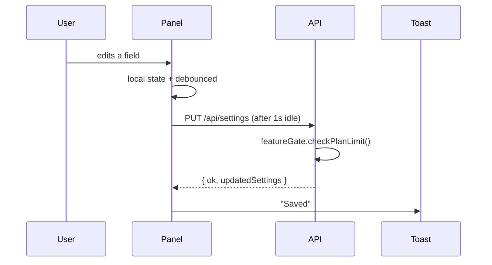

<div align="center">

# 🧱 Frontend — Components

**Reusable React components in `src/components/`**


</div>

---

## 🗂️ Component Catalog

| Component | Lines | Used on | Purpose |
|---|---:|---|---|
| **Dashboard.tsx** | 459 | `/dashboard` | Main dashboard grid — post queue with filters & stats |
| **PostCard.tsx** | 162 | `/dashboard/posts`, `/dashboard/review` | Individual post card with reply editing, approve/reject, status badge |
| **SettingsPanel.tsx** | 639 | `/dashboard/settings`, inline on `/dashboard` | Modal/inline form for all global settings |
| **ExtensionInstallCard.tsx** | 573 | `/dashboard/settings`, `/onboarding` | Prompts users to install Chrome extension + API-key setup |
| **StatusBadge.tsx** | 21 | Dashboard, logs | Status indicator (new/evaluating/approved/rejected/posted/skipped) |
| **UpgradeBanner.tsx** | 80 | Feature-limit hits | Subscription upsell banner with plan badge + CTA |
| **HeroSpotlight.tsx** | 53 | `/` (landing) | Cursor-follow radial-gradient spotlight client island |
| **ThemeProvider.tsx** | 150 | Root layout | React Context for light/dark theme toggle; persists to localStorage |
| **Providers.tsx** | 5 | Root layout | Composition wrapper (Clerk + Theme) |

---

## 🧬 Component Tree



---

## 1 · 📊 `Dashboard.tsx`

**Main dashboard grid** for `/dashboard`. Orchestrates the post queue, filters, stats, and actions.

**Key responsibilities:**
- Polls `/api/posts`, `/api/stats` on mount and at 30 s intervals
- Time filter (Today / 7d / 15d)
- Platform filter chips (7 platforms)
- Status filter (all / new / approved / posted / rejected / skipped)
- Search by keyword / author
- Renders a grid of `<PostCard />` with virtualization for >50 posts
- Inline quick-action buttons: Scrape now → `POST /api/run-cron`
- Plan-limit callout → renders `<UpgradeBanner />` when quota exceeded

---

## 2 · 💬 `PostCard.tsx`

**Individual post card** — the workhorse of the dashboard.

**Displays:**
- Platform badge (colored circle + name)
- Author handle + timestamp
- Post title/body (truncated with "Show more")
- AI relevance score gauge (0–100)
- AI reply textarea (editable)
- Status badge (via `<StatusBadge />`)
- Action buttons:
  - **Approve** → navigates to platform URL with `#gm_task=<id>` (extension auto-posts)
  - **Reject** → `PATCH /api/posts` with status='rejected'
  - **Edit reply** → updates `editedReply` field
- **View reply / View answer** link — uses `replyUrl` (or `verifiedAnswerUrl` for Quora)
- **✓ Verified badge** — shown for Quora posts with `verifiedAnswerUrl` match

---

## 3 · ⚙️ `SettingsPanel.tsx`

**Form for all user settings**. Largest component (639 lines).

**Sections:**
- Brand info (company name, description)
- Global keywords (chip input)
- Platform grid — enable/disable each of 7 platforms
- **Per-platform collapse panels**, each with:
  - Daily limit
  - Auto-post threshold (0–100 slider)
  - Cooldown minutes
  - Brand mention rate
  - Platform-specific fields (Facebook: groups, Skool: communities)
- Prompt template textarea
- Cron schedule (timezone, start/end hour, interval)
- Auto-posting pause toggle
- Extension API key section (generate / revoke / copy)

**Data flow:**


---

## 4 · 🧩 `ExtensionInstallCard.tsx`

**CTA to install the Chrome extension.**

**Flow:**
1. Show zipped extension **Download** button (hits `/api/download`)
2. Step-by-step install guide:
   - Unzip
   - Open `chrome://extensions`
   - Enable Developer Mode
   - Load unpacked
   - Paste API key into popup
3. Displays **API key** with copy-to-clipboard
4. **Generate new key** / **Revoke** buttons → `POST`/`DELETE /api/extension/api-key`
5. Status check (polls `/api/extension/ping` proxy) — once the extension connects, flips to green "✅ Connected"

---

## 5 · 🎨 `StatusBadge.tsx`

Tiny status pill. 21 lines.

```tsx
<StatusBadge status="posted" />
```

Renders a colored rounded-pill label. Colors from `globals.css` tokens:
| Status | Color |
|---|---|
| `new` | `#3b82f6` blue |
| `evaluating` | `#f59e0b` amber |
| `evaluated` | `#0ea5e9` sky |
| `approved` | `#10b981` emerald |
| `rejected` | `#ef4444` red |
| `posted` | `#6b7280` gray |
| `skipped` | `#64748b` slate |

---

## 6 · 💎 `UpgradeBanner.tsx`

Subscription upsell banner. Shown when the user hits a plan limit.

**Props:**
```ts
{
  currentPlan: 'free' | 'pro' | 'business',
  limitHit: 'keywords' | 'platforms' | 'dailyPosts' | 'feature',
  featureName?: string,
}
```

Renders with gradient background (sky-blue → indigo), plan badge, "Upgrade to Pro/Business" CTA → `/dashboard/billing`.

---

## 7 · ✨ `HeroSpotlight.tsx`

**New in v1.0.23** — cursor-follow spotlight on the landing page hero.

**Mechanics:**
- Listens to `document` `mousemove` via `requestAnimationFrame` (throttled to 60fps)
- Updates `--lp-x` / `--lp-y` CSS custom properties on a positioned div
- `pointer-events: none` — doesn't block button clicks
- Respects `prefers-reduced-motion` (disables entirely)

```tsx
<div style={{
  background: 'radial-gradient(600px circle at var(--lp-x, 50%) var(--lp-y, 30%), rgba(14,165,233,0.12), transparent 55%)',
}} />
```

Why a client island? Landing page is a server component (runs `auth()` + `redirect()`); mouse tracking needs `useEffect`.

---

## 8 · 🌓 `ThemeProvider.tsx`

React Context for light/dark theme.

**API:**
```tsx
const { theme, setTheme, toggleTheme } = useTheme()
```

**Mechanics:**
- Reads initial theme from `localStorage.getItem('theme')` or `prefers-color-scheme` media query
- Sets `<html data-theme="dark|light">`
- `globals.css` uses `[data-theme="light"]` selector to override dark defaults
- Persists changes to localStorage

---

## 9 · 🧷 `Providers.tsx`

Composition wrapper used by `app/layout.tsx`:

```tsx
export function Providers({ children }) {
  return (
    <ClerkProvider appearance={darkTheme}>
      <ThemeProvider>{children}</ThemeProvider>
    </ClerkProvider>
  );
}
```

---

<div align="center">

**← [Pages](./pages.md)** · **[Back to index](../README.md)** · **Next: [Extension Overview](../extension/overview.md)** →

</div>
