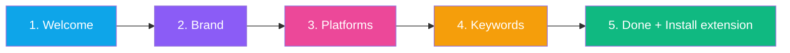
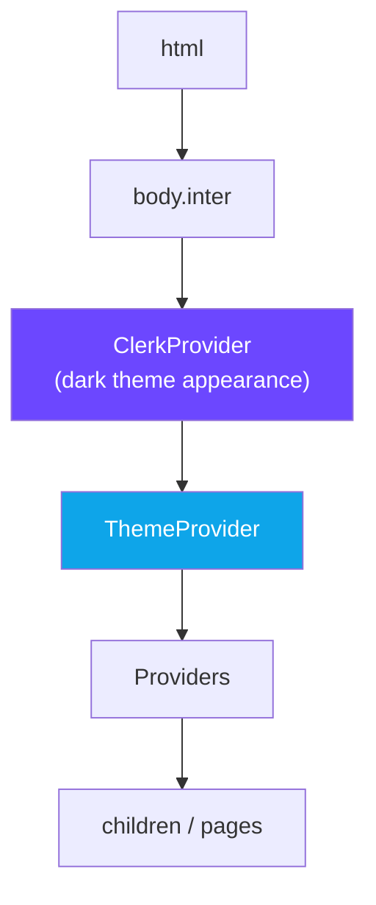

<div align="center">

# 🖼️ Frontend — Pages

**Every page route in `src/app/`**


</div>

---

## 🗺️ Page Map

```mermaid
flowchart TB
    ROOT[/]:::pub --> HOME[page.tsx<br/>Landing]:::pub
    ROOT --> LOGIN[login/]:::pub
    ROOT --> SIGNUP[signup/]:::pub
    ROOT --> RESET[reset-password/]:::pub
    ROOT --> PRICING[pricing/]:::pub
    ROOT --> PRIV[privacy/]:::pub
    ROOT --> TERMS[terms/]:::pub
    ROOT --> ONB[onboarding/]:::auth
    ROOT --> DASH[dashboard/]:::auth

    DASH --> DMAIN[page.tsx<br/>Hub]:::auth
    DASH --> DPOSTS[posts/]:::auth
    DASH --> DREVIEW[review/]:::auth
    DASH --> DLOGS[logs/]:::auth
    DASH --> DHEALTH[health/]:::auth
    DASH --> DSETT[settings/]:::auth
    DASH --> DACC[accounts/]:::auth
    DASH --> DBILL[billing/]:::auth
    DASH --> DADMIN[admin/]:::admin
    DASH --> DPLAT["platform/[platform]/"]:::auth

    classDef pub fill:#10b98122,stroke:#10b981
    classDef auth fill:#0ea5e922,stroke:#0ea5e9
    classDef admin fill:#ef444422,stroke:#ef4444
```

**Legend:**
 no auth needed · 
 Clerk session required · 
 Clerk + admin

---

## 1 · 🌐 Public Pages

### `/` — Landing 
**File:** `src/app/page.tsx`

Marketing landing page showcasing platform features, comparison table, pricing, and the how-it-works flow. Checks auth with Clerk and **redirects logged-in users to `/dashboard`**.

**Key features:**
- 🎨 Hero section with animated glow orbs + rotating keywords + live dashboard demo card
- 🌐 7-platform comparison matrix
- 💬 Feature cards with floating animations + conic-gradient borders
- 🎯 Step-by-step onboarding explanation
- 📊 Stats bar (7 Platforms / 24/7 / <2m Setup / 0% Detection)
- 🖱️ Cursor-follow spotlight (`HeroSpotlight` client island)
- ⚡ Scroll-triggered reveals via CSS `animation-timeline: view()`
- 🎨 `prefers-reduced-motion` support on every animation

### `/login` — Sign in 
Clerk `<SignIn />` with custom dark theme styling. Redirects to `/dashboard` if already authenticated.

### `/signup` — Sign up 
Clerk `<SignUp />` component. Redirects authed users away.

### `/reset-password` — Recovery 
Clerk `<TaskResetPassword />` task component.

### `/pricing` — Plan comparison 
Static server component showing Starter / Pro / Business plans.

### `/privacy` — Privacy policy 
Extension-first architecture statement, data boundaries, third-party processors (Clerk, PayPal, Resend, MongoDB Atlas, AI providers), extension permissions explanation. **Critical for Chrome Web Store submission.**

### `/terms` — Terms of service 
Legal terms.

---

## 2 · 🧭 Onboarding

### `/onboarding` 

Multi-step wizard (5 steps):



- Interactive state via `"use client"`
- Step progress bar with fade transitions
- Platform checkbox grid
- Keyword chips with add/remove
- Final step: **Download extension** card + API-key generation button

---

## 3 · 📊 Dashboard Pages

All under `/dashboard/*`, all client components with live filters and real-time polling.

### `/dashboard` — Main hub
- Real-time post/engagement counters
- Platform overview cards
- Quick actions (Scrape now, Force poll)
- Recent activity preview

### `/dashboard/accounts`
- Per-platform connection cards (connected / not connected / paused)
- Extension-install CTA if not yet linked
- Per-account health indicator
- Resume / disconnect actions

### `/dashboard/posts`
- Time filters (Today / 7d / 15d)
- Platform filter chips
- Status filter (new / evaluated / approved / rejected / posted / skipped)
- Expandable post cards with AI reply editor
- Approve / reject / edit actions
- **"View reply" / "View answer" link** — uses `replyUrl` / `verifiedAnswerUrl` with **✓ Verified** badge for Quora `/stats`-matched answers
- Pagination

### `/dashboard/review`
- Pre-approval queue sorted by AI relevance score
- Inline edit + approve flow
- Bulk approve / reject
- Manual comment text editor per post

### `/dashboard/logs`
- Activity feed (info / warn / error / success)
- Level filters + action search
- Clickable URLs in log messages
- **"Verified by" receipt shown for success logs** (editor_cleared, url_changed, state_flipped, snippet_match, etc.)

### `/dashboard/health`
- Per-platform `healthScore` gauge
- Auto-pause indicators
- Error rate + recent failures
- Backoff timer (when `backoffUntil` set)

### `/dashboard/settings`
- Brand info (name, description)
- Global keywords
- Platform toggle grid
- **Per-platform config**: daily limit, auto-post threshold (0-100), cooldown minutes, brand mention rate
- Cron schedule: timezone, start/end hours, interval minutes
- Auto-posting pause toggle
- Extension API-key generation + download extension card
- Plan limits display ("Keywords: 8 / 25" for Pro)

### `/dashboard/admin` 
- User list with post counts + subscription tier
- Platform-wide stats (total posts, revenue, active accounts)
- User management actions (cascade delete)

### `/dashboard/billing`
- Plan cards with feature comparison
- Current usage vs. limit progress bars
- **Upgrade** button → PayPal checkout
- **Manage subscription** → PayPal portal

### `/dashboard/platform/[platform]` — dynamic route
- Platform-scoped dashboard
- Posts filtered by `platform` param
- Per-platform stats (scraped, posted, success rate)
- Uses `useParams()` hook

---

## 4 · 🎨 Global Layout & Theme

**File:** `src/app/layout.tsx`

Wraps every page in:



- **Font**: Inter from Google Fonts via `next/font/google` (CSS variable `--font-inter`)
- **Metadata**: `"GetMention — Social Engagement Bot"`
- **ClerkProvider**: custom dark theme (primary cyan `#0ea5e9`, dark purple/gray backgrounds)
- **ThemeProvider**: React Context for `dark` / `light` toggle, persisted to localStorage via `[data-theme="..."]` on `<html>`

### `globals.css` tokens (selected)

| Token | Dark default | Light |
|---|---|---|
| `--bg` | `#0d0914` | pastel |
| `--card` | `#1a0f2e` | white |
| `--accent` | `#0ea5e9` | same |
| Status: new | `#3b82f6` (blue) | |
| Status: evaluating | `#f59e0b` (amber) | |
| Status: approved | `#10b981` (emerald) | |
| Status: rejected | `#ef4444` (red) | |
| Status: posted | `#6b7280` (gray) | |

**Platform colors:**
`#1d9bf0` Twitter · `#3b82f6` Reddit · `#1877f2` Facebook · `#ff0000` YouTube · `#b92b27` Quora · `#e60023` Pinterest · `#5865f2` Skool

**Transitions:** fast 150ms · default 250ms · slow 400ms · spring 500ms

---

## 5 · 📊 Client vs Server Rendering

| Count | Type |
|:-:|---|
| 14 | Client components (`"use client"` directive) |
| 4 | Server components (public pages + `/api/*` routes) |
| 9 | Components with interactivity (all dashboard + login/signup/onboarding) |

**Server-default architecture** — layouts, public pages, and API routes are server-rendered. Client components cluster around interactive dashboards, auth flows, and onboarding.

---

<div align="center">

**← [Libraries](../backend/libraries.md)** · **[Back to index](../README.md)** · **Next: [Components](./components.md)** →

</div>
