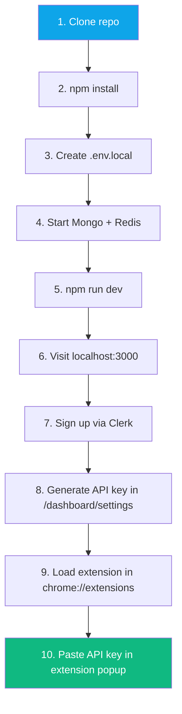
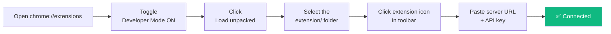
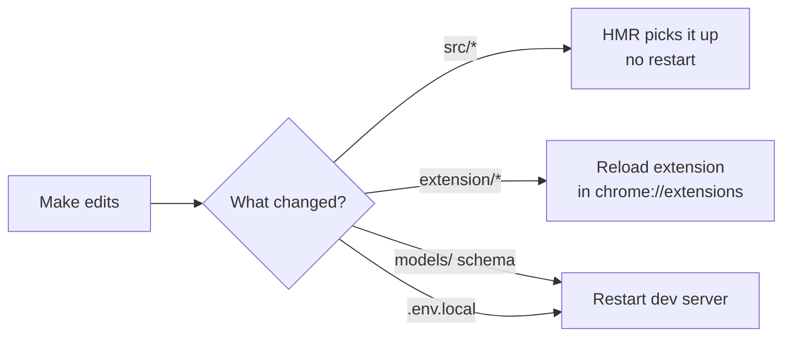

<div align="center">

# 🚀 Getting Started

**Local development setup — from zero to running in ~15 minutes**


</div>

---

## 📋 Prerequisites

| Tool | Version | Purpose |
|---|---|---|
| **Node.js** | ≥ 20 | Next.js runtime + npm |
| **MongoDB** | ≥ 7 | Primary data store |
| **Redis** | ≥ 6 | Rate limits, cache, cron locks |
| **Google Chrome** | ≥ 115 | To load the extension (supports `animation-timeline: view()` CSS used by the landing page) |
| **git** | any | Clone repo |

> [!TIP]
> On Ubuntu: `sudo apt install mongodb redis-server nodejs npm` (then install Node ≥ 20 via `nvm`).

---

## 🗺️ 15-Minute Setup



---

## 1 · Clone & Install

```bash
git clone git@github.com:devserpbays/Serpbays-Bot.git
cd Serpbays-Bot
git checkout extension      # working branch
npm install
```

---

## 2 · Environment Variables

Create `.env.local` in the project root. Minimum for local dev:

```bash
# === Database ===
MONGODB_URI=mongodb://127.0.0.1:27017/social-engagement-bot
REDIS_URL=redis://127.0.0.1:6379

# === Clerk (required — sign up at https://clerk.com for free dev keys) ===
CLERK_SECRET_KEY=sk_test_xxxxxxx
NEXT_PUBLIC_CLERK_PUBLISHABLE_KEY=pk_test_xxxxxxx
CLERK_TRUST_HOST=true
ADMIN_USER_IDS=user_your_clerk_id

# === OpenClaw AI (optional — mock mode if omitted) ===
OPENCLAW_HOST=127.0.0.1
OPENCLAW_PORT=18789
OPENCLAW_GATEWAY_TOKEN=dev-token

# === Public-URL ===
NEXT_PUBLIC_APP_URL=http://localhost:3000

# === Logging ===
LOG_LEVEL=debug
```

See [operations/environment.md](./operations/environment.md) for the full list including billing, email, and proxies.

> [!WARNING]
> `.env.local` is in `.gitignore` — never commit it.

---

## 3 · Start Services

```bash
# MongoDB (if not already running)
sudo systemctl start mongod

# Redis (if not already running)
sudo systemctl start redis-server

# Confirm both are reachable
mongosh --eval 'db.runCommand({ping: 1})'   # expect { ok: 1 }
redis-cli ping                              # expect PONG
```

---

## 4 · Run the App

```bash
npm run dev
```

- Dev server starts on **`http://localhost:3000`** (Next default) with Turbopack
- Hot-reload enabled on `src/**`
- Clerk sign-up at `/signup`
- Dashboard at `/dashboard`

To run on port **3005** (matching production), use:

```bash
PORT=3005 npm run dev
```

---

## 5 · Generate Extension API Key

1. Sign up at `/signup`
2. Complete the 5-step onboarding (`/onboarding`)
3. Go to `/dashboard/settings` → top card → click **Generate API Key**
4. Copy the `gm_...` key

---

## 6 · Load the Chrome Extension

### Build the extension zip

```bash
bash scripts/build-extension.sh
```

Outputs `extension-builds/getmention-latest.zip`.

### Install in Chrome



**Server URL to paste:**
- Local dev: `http://localhost:3000`
- Production: `http://88.222.214.19:3005`

> [!NOTE]
> The extension requests a runtime host permission for whatever URL you type. Chrome will prompt you once — click **Allow**.

---

## 7 · Verify the Loop Works

After connecting, in the dashboard:

1. **Settings** → add a keyword like `"seo"`
2. **Scrape now** button in the extension popup
3. Watch `/dashboard/logs` — you should see:
   - `[Extension] Extension boot v1.0.25`
   - `[Extension] Scraping twitter for "seo"`
   - `[Extension] Scraped "seo": 8 found, 8 new, 8 evaluated`
4. **Review** — `/dashboard/review` shows AI-scored posts
5. Approve one → the extension auto-posts the comment
6. **Logs** → `Commented on twitter — <URL> [verified: box_cleared]`

---

## 🧪 Common First-Run Issues

| Symptom | Likely cause | Fix |
|---|---|---|
| `npm run dev` fails with `Module not found: ioredis` | Missing peer dep | `npm install ioredis` |
| `Cannot find module 'playwright'` | Legacy code in `src/lib/humanize.ts` | Already patched in the `extension` branch — `git pull` |
| Extension popup "Not connected" | Wrong server URL or API key | Check popup → paste correct URL, regenerate key |
| `/dashboard` loops back to `/onboarding` | Missing Clerk JWT claim | Complete onboarding; middleware sets `onboardingCompleted` |
| Mongo connection refused | Mongo not running | `sudo systemctl start mongod` |
| Site is slow on first request | Turbopack cold build | Normal — subsequent requests ~5-50ms |

For more, see [troubleshooting.md](./troubleshooting.md).

---

## 📁 Key Folders to Know

```
/var/www/ai-bot/bot-serp/
├── src/app/                # Next.js pages + API routes
├── src/components/         # React components
├── src/lib/                # Utility modules (auth, rate-limit, billing, AI)
├── src/models/             # Mongoose schemas (9 collections)
├── src/services/           # Data-access layer over models
├── extension/              # Chrome MV3 extension source
├── extension-builds/       # Zip artifacts from scripts/build-extension.sh
├── scripts/                # build-extension.sh, deploy helpers
└── docs/                   # ← you are here
```

---

## 🎬 Dev Workflow



---

## 🧯 Reset to Clean State

```bash
# Wipe local DB (WARNING: deletes all data)
mongosh social-engagement-bot --eval 'db.dropDatabase()'

# Wipe Redis cache
redis-cli FLUSHDB

# Rebuild Next cache
rm -rf .next
npm run dev
```

---

<div align="center">

**[Back to index](./README.md)** · **Next: [Architecture](./architecture.md)** →

</div>
