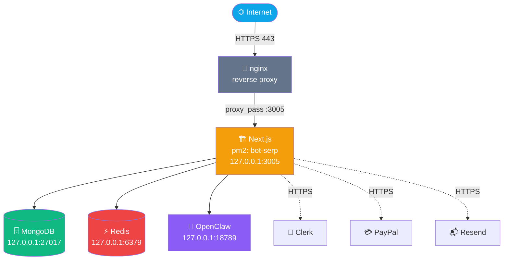
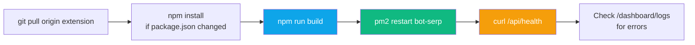
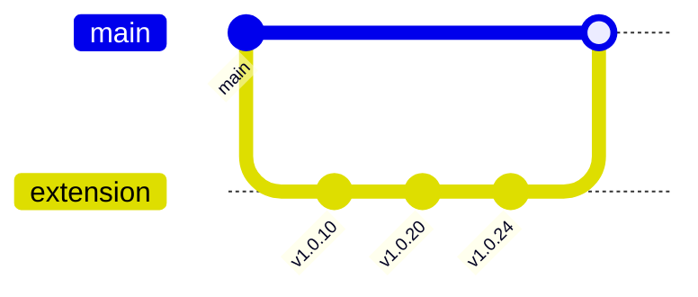

<div align="center">

# 🚢 Operations — Deployment

**pm2, nginx, build & release workflow**


</div>

---

## 🗺️ Topology



---

## 🖥️ Host

- **OS:** Linux 6.8.0 (Hostinger VPS)
- **Service account:** root (pm2 ecosystem managed as root)

---

## 🏃 pm2 processes

```bash
pm2 status
```

| ID | Name | Script | Port | Notes |
|:-:|---|---|---|---|
| 5 | `bot-serp` | `npm start` | **3005** | Main SaaS Next.js app |
| 11 | `pm2-logrotate` | module | — | Log rotation (daily) |

**Start command inside pm2:** `npm start` → `next start -p 3005`.

> [!IMPORTANT]
> Production mode **requires** `npm run build` before `pm2 restart` — Next.js serves the built output, not source.

---

## 🚀 Deploy Workflow



**Full deploy command:**

```bash
cd /var/www/ai-bot/bot-serp
git pull origin extension
npm install                    # only if package.json changed
npm run build
pm2 restart bot-serp --update-env
curl -s http://127.0.0.1:3005/api/health
pm2 logs bot-serp --lines 30   # verify no startup errors
```

Typical full-build + restart takes **~2–3 minutes**.

---

## 🧩 Extension Build & Deploy

```bash
bash scripts/build-extension.sh
```

**Output:** `extension-builds/getmention-latest.zip`

The zip is served to authenticated users via `GET /api/download`:

```
curl -H "Cookie: __session=<clerk-jwt>" \
     http://88.222.214.19:3005/api/download \
     -o GetMention-1.0.24.zip
```

> [!NOTE]
> The zip deliberately excludes `extension/debug/`, `*.bak`, `*.orig`, `.DS_Store`, and `.map` files. See `scripts/build-extension.sh` for the full `-x` list.

---

## 🔁 nginx Reverse Proxy

Handles HTTPS termination and forwards to `127.0.0.1:3005`.

**Relevant location block** (simplified):

```nginx
server {
    listen 443 ssl http2;
    server_name 88.222.214.19;

    ssl_certificate     /etc/letsencrypt/live/88.222.214.19/fullchain.pem;
    ssl_certificate_key /etc/letsencrypt/live/88.222.214.19/privkey.pem;

    # Streaming responses (large log exports)
    proxy_buffering off;
    proxy_http_version 1.1;

    location / {
        proxy_pass http://127.0.0.1:3005;
        proxy_set_header Host $host;
        proxy_set_header X-Real-IP $remote_addr;
        proxy_set_header X-Forwarded-For $remote_addr;
        proxy_set_header X-Forwarded-Proto $scheme;
        proxy_set_header X-Forwarded-Host $host;
    }
}
```

> [!IMPORTANT]
> The app **trusts `X-Forwarded-Host`** for Clerk callback URLs. `CLERK_TRUST_HOST=true` must be set in `.env.local`.

---

## 🩺 Health Checks

| Endpoint | What it checks |
|---|---|
| `GET /api/health` | App is up and can parse requests |
| `curl -s http://88.222.214.19:3005/api/health` | End-to-end through nginx |
| `pm2 status bot-serp` | Process state, memory, CPU, restart count |
| `pm2 logs bot-serp --err --lines 50` | Recent error output |
| `mongosh --eval 'db.runCommand({ping: 1})'` | MongoDB is reachable |
| `redis-cli ping` | Redis is reachable (expect `PONG`) |

---

## 🪵 Logs

| Source | Location |
|---|---|
| App stdout/stderr | `~/.pm2/logs/bot-serp-out.log`, `bot-serp-error.log` |
| pm2-logrotate | Rotates daily, keeps 30 days |
| nginx access | `/var/log/nginx/access.log` |
| nginx error | `/var/log/nginx/error.log` |
| App structured logs | `src/lib/logger.ts` → stdout (captured by pm2) |
| User activity feed | `ActivityLog` collection (TTL 7 days) — shown in `/dashboard/logs` |

**Tail live:**

```bash
pm2 logs bot-serp --lines 0    # attach to current tail
```

---

## 🗃️ MongoDB Operations

**Local connection:**
```bash
mongosh "mongodb://127.0.0.1:27017/social-engagement-bot"
```

**Common queries:**

```js
// Count users
db.users.countDocuments()

// Recent failed tasks
db.activitylogs.find({ level: 'error', platform: 'reddit' })
  .sort({ createdAt: -1 }).limit(20)

// User's recent activity
db.activitylogs.find({ userId: 'user_xxx' })
  .sort({ createdAt: -1 }).limit(50)

// Posts stuck in 'evaluating' for >10 minutes
db.posts.find({
  status: 'evaluating',
  updatedAt: { $lt: new Date(Date.now() - 10 * 60 * 1000) }
})
```

---

## ⚡ Redis Operations

```bash
redis-cli

> KEYS "rate:*"
> TTL "plan:user_xxx"
> FLUSHDB             # DANGEROUS — clears rate limits and plan cache
```

**Key patterns:**
- `rate:api:<userId>` — sliding-window API rate limit
- `rate:scrape:<userId>` — scrape endpoint rate limit
- `plan:<userId>` — cached plan (60 s TTL)
- `cron:<userId>:<platform>` — cron lock

---

## 🚨 Rollback

**If a deploy breaks production:**

```bash
cd /var/www/ai-bot/bot-serp
git reflog | head -10               # find previous known-good HEAD
git checkout <prev-sha>
npm run build
pm2 restart bot-serp
```

**Extension rollback:** The zip in `extension-builds/` is version-stamped; users who've already installed don't need to re-install for a rollback — just restore the previous server code.

---

## 🏷️ Branch & Release Strategy



- All active extension development happens on `extension`
- Merge to `main` only when a cluster of changes has been validated
- Tag releases (`v1.0.24`) on `main`

---

## 🔒 Security Checklist (pre-deploy)

- [ ] `.env.local` is **not** in git
- [ ] `ADMIN_USER_IDS` set
- [ ] `CLERK_TRUST_HOST=true` because we're behind nginx
- [ ] All host permissions in `extension/manifest.json` are HTTPS
- [ ] No wildcard permissions (`<all_urls>`, `http://*/*`)
- [ ] `pm2 restart` executed with `--update-env` so new env vars are picked up
- [ ] MongoDB is bound to `127.0.0.1` only (not `0.0.0.0`)
- [ ] Redis is bound to `127.0.0.1` only
- [ ] nginx HTTPS redirect from :80 → :443

---

<div align="center">

**← [Engagement](../features/engagement.md)** · **[Back to index](../README.md)** · **Next: [Environment](./environment.md)** →

</div>
