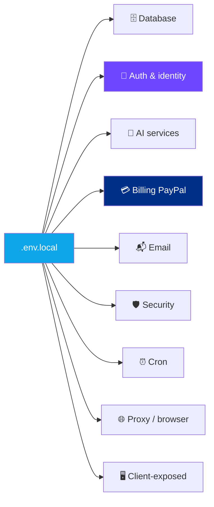

<div align="center">

# 🔐 Operations — Environment Variables

**Every env var used by the project, grouped by purpose**


</div>

> [!WARNING]
> **`.env.local` is never committed.** Keep your copy out of version control. Use a secrets manager or sealed vault for team sharing.

---

## 📋 Quick Reference



---

## 🗄️ 1. Database & Infrastructure

| Key | Default | Purpose |
|---|---|---|
| `MONGODB_URI` | `mongodb://127.0.0.1:27017/social-engagement-bot` | Main MongoDB connection string |
| `REDIS_URL` | `redis://127.0.0.1:6379` | Redis for rate limits, plan cache, cron locks |
| `WORKER_PROCESS` | — | Flag (any truthy value) to use smaller connection pool (for worker processes) |

---

## 🔐 2. Authentication (Clerk)

| Key | Required | Purpose |
|---|:-:|---|
| `CLERK_SECRET_KEY` | ✅ | Clerk backend secret |
| `NEXT_PUBLIC_CLERK_PUBLISHABLE_KEY` | ✅ | Clerk frontend publishable key (public) |
| `CLERK_TRUST_HOST` | ✅ (prod) | Set to `true` because app runs behind nginx; tells Clerk to trust `X-Forwarded-Host` / `X-Forwarded-Proto` |
| `ADMIN_USER_IDS` | ✅ | Comma-separated Clerk user IDs that get admin access |
| `INTERNAL_USER_IDS` | — | Comma-separated Clerk user IDs granted free Business-tier access (team accounts) |

---

## 🤖 3. AI Services (OpenClaw)

| Key | Default | Purpose |
|---|---|---|
| `OPENCLAW_HOST` | `127.0.0.1` | OpenClaw gateway hostname |
| `OPENCLAW_PORT` | `18789` | OpenClaw gateway port |
| `OPENCLAW_GATEWAY_TOKEN` | — | Authentication token |
| `MAX_OPENCLAW_CLI` | `5` | Max concurrent CLI fallback processes when HTTP gateway fails |

---

## 💳 4. PayPal Billing

| Key | Required | Purpose |
|---|:-:|---|
| `PAYPAL_CLIENT_ID` | ✅ | OAuth client ID |
| `PAYPAL_SECRET` | ✅ | OAuth secret |
| `PAYPAL_MODE` | ✅ | `sandbox` or `live` |
| `PAYPAL_WEBHOOK_ID` | ✅ | Webhook ID used to verify incoming webhooks |
| `PAYPAL_PLAN_PRO` | ✅ | Monthly Pro plan ID |
| `PAYPAL_PLAN_PRO_YEARLY` | ✅ | Yearly Pro plan ID |
| `PAYPAL_PLAN_BUSINESS` | ✅ | Monthly Business plan ID |
| `PAYPAL_PLAN_BUSINESS_YEARLY` | ✅ | Yearly Business plan ID |

---

## 📬 5. Email (Resend)

| Key | Default | Purpose |
|---|---|---|
| `RESEND_API_KEY` | — | Resend API key for transactional emails |
| `RESEND_FROM` | — | From address (e.g. `GetMention <notify@serpbays.com>`) |
| `NEXT_PUBLIC_APP_URL` | — | App URL embedded in email links (e.g. dashboard link in a "cookie expired" email) |

---

## 🛡️ 6. Security

| Key | Purpose |
|---|---|
| `ADMIN_HEALTH_KEY` | Optional secret for admin-only `/api/health` endpoint variant |
| `COOKIE_ENCRYPTION_KEY` | AES-256-GCM key for encrypting legacy cookie blobs. **Must be 32 hex chars** (= 16 bytes). |
| `EXTRA_ALLOWED_HOSTS` | Comma-separated hosts allowed behind nginx proxy (additional to built-in localhost + `engageai.pro` + `app.engageai.pro`) |

---

## ⏰ 7. Cron & Scheduling

| Key | Purpose |
|---|---|
| `CRON_USER_ID` | Clerk user ID used for server-triggered cron jobs |
| `GOOGLE_APPS_SCRIPT_URL` | Webhook URL that triggers cron runs via Google Apps Script (external heartbeat) |

---

## 🌐 8. Proxies & Browser (legacy)

| Key | Purpose |
|---|---|
| `RESIDENTIAL_PROXY_URL` | Residential SOCKS5 proxy for Cloudflare-protected platforms (Quora, Reddit). Legacy — extension runs from user's IP. |
| `CHROMIUM_PATH` | Path override for local Chromium (Playwright). Legacy. |
| `MAX_BROWSER_CONCURRENCY` | Max concurrent Playwright instances. Legacy. |

> [!NOTE]
> Browser/proxy vars are relics of the pre-extension server-side automation. Safe to omit once legacy code is fully removed.

---

## 🐦 9. Twitter (legacy)

| Key | Purpose |
|---|---|
| `TWITTER_AUTH_TOKEN`, `TWITTER_CT0`, `TWITTER_TWID`, `TWITTER_GUEST_ID`, `TWITTER_KDT`, `TWITTER_PERSONALIZATION_ID`, `TWITTER_EXTERNAL_REFERER` | Legacy cookie-based auth tokens for server-side Twitter HTTP client (`src/lib/twitterHttp.ts`). |

> [!NOTE]
> Extension-first architecture doesn't need these — tweets are scraped and replied to from the user's real browser.

---

## 🖥️ 10. Client-side (`NEXT_PUBLIC_*`)

Variables prefixed with `NEXT_PUBLIC_` are bundled into the client JS.

| Key | Purpose |
|---|---|
| `NEXT_PUBLIC_CLERK_PUBLISHABLE_KEY` | Clerk frontend key |
| `NEXT_PUBLIC_API_BASE` | Base URL for frontend API calls; empty = same-origin |
| `NEXT_PUBLIC_APP_URL` | Public-facing app URL |

> [!WARNING]
> **Never put secrets in `NEXT_PUBLIC_*`** — they're visible in client JS to anyone who views page source.

---

## 🪵 11. Logging

| Key | Default | Purpose |
|---|---|---|
| `LOG_LEVEL` | `info` | Min log level: `debug`, `info`, `warn`, `error` |

---

## 📝 Example `.env.local` (skeleton)

```bash
# === Database ===
MONGODB_URI=mongodb://127.0.0.1:27017/social-engagement-bot
REDIS_URL=redis://127.0.0.1:6379

# === Clerk ===
CLERK_SECRET_KEY=sk_test_xxx
NEXT_PUBLIC_CLERK_PUBLISHABLE_KEY=pk_test_xxx
CLERK_TRUST_HOST=true
ADMIN_USER_IDS=user_2XXXXXXX,user_2YYYYYYY

# === OpenClaw AI ===
OPENCLAW_HOST=127.0.0.1
OPENCLAW_PORT=18789
OPENCLAW_GATEWAY_TOKEN=xxx

# === PayPal ===
PAYPAL_CLIENT_ID=xxx
PAYPAL_SECRET=xxx
PAYPAL_MODE=live
PAYPAL_WEBHOOK_ID=xxx
PAYPAL_PLAN_PRO=P-xxx
PAYPAL_PLAN_PRO_YEARLY=P-xxx
PAYPAL_PLAN_BUSINESS=P-xxx
PAYPAL_PLAN_BUSINESS_YEARLY=P-xxx

# === Resend ===
RESEND_API_KEY=re_xxx
RESEND_FROM="GetMention <notify@serpbays.com>"
NEXT_PUBLIC_APP_URL=http://88.222.214.19:3005

# === Security ===
COOKIE_ENCRYPTION_KEY=0123456789abcdef0123456789abcdef
EXTRA_ALLOWED_HOSTS=myotherdomain.com

# === Logging ===
LOG_LEVEL=info
```

---

## 🔍 How to Find All Env References

```bash
# List every process.env reference in source
grep -rn "process\.env\." src/ extension/ --include="*.ts" --include="*.js" | sort -u | cut -d: -f3 | grep -oP 'process\.env\.\w+' | sort -u
```

---

## 🧪 Sandbox vs. Production

| Env | `.env.local` → | MongoDB | PayPal | Clerk |
|---|---|---|---|---|
| Dev | Dev values | Local instance | `PAYPAL_MODE=sandbox` | Clerk development keys |
| Prod | Prod values | Managed + auth | `PAYPAL_MODE=live` | Clerk production keys |

**Clerk sandbox/prod are separated by keys** — no env-var flag. Using `sk_test_*` keys keeps it in development mode automatically.

---

<div align="center">

**← [Deployment](./deployment.md)** · **[Back to index](../README.md)**

</div>
