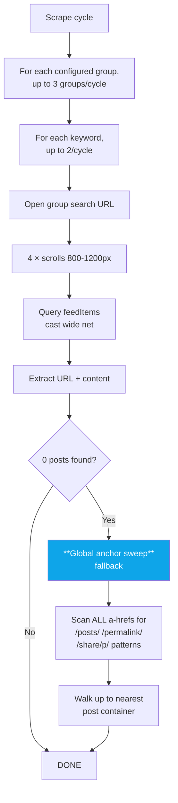
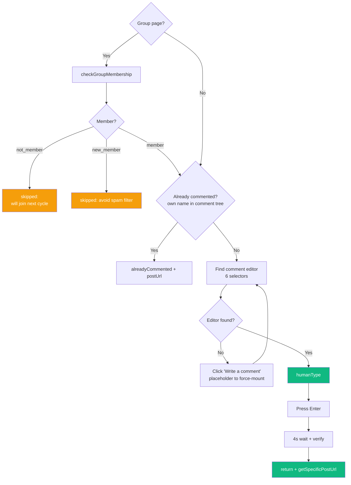
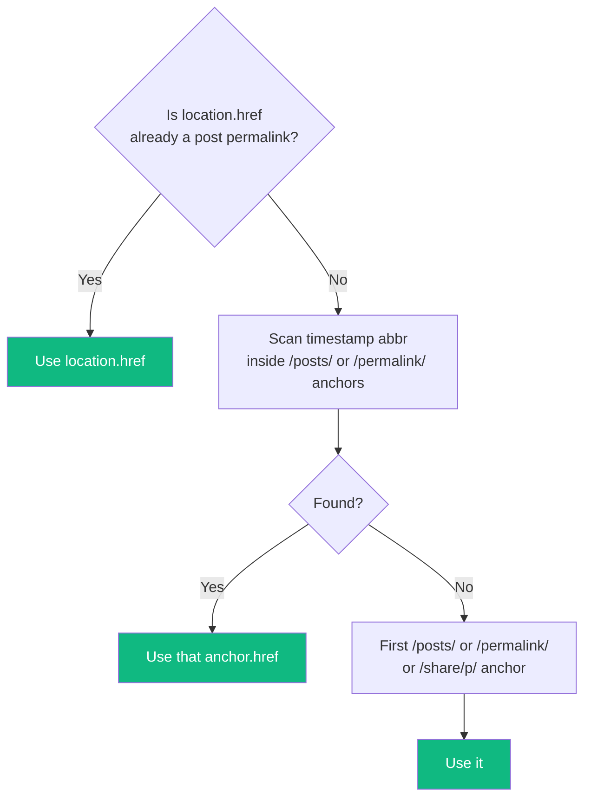

<div align="center">

# 🔵 Platform — Facebook (Groups)

**Scrape · Comment · React · Join — with post-permalink extraction and global anchor sweep**


</div>

---

## 🔗 URL Patterns

| URL | Purpose |
|---|---|
| `https://www.facebook.com/groups/<gid>/` | Group home |
| `https://www.facebook.com/groups/<gid>/search/?q=<kw>` | Group keyword search (scraping target) |
| `https://www.facebook.com/groups/<gid>/posts/<pid>/` | Individual post permalink (task target) |
| `https://www.facebook.com/groups/<gid>/permalink/<pid>/` | Old-style post permalink |
| `https://www.facebook.com/<user>/posts/pfbid...` | Post with modern `pfbid` format |

---

## 🔍 Scraping

### Strategy: loop groups × keywords



Up to **3 groups × 2 keywords = 6 scrape runs per cycle**, with 3-5s pause between each.

### feedItems selector

```css
[role="article"],
[data-pagelet*="FeedUnit"],
[data-pagelet*="GroupFeed"],
[data-pagelet*="Search"],
[data-pagelet*="BrowseSearch"],
[data-ad-preview],
[data-ad-rendering-role],
div[class*="userContentWrapper"],
a[href*="/groups/"][href*="/posts/"],
a[href*="/groups/"][href*="/permalink/"]
```

### Global anchor sweep (v1.0.12)

When modern FB serves a search result where each card is a `<div role="link">` with JS-only navigation (no `<a href>`), the per-item scan finds 0 URLs. The fallback:

```ts
document.querySelectorAll(
  'a[href*="/posts/"], a[href*="/permalink/"], ' +
  'a[href*="/share/p/"], a[href*="story_fbid"]'
);
```

Each match walks up to its nearest post container (`[role="article"]`, `[data-pagelet*="FeedUnit"]`, or first ancestor with ≥40 chars of text) and extracts content from there.

Log reveals whether sweep helped: `sweep:128 viaSweep:3`.

### URL cleanup

Every extracted URL passes `clean(href)`:
- Strips `__cft__` (FB click-tracking — leaks session info)
- Strips `__tn__` (FB tracking code)
- Preserves `comment_id=` if present

### Blacklist (never treated as post permalinks)

```
/user/
/profile.php
/members/
/about/
/events/
/admin/
/settings/
/calendar/
/leaderboard/
```

Example of rejected hrefs:
- `/groups/123/user/456/` → blacklisted
- `/groups/123/members/` → blacklisted

---

## 💬 Commenting

### Flow



### Editor detection (6 fallbacks, in priority order)

```ts
[contenteditable="true"][aria-label*="comment" i]
[contenteditable="true"][data-lexical-editor="true"]
[contenteditable="plaintext-only"]
[role="dialog"] [contenteditable="true"]
[contenteditable="true"][role="textbox"]
[contenteditable="true"]     // last resort
```

If none found → click the "Write a comment" / "Write an answer" / "Write a public comment" placeholder (5 selectors + text-match fallback) to force-mount the editor.

### Placeholder detection

```ts
[aria-label="Write a comment"]
[aria-label="Write an answer"]
[aria-label*="Write a comment" i]
[aria-label*="Comment as" i]
[placeholder*="Write a comment" i]
// text-match fallback:
text === "write a comment" / "write a public comment" / "write an answer"
```

### Submit
Press **Enter** on the editor — FB's composer submits on Enter (no explicit button click).

### Verification
- Editor cleared after 4 s wait → ✓
- OR snippet visible in page text → ✓

Returns `postUrl` from `getSpecificPostUrl()` so dashboard log links to the specific post, not the group.

---

## ⭐ `getSpecificPostUrl()` — the key helper

Returns the canonical post permalink. 3 strategies:



Output goes through `clean()` — strips `__cft__`, `__tn__`, preserves `comment_id`.

**Why it matters:** without this, the dashboard's "View reply" link points to the group homepage instead of the actual post.

---

## 👍 Reacting

```ts
// Already liked?
[aria-label="Remove Like"] ||
[aria-label*="Unlike"] ||
[aria-pressed="true"][aria-label*="like" i]

// Like button (5 fallbacks)
div[aria-label="Like"][role="button"] ||
span[aria-label="Like"][role="button"] ||
[aria-label="Like"] ||
[data-testid="like_button"] ||
// reaction-bar fallback: first [role="button"] inside [aria-label*="reaction"]
```

**Reactions beyond Like** — Facebook has Like / Love / Care / Haha / Wow / Sad / Angry. The user's configured `botReaction` in Settings determines which one to click. Default is `"Like"`.

Verification: same aria-label flip check after 2 s. Returns `postUrl` via `getSpecificPostUrl()`.

---

## 🤝 Join Group

```ts
// Already member?
[aria-label*="Leave" i] || text-match: "Joined" / "Joined community" / "Leave"

// Join button
button[join] ||
button[aria-label*="Join" i] ||
text-match: "Join" / "Join Community" / "Join Group" / "Request to Join"
```

After joining, waits ~15 min before first comment in that group (`new_member` grace period) to avoid spam-filter flags.

---

## 🚨 Known Failure Modes

| Symptom | Cause | Fix |
|---|---|---|
| Scrape `no-links: N, no-url: M`, zero OK | FB changed search-result wrapper | Global anchor sweep should catch it — check `sweep:N viaSweep:M` |
| "Comment box not found — no contenteditable found after 8 attempts" | Post may be locked or member-only | Log shows `textboxes: N, dialogs: N, placeholdersTried: N, scrolls: N` for diagnosis |
| "redirected to login/checkpoint" | FB session expired | User needs to manually log back in |
| "Comment submitted but not confirmed" | FB's lazy-render | Verification signal may have missed; retry next cycle |
| Dashboard-approve log shows group URL not post URL | Pre-v1.0.24 code | Should be v1.0.24+ — `autopost.js` now propagates `postUrl` |

---

## 🎛️ Settings That Affect Facebook

| Setting | Purpose | Default |
|---|---|---|
| `facebookKeywords` | Filter keywords | empty |
| `facebookGroups` | Group IDs to scrape + join | empty |
| `facebookDailyLimit` | Max comments/day | 10 |
| `facebookAutoPostThreshold` | AI score cutoff | 70 |
| `facebookCooldownMinutes` | Gap between comments | auto-computed |
| `facebookBrandMentionRate` | Max brand mentions/day | 2 |

Reaction type per user: `Settings.socialAccounts[].botReaction` (defaults to "Like"; can be set per-account).

---

## 📁 Related Files

| File | Role |
|---|---|
| `extension/content/facebook.js` | Scrape / comment / react / join (622 lines) |
| `extension/background.js` | `scrapeFacebookGroups()`, up to 3×2 loop |
| `extension/content/autopost.js` | Dashboard-approve relay with `result.postUrl` |
| `src/app/api/fb-status/route.ts` | Dashboard status |

---

## 🎬 Log Line Examples

```
[Extension] Scraping Facebook group search: 732579348701497 • "link building"
732579348701497 • "link building": no posts found — scanned 36 items: 28 no-links, 8 no-url, 0 short, 0 kw-miss, 0 dupe; sweep:128 viaSweep:3
Commented on facebook (2/10 today) — https://facebook.com/user/posts/pfbid036KW5QmTg... [verified: editor_cleared]
Liked on facebook (3/10 today) — https://facebook.com/groups/.../posts/... [verified: remove_like_btn]
```

---

<div align="center">

**← [Reddit](./reddit.md)** · **[Back to index](../README.md)** · **Next: [Quora](./quora.md)** →

</div>
