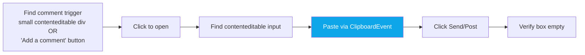

<div align="center">

# 📌 Platform — Pinterest

**Scrape · Comment · Heart-like — the simplest content script**


</div>

---

## 🔗 URL Patterns

| URL | Purpose |
|---|---|
| `https://www.pinterest.com/search/pins?q=<kw>` | Scrape |
| `https://www.pinterest.com/pin/<id>/` | Individual pin (task target) |
| `https://in.pinterest.com/*` | India mirror — same UI |

Content script matches both hosts.

---

## 🔍 Scraping

### Selectors
```ts
// Pin cards
[data-test-id="pin"]
[role="listitem"][role="link"]
```

### Extracted fields
| Field | Source |
|---|---|
| `url` | Pin's `<a href>` (relative → absolute via `new URL(href, location.origin)`) |
| `title` | Pin title + description concatenated |
| `author` | Creator handle |

### Tricks
- **Infinite scroll** — 3-4 scrolls needed for enough pins to render
- **Relative URLs** resolved to absolute

---

## 💬 Commenting

### Flow



### Why paste, not humanType?
Pinterest's composer accepts `ClipboardEvent` with `DataTransfer` — reliably and fast. No need for per-char typing. This is the exception vs other platforms' humanType pattern.

```ts
const dt = new DataTransfer();
dt.setData('text/plain', text);
editor.dispatchEvent(new ClipboardEvent('paste', {
  clipboardData: dt, bubbles: true, cancelable: true,
}));
```

### Comment trigger detection
```ts
// Small contenteditable (height < 50px) or
// text-match "Add a comment" on a role=button
[contenteditable="true"]  // with visible bounding rect < 50px height
[role="button"] with text "add a comment" / "write a comment"
```

### Submit button
Text-match: `"Send"`, `"Post"`, `"Submit"`, `"Done"`. Usually visible after opening the composer.

### Verification
- Comment box empty after click → ✓

---

## ❤️ Liking (Heart)

Pinterest's "like" is the heart icon on a pin.

```ts
// Heart button
button[aria-label*="react" i]
[data-test-id*="react"]
[aria-label*="save" i]   // Pinterest variant — "Save" reaction
```

Click → verify filled heart state changes.

`verifyMethod: heart_filled`

> [!NOTE]
> Pinterest's "Save to board" is different from liking — that's a full separate flow (`Post.sharedByBot`). The primary like action is the heart/reaction.

---

## 🚨 Known Failure Modes

| Symptom | Cause | Fix |
|---|---|---|
| "Comment box not found" | Pin is image-only or creator disabled comments | Skip — common for stock-photo boards |
| "Paste failed, box empty" | Focus not properly transferred | Retry: click editor → wait 300ms → paste |
| Scrape returns 0 pins | Keyword too niche | Broaden keyword |
| "Already liked (alreadyLiked: true)" | Working as intended | — |

---

## 🎛️ Settings That Affect Pinterest

| Setting | Purpose | Default |
|---|---|---|
| `pinterestKeywords` | Keywords | empty |
| `pinterestDailyLimit` | Max comments/day | 10 |
| `pinterestAutoPostThreshold` | AI score cutoff | 70 |
| `pinterestCooldownMinutes` | Gap | auto |

Note: Pinterest doesn't have a "community" concept, so no join flow.

---

## 📁 Related Files

| File | Role |
|---|---|
| `extension/content/pinterest.js` | Scrape / comment / like (246 lines — smallest content script) |
| `src/app/api/pinterest-status/route.ts` | Dashboard status |

---

## 🎬 Log Line Examples

```
[Extension] Scraping pinterest for "home decor"
Scraped "home decor": 15 found, 4 new, 4 evaluated
Commented on pinterest (1/10 today) — https://pinterest.com/pin/12345/ [verified: box_cleared]
Liked on pinterest (3/10 today) — https://pinterest.com/pin/67890/ [verified: heart_filled]
```

---

<div align="center">

**← [YouTube](./youtube.md)** · **[Back to index](../README.md)** · **Next: [Skool](./skool.md)** →

</div>
