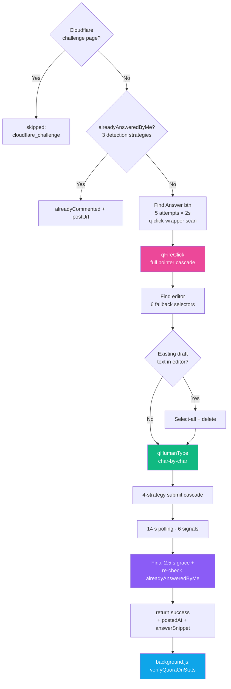

<div align="center">

# 🟥 Platform — Quora

**Scrape · Answer · Upvote — with /stats verification and pointer-event magic**


</div>

---

## 🔗 URL Patterns

| URL | Purpose |
|---|---|
| `https://www.quora.com/search?q=<kw>&type=question` | Scrape |
| `https://www.quora.com/<Question-Title>` | Individual question (task target) |
| `https://www.quora.com/answer` | Unanswered questions feed (alt scrape) |
| `https://www.quora.com/stats` | **User's stats page — post-verification** |

---

## 🔍 Scraping

### Strategy
Quora's search page is a flat list of question links. We scrape `<a href>` tags matching question-URL patterns.

### Selector
```ts
document.querySelectorAll('a[href]')
  .filter(a => a.href.includes('quora.com/'))
  // starts with capital letter → question title
  // OR path contains /unanswered/
  .filter(href => /\/[A-Z]/.test(path) || path.includes('/unanswered/'))
```

### Blacklist
```
/profile/
/topic/
/search
/answer (unanswered page itself, not individual answers)
```

### On /answer page

If URL is `/answer` or `/answer/`, scrolls twice to load more questions. Otherwise single pass.

---

## 💬 Answering

### Full flow



### `alreadyAnsweredByMe(snippet)` — 3 strategies

1. **Snippet on page** — our intended text is already visible
2. **Author name match** — `<a href*="/profile/">` contains our profile name
3. **"Edit your answer" button** — Quora replaces the Answer button once posted

Returns `{ ok: true, reason: 'snippet_on_page' | 'author_match' | 'edit_answer_btn' }`.

### Find Answer button (5 strategies)

Quora frequently changes this button's text/structure:

```ts
// Strategy A: q-click-wrapper (Quora's main button class)
button.q-click-wrapper (filter by isAnswerLike)

// Strategy B: aria-label
button[aria-label*="nswer" i]

// Strategy C: any button whose text starts with "Answer" / "Write"
text-match: /^(answer|write|add answer|write answer|post answer)$/i
         OR starts with "answer " / "write an answer"

// Strategy D: shadow DOM walk
(rare on Quora)

// Strategy E: link-styled Answer
a[href*="/answer/"], a.q-click-wrapper
```

### `qFireClick()` — full pointer cascade

Quora's `q-click-wrapper` component listens primarily to **pointer events**, not plain `.click()`. Full sequence:

```ts
pointerover → pointerenter → mouseover
→ pointerdown → mousedown → focus
→ pointerup → mouseup → click → native click()
```

Each with `clientX/Y` at element center, `pointerId: 1, pointerType: 'mouse'`.

### Editor detection (6 selectors)

```ts
div.doc[contenteditable="true"]
[contenteditable="true"][data-placeholder]
.qu-contentEditable[contenteditable="true"]
[role="textbox"][contenteditable="true"]
[contenteditable="true"][class*="editor"]
[contenteditable="true"]    // last resort
```

### Draft cleanup

Quora auto-saves drafts between sessions. If the editor has existing content on open, we `select-all + execCommand('delete')` before typing. Otherwise we'd append to the old draft.

### `qHumanType()` (same as Twitter pattern)

Character-by-character `execCommand('insertText')`, 35–100 ms per char, 120–340 ms pauses after punctuation.

### 4-strategy submit

| t | Strategy |
|:-:|---|
| 0 s | Pointer click |
| 3 s | `form.requestSubmit()` |
| 7 s | Ctrl+Enter on editor + document |
| 11 s | Re-click |

### 6 verification signals (14 s polling)

- `url_changed` | `editor_removed` | `editor_cleared` | `submit_gone` | `text_on_page`
- Also re-runs `alreadyAnsweredByMe` mid-polling — if a marker shows up, that's proof of success

### Final grace period (2.5 s) + re-verify

After 14 s of polling, if nothing confirmed, wait 2.5 s extra then re-run `alreadyAnsweredByMe`. Catches false negatives where Quora's render lagged past the polling window.

---

## ✅ `/stats` Verification (background-side)

After the content script returns success, `background.js` calls `verifyQuoraOnStats()`:

```mermaid
sequenceDiagram
    CS as content script
    BG as background.js
    ST as /stats tab

    CS-->>BG: { success, answerSnippet, postedAt }
    BG->>BG: sleep 5s (Quora needs time to index)
    BG->>ST: createBackgroundTab(/stats)
    ST->>ST: SPA renders answers list
    BG->>ST: scrollBy(0, 800) trigger lazy-load
    BG->>ST: chrome.scripting.executeScript (reader)
    ST-->>BG: { rows: [{url, text}, ...] }
    BG->>BG: match rows by snippet<br/>(80/60/40/25 char prefixes)
    alt match found
        BG-->>Server: verifiedAnswerUrl = <canonical>
    else no match + age < 5 min
        BG-->>Server: verifiedAnswerUrl = topmost<br/>(method: top_row_recency)
    end
```

- **Primary match**: our `answerSnippet` substring appears in a `/stats` row's text. Tries 80, 60, 40, 25-char prefixes for robustness (Quora may truncate or wrap).
- **Fallback match**: if `Date.now() - postedAt < 5 * 60 * 1000`, assumes topmost row is ours — `verifyMethod: top_row_recency`, lower confidence but still verified.

Result attached to task completion payload as `verifiedAnswerUrl` + `verifiedMethod`. Server stores on `Post.verifiedAnswerUrl` + `Post.verifiedAt`. Dashboard shows **✓ Verified** badge.

---

## ⬆️ Upvoting

```ts
// Find upvote button (3 strategies)
// A: aria-label
button[aria-label="upvote"] || "upvoted" || "upvote this" ||
  "remove upvote" || "undo upvote"

// B: text regex
/^(Upvote|Upvoted)(\s*·?\s*\d+)?$/i

// C: shadow DOM walk (rare on Quora)

// isAlreadyUpvotedQuora(btn)
aria-pressed === 'true' ||
aria-label starts with "upvoted" ||
contains "remove upvote" / "undo upvote" ||
text === "Upvoted"
```

Flow: snapshot aria-label + text + aria-pressed BEFORE click → qFireClick → 6 s polling → if any change vs snapshot → verified.

Returns `verifyMethod: state_flipped` (aria-pressed now true) OR `label_changed` (any attribute changed).

---

## 🚨 Known Failure Modes

| Symptom | Cause | Fix |
|---|---|---|
| `skipped: cloudflare_challenge` | CF challenge page showed | User opens Quora manually once → then retries |
| "Answer button not found" | Quora's button naming varied | 5-strategy scan should catch it — else log tells you button count (`N buttons, M q-click`) |
| "Editor not found after clicking Answer" | Answer click didn't open the editor modal | Usually transient; retry next cycle |
| "Could not type in editor" | Lexical rejected insertText (rare) | Fallback to clipboard paste + innerHTML — if all fail, DOM has changed |
| `[⚠ /stats verify: no_match]` | Quora didn't index fast enough OR snippet got truncated/reformatted | Retry next cycle; if persistent, lower snippet-length threshold |
| `[⚠ /stats verify: reader_failed]` | chrome.scripting injection failed | Check `optional_host_permissions` includes Quora |

---

## 🎛️ Settings That Affect Quora

| Setting | Purpose | Default |
|---|---|---|
| `quoraKeywords` | Keywords | empty |
| `quoraDailyLimit` | Max answers/day | 10 |
| `quoraAutoPostThreshold` | AI score cutoff | 70 |
| `quoraCooldownMinutes` | Gap | auto |
| `quoraBrandMentionRate` | Brand cap | 2 |

---

## 📁 Related Files

| File | Role |
|---|---|
| `extension/content/quora.js` | Scrape / answer / upvote (521 lines) |
| `extension/background.js` | `verifyQuoraOnStats()` — the /stats verifier |
| `src/app/api/quora-status/route.ts` | Dashboard status |
| `src/models/Post.ts` | `verifiedAnswerUrl`, `verifiedAt` fields |
| `src/app/dashboard/posts/page.tsx` | Renders ✓ Verified badge |

---

## 🎬 Log Line Examples

```
[Extension] Scraping quora for "guest post"
Scraped "guest post": 8 found, 2 new, 2 evaluated
Verifying Quora answer on /stats for https://quora.com/How-do-I-...
Commented on quora (3/10 today) — https://quora.com/.../answer/xxxxx [verified: text_on_page] [✓ verified on Quora /stats: snippet_match_60]
Already commented on quora — https://quora.com/... [verified: edit_answer_btn]
Upvoted on quora (5/10 today) — https://quora.com/... [verified: state_flipped]
```

---

<div align="center">

**← [Facebook](./facebook.md)** · **[Back to index](../README.md)** · **Next: [YouTube](./youtube.md)** →

</div>
