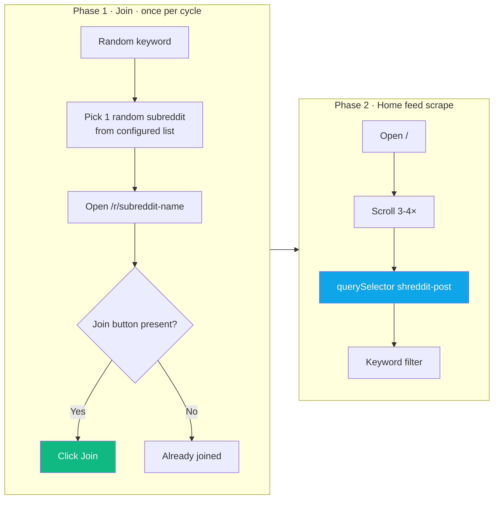
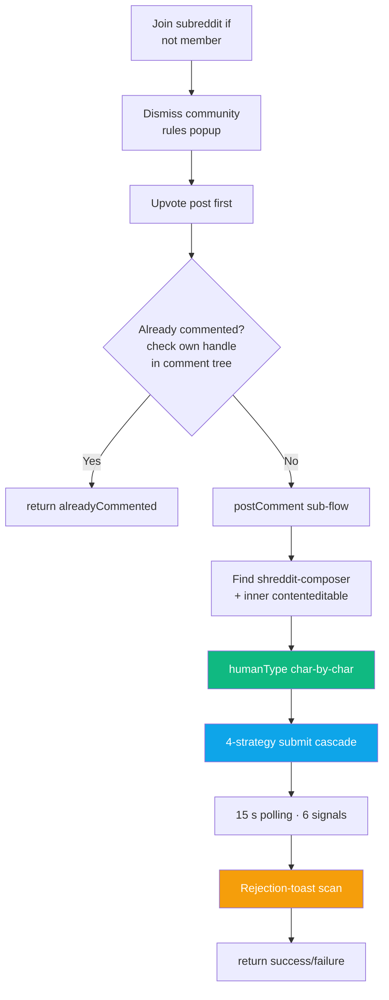
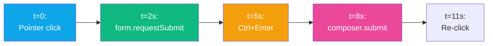

<div align="center">

# 🔴 Platform — Reddit

**Scrape · Comment · Upvote · Join — deepest content script (871 lines)**


</div>

---

## 🔗 URL Patterns

| URL | Purpose |
|---|---|
| `https://www.reddit.com/` | Home feed (shows joined subs) |
| `https://www.reddit.com/r/<sub>` | Subreddit — target for Join |
| `https://www.reddit.com/r/<sub>/comments/<id>/...` | Individual post (task target) |
| `https://www.reddit.com/search/?q=<kw>&t=day` | Keyword search (fallback) |
| `https://old.reddit.com/*` | Old Reddit — dual-supported |

Content script matches: both new + old hostnames.

---

## 🔍 Scraping

### Two-phase strategy



**Why home feed, not search?** Reddit search hides posts older than ~24h. Home feed after joining shows posts from ALL joined subs.

### Selectors
| Element | Selector |
|---|---|
| New Reddit post card | `shreddit-post` (inside shadow DOM, surfaced by `document.querySelector`) |
| Old Reddit post card | `.thing.link` |
| URL | `a[slot="title"]`, `a[data-testid="post-title"]`, `a[href*="/comments/"]` |
| Title | `<h3>` / slot title |
| Author | `shreddit-post.author` attribute |
| Body | `[slot="text-body"]`, `[data-testid="post-body"]` |

### Fallback scrape (light DOM)
If the shreddit-post scan finds nothing (Reddit hid it), we fall back to:
```ts
document.querySelectorAll('a[href*="/comments/"]')
  .filter(a => a.href.match(/reddit\.com\/r\/\w+\/comments\//))
```

---

## 💬 Commenting (with pre-upvote)

The task action is `comment` but the function is `commentWithUpvote()` — Reddit wants engagement **before** you comment so we upvote first.

### Full flow



### Dismiss rules popup

After joining, Reddit often shows a "Community Rules" modal blocking the composer. Priority order:
```ts
faceplate-dialog button[type="submit"]
shreddit-dialog button[type="submit"]
[role="dialog"] button[type="submit"]
text match: "okay" / "ok" / "i agree" / "agree" / "got it" /
            "continue" / "accept" / "i understand" / "acknowledge"
```

### Editor

Primary: `shreddit-composer > div[slot="rte"][contenteditable="true"]` (Lexical editor).
Fallbacks:
```ts
[data-lexical-editor="true"]
div[contenteditable="true"][role="textbox"]
[contenteditable="true"]
```

### humanType

Character-by-character `execCommand('insertText', false, char)` with 35–100 ms delays and 120–340 ms pauses after punctuation. Critical for Lexical — one-shot insertion doesn't fire the per-keystroke `beforeinput`+`input` events Lexical needs to mark itself dirty.

### 4-Strategy Submit Cascade



Details:

| t | Strategy | Implementation |
|:-:|---|---|
| 0 s | Pointer event click | Full sequence: pointerover → pointerenter → mouseover → pointerdown → mousedown → focus → pointerup → mouseup → click → native click |
| 2 s | `form.requestSubmit()` | `submitBtn.closest('form').requestSubmit()` if form exists |
| 5 s | Ctrl/Cmd+Enter | Dispatch `keydown` with ctrlKey on editor + document |
| 8 s | `composer.submit()` | Call method on `shreddit-composer` web component directly; also fires `CustomEvent('submit')` |
| 11 s | Re-click | Fires `fireClick(submitBtn)` again for race conditions |

### Submit button (deep shadow-DOM search)

```ts
// Priority selectors (searched recursively through every .shadowRoot)
button[aria-label="Submit comment" i]
button[aria-label*="submit comment" i]
button[aria-label*="Post comment" i]
button[slot="submit-button"]
button[type="submit"]
```

Falls back to text-match (`Comment` / `Reply` / `Submit` / `Post`) scoped to `shreddit-composer`, rejecting `aria-label*="cancel"` + `text: "cancel"` / `"discard"`.

### 6 Verification Signals (15 s polling)

| Signal | Means |
|---|---|
| `url_changed` | Redirected to `/comments/...#new-comment` |
| `editor_removed` | Composer DOM element vanished |
| `editor_cleared` | Text was cleared |
| `submit_gone` | Button disabled / removed |
| `text_on_page` | Snippet in `document.body.innerText` |
| `text_in_comment` | Snippet inside `shreddit-comment` shadow DOM |

### Rejection toast detection

Scans `document.body.innerText` for Reddit's rejection phrases:

| Phrase | Reason |
|---|---|
| `doing that too much`, `please slow down`, `try again in` | `rate_limited` |
| `something went wrong`, `whoops, we had an issue`, `unable to create comment` | `reddit_error` |
| `submission has been filtered`, `removed by reddit` | `spam_filter` |
| `requires you to have`, `must have at least` | `karma_gate` |

Returns `{ skipped: true, reason }` so log becomes `post_skipped` (info) not `post_failed` (error).

---

## ⬆️ Upvoting

```mermaid
flowchart TB
    A{old.reddit.com?} -->|Yes| OU[Click .arrow.up,<br/>verify .arrow.upmod]
    A -->|No| DF[deepFindUpvote<br/>walk every shadowRoot]
    DF --> C[Collect:<br/>button[aria-label*=upvote],<br/>shreddit-vote-button,<br/>button[upvote]]
    C --> AL{isAlreadyUpvoted?<br/>aria-pressed=true OR<br/>svg[icon-name=upvote-fill]}
    AL -->|Yes| AD[return alreadyUpvoted]
    AL -->|No| FC[fireVoteClick<br/>full pointer+mouse+click]
    FC --> P[6 s polling]
    P --> S1[t=2s: inner<br/>shadow-root button retry]
    P --> S2[t=4s: 'a' keyboard<br/>shortcut on document.body]

    style DF fill:#0ea5e9,color:#fff
    style FC fill:#ec4899,color:#fff
    style AD fill:#10b981,color:#fff
```

Reddit's `shreddit-vote-button` hides the real button inside **closed shadow DOM**, out of reach of `document.querySelector`. `deepFindUpvote()` walks every `element.shadowRoot` recursively to find it.

---

## 🤝 Join Subreddit

```ts
// Already joined?
document.querySelector('button[aria-label*="Leave" i]') ||
  text-match: "Joined", "Joined community", "Leave"

// Join button
document.querySelector('shreddit-subreddit-header-button button') ||
document.querySelector('button[join]') ||
document.querySelector('button[aria-label*="Join" i]') ||
  text-match: "Join", "Join Community", "Join community"
```

Logs: `join_subreddit` action with `{ subreddit }` meta.

---

## 🚨 Known Failure Modes

| Symptom | Cause | Fix / Detection |
|---|---|---|
| "Comment not confirmed after 15s — tried click,requestSubmit,ctrlEnter,componentSubmit" | None of 4 strategies worked | Most likely account-side (see rejection toasts) or DOM redesign |
| `reason: rate_limited` | Posted too fast | Cooldown will enforce; or lower daily limit |
| `reason: karma_gate` | Sub requires karma | Can't fix in code; user needs karma |
| `reason: spam_filter` | Reddit's spam AI flagged the reply | Make replies more specific; vary tone |
| "Upvote clicked but state did not flip after 6s" | Shadow DOM isolation | Keyboard shortcut fallback usually wins |

---

## 🎛️ Settings That Affect Reddit

| Setting | Purpose | Default |
|---|---|---|
| `redditKeywords` | Filter keywords | empty |
| `redditSubreddits` | Subreddits to join/scrape | empty |
| `redditDailyLimit` | Max comments/day | 10 |
| `redditAutoPostThreshold` | AI score cutoff | 70 |
| `redditCooldownMinutes` | Min gap between comments | auto-computed |
| `redditBrandMentionRate` | Max brand mentions/day | 2 |

---

## 📁 Related Files

| File | Role |
|---|---|
| `extension/content/reddit.js` | Scrape / comment / upvote / join logic (871 lines) |
| `extension/background.js` | `scrapeRedditSubreddits()`, task execution |
| `src/app/api/reddit-status/route.ts` | Dashboard status endpoint |

---

## 🎬 Log Line Examples

```
[Extension] Joined r/GuestPost
[Extension] Scraping Reddit: Home Feed (joined communities)
Home Feed (joined communities): 10 found, 6 new, 6 evaluated
Commented on reddit (3/25 today) — https://reddit.com/r/.../#comment [verified: editor_cleared]
Skipped comment on reddit (rate_limited) — https://reddit.com/r/... | Reddit rejected comment: rate limited
Already upvoted on reddit — https://reddit.com/r/... [verified: state_flipped]
```

---

<div align="center">

**← [Twitter](./twitter.md)** · **[Back to index](../README.md)** · **Next: [Facebook](./facebook.md)** →

</div>
