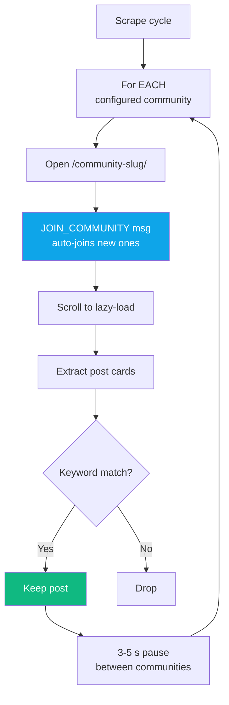
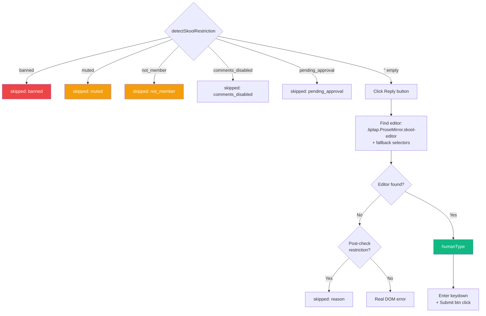

<div align="center">

# 🟣 Platform — Skool

**Scrape · Comment · Like · Join — with restriction detection (banned/muted/pending)**


</div>

---

## 🔗 URL Patterns

| URL | Purpose |
|---|---|
| `https://www.skool.com/<community>` | Community home (scrape target) |
| `https://www.skool.com/<community>/post/<slug>` | Individual post (task target) |
| `https://www.skool.com/search?q=<kw>` | Keyword search (fallback) |

---

## 🔍 Scraping

### Strategy: loop ALL communities per cycle (v1.0.13)



Previously (pre-v1.0.13) only 1 random community per cycle. With 4 communities configured, each was scraped once every 4 cycles. Now every cycle hits every community.

### Selectors
Skool uses Next.js — posts render as `<div>` cards containing:
```ts
a[href^="/<community-slug>/post/"]  // post link
```

### Auto-join
Before scraping each community, sends `JOIN_COMMUNITY` message. Content script clicks Join button if present (ignored if already member). New communities start contributing posts immediately.

---

## 💬 Commenting

### Pre-check: `detectSkoolRestriction()` (v1.0.13)

Before doing anything else, scan page text for Skool's restriction phrases:

```ts
const checks = [
  ['you are not a member',            'not_member'],
  ['join this community to',          'not_member'],
  ['join to comment',                 'not_member'],
  ["you can't comment",               'restricted'],
  ['you cannot comment',              'restricted'],
  ['commenting is disabled',          'comments_disabled'],
  ['comments are closed',             'comments_disabled'],
  ['you have been banned',            'banned'],
  ['you are banned',                  'banned'],
  ['your membership has been removed','banned'],
  ['access denied',                   'banned'],
  ['pending approval',                'pending_approval'],
  ['awaiting approval',               'pending_approval'],
  ['muted in this community',         'muted'],
  ['you are muted',                   'muted'],
];
```

Also checks if a visible Join button is the only interactive element → `'not_member'`.

Returns `{ success: false, skipped: true, reason: <one-of-above> }` → dashboard logs as `post_skipped` (info), not as failure.

### Full flow



### Editor — TipTap / ProseMirror

Primary: `.tiptap.ProseMirror.skool-editor` (Skool uses TipTap rich editor).

Fallbacks:
```ts
.ProseMirror[contenteditable="true"]
div[contenteditable="true"][role="textbox"]
[contenteditable="true"]   // last resort
```

### humanType
Same per-char pattern — 35–100 ms delays, punctuation pauses. TipTap responds well to `execCommand('insertText')`.

### Submit
- Enter keydown on editor → works for simple replies
- If no reaction, click the explicit Submit button (text `"Reply"`, `"Post"`, `"Send"`)

### Verification
- Editor cleared after click → ✓

### Post-editor-not-found restriction re-check
If editor doesn't mount, re-run `detectSkoolRestriction()` — Skool sometimes renders the restriction banner AFTER the post body, which the pre-check missed.

---

## 👍 Liking

Similar to Facebook — scan reaction bar for Like button, click, verify aria-pressed flip.

```ts
// Like button (2 selectors)
button[aria-label*="like" i]:not([aria-label*="dislike"])
// + reaction-bar fallback
```

Includes `detectSkoolRestriction()` pre-check too.

---

## 🤝 Join Community

```ts
// Already joined?
text-match: "joined" / "member" / "leave"

// Join button (5 text variants)
text-match: "join" / "join community" / "join for free" /
            "join group" / "request to join"
```

Called automatically by `scrapeOnePlatform()` before scraping each community. User just adds community URLs to Settings → extension handles the rest.

---

## 🚨 Known Failure Modes

| Symptom | Cause | Fix |
|---|---|---|
| `skipped: banned` | Account banned from that community | User needs to appeal to mod or rejoin |
| `skipped: muted` | Moderator muted this account | Wait until mute expires |
| `skipped: pending_approval` | Membership request awaiting mod approval | Wait |
| `skipped: not_member` | JOIN_COMMUNITY failed | Check if community requires payment or application |
| `skipped: comments_disabled` | Post has comments locked | No action |
| "Skool editor not found (no restriction detected)" | TipTap DOM changed OR page didn't load | Update selector in `findSkoolEditor()` |

---

## 🎛️ Settings That Affect Skool

| Setting | Purpose | Default |
|---|---|---|
| `skoolKeywords` | Filter keywords | empty |
| `skoolCommunities` | Community URLs to scrape/join | empty |
| `skoolDailyLimit` | Max comments/day | 10 |
| `skoolAutoPostThreshold` | AI score cutoff | 70 (many Skool communities default to 5 for broader engagement) |
| `skoolCooldownMinutes` | Gap | auto |
| `skoolBrandMentionRate` | Brand cap | 2 |

---

## 📁 Related Files

| File | Role |
|---|---|
| `extension/content/skool.js` | Scrape / comment / like / join (577 lines) |
| `extension/background.js` | Multi-community loop (v1.0.13) |
| `src/app/api/settings/route.ts` | Saves `skoolCommunities` array |

---

## 🎬 Log Line Examples

```
[Extension] Scraping Skool community "theskoolhub" for "Facebook page" (1/4)
Skool "theskoolhub" — "Facebook page": 15 found, 1 new, 1 evaluated
Commented on skool (2/10 today) — https://skool.com/theskoolhub/post/... [verified: editor_cleared]
Skipped comment on skool (banned) — https://skool.com/theskoolhub/post/... | Skool community restriction: banned — comment composer is hidden by Skool
Skipped comment on skool (not_member) — https://skool.com/new-community/post/... | Skool community restriction: not member
```

---

<div align="center">

**← [Pinterest](./pinterest.md)** · **[Back to index](../README.md)**

</div>
