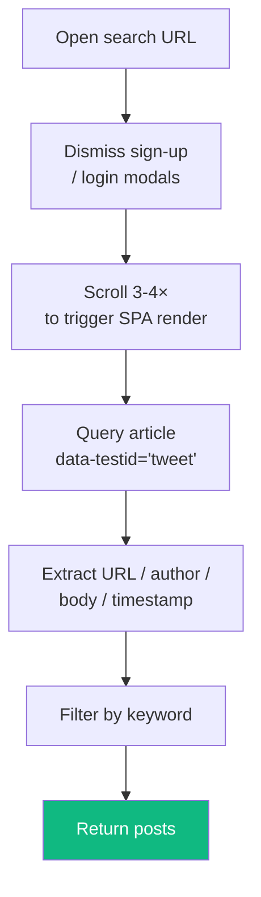
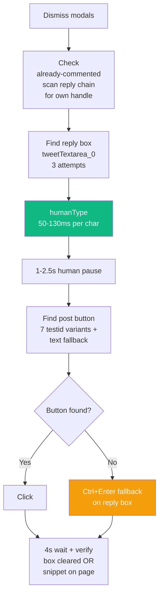

<div align="center">

# 🐦 Platform — Twitter / X

**Scrape · Comment · Like — everything in one place**


</div>

---

## 🔗 URL Patterns

| URL | Purpose |
|---|---|
| `https://x.com/search?q=<kw>&src=typed_query&f=live` | Scrape |
| `https://x.com/<user>/status/<id>` | Individual tweet (task target) |
| `https://twitter.com/*` | Legacy alias — still routes to x.com |

Content script matches: `https://x.com/*`, `https://twitter.com/*`.

---

## 🔍 Scraping

### Flow



### Selectors
| Element | Selector |
|---|---|
| Tweet card | `article[data-testid="tweet"]` |
| URL | `<a>` with `/status/` in href |
| Author | `[data-testid="User-Name"]` first link |
| Body | `[data-testid="tweetText"]` |
| Timestamp | `<time datetime>` |

### Tricks
- **Dismiss modals** — "Sign up", "Log in", notification pop-ups scroll off. Selectors: `[data-testid="app-bar-close"]`, `[data-testid="confirmationSheetCancel"]`, `[aria-label="Close"]`, text-match "Not now" / "Maybe later".
- **Filter promoted** — tweets with "Ad" label are excluded.
- **Infinite scroll** — needs 3-4 × ~1500 px scrolls before enough tweets render.

---

## 💬 Commenting

### Flow



### Editor

Primary: `[data-testid="tweetTextarea_0"]`.
Fallbacks:
```ts
[data-testid="tweetTextarea_0_label"]
  .closest('div')?.querySelector('[contenteditable="true"]')
div[role="textbox"][data-testid]
```

If box is collapsed, click `[data-testid="reply"]` button first.

### Submit button finder (priority order)

```
tweetButtonInline
tweetButton
tweetButton-Reply
replyButton
tweetButton-Inline
postButton
postInlineReplyButton
```

Scoped to the reply box's nearest `[role="dialog"]` / `form` / `[data-testid*="ompose"]` / `[data-testid*="Reply"]` before falling back to global search.

### Verification
- Reply box cleared → ✓ (`boxCleared` / `box_cleared`)
- OR text snippet appears on page → ✓ (`text_on_page`)
- OR Ctrl+Enter cleared box → ✓ (`ctrl_enter`)

---

## ❤️ Liking

```ts
likeBtn = document.querySelector('[data-testid="like"]')
alreadyLiked = document.querySelector('[data-testid="unlike"]')
```

Simple and stable — `data-testid` has been unchanged for 3+ years. Just `likeBtn.click()`, wait 2 s, verify `[data-testid="unlike"]` appeared.

`verifyMethod: unlike_btn_visible`

---

## 🛡️ Already-Commented Detection

```ts
const myHandle = document.querySelector(
  '[data-testid="SideNav_AccountSwitcher_Button"] span'
)?.textContent?.trim();

const replies = document.querySelectorAll(
  'article[data-testid="tweet"] [data-testid="User-Name"]'
);

for (const r of replies) {
  if (r.textContent?.includes(myHandle)) {
    return { success: true, alreadyCommented: true };
  }
}
```

Runs before trying to type.

---

## 🚨 Known Failure Modes

| Symptom | Cause | Fix |
|---|---|---|
| "Reply box not found" | Modal blocking UI | `dismissTwitterModals()` + wait + retry |
| "Post button not found" | Box still empty (Lexical not marked dirty) | `humanType()` should fix; else Ctrl+Enter |
| "Reply submitted but not confirmed" | Verification too quick | Retry next cycle; usually self-heals |
| Scrape returns 0 posts | Twitter showing "For you" noise | Make keyword more specific |

---

## 🎛️ Settings That Affect Twitter

| Setting | Purpose | Default |
|---|---|---|
| `twitterKeywords` | Keywords to search for | empty |
| `twitterDailyLimit` | Max comments/day | 10 |
| `twitterAutoPostThreshold` | AI score cutoff | 70 |
| `twitterCooldownMinutes` | Min gap between comments | derived from `activeMinutes / remainingPosts` |
| `twitterBrandMentionRate` | Max brand mentions/day | 2 |
| `twitterCommunities` | Twitter community IDs to post into | empty |

---

## 📁 Related Files

| File | Role |
|---|---|
| `extension/content/twitter.js` | Scrape / comment / like logic (276 lines) |
| `extension/background.js` | `scrapeOnePlatform('twitter')`, task execution |
| `src/app/api/twitter-status/route.ts` | Dashboard status endpoint |
| `src/app/api/twitter-engagement/route.ts` | Likes/retweets/replies on bot-posted tweets |
| `src/app/api/twitter-communities/route.ts` | Community ID management |
| `src/lib/twitterHttp.ts` | Legacy cookie-based HTTP client (unused) |

---

## 🎬 Log Line Examples

```
[Extension] Scraping twitter for "SEO"
Scraped "SEO": 12 found, 4 new, 4 evaluated
Commented on twitter (3/10 today) — https://x.com/user/status/1234 [verified: box_cleared]
Liked on twitter (7/10 today) — https://x.com/user/status/5678 [verified: unlike_btn_visible]
```

---

<div align="center">

**[Back to index](../README.md)** · **Next: [Reddit](./reddit.md)** →

</div>
