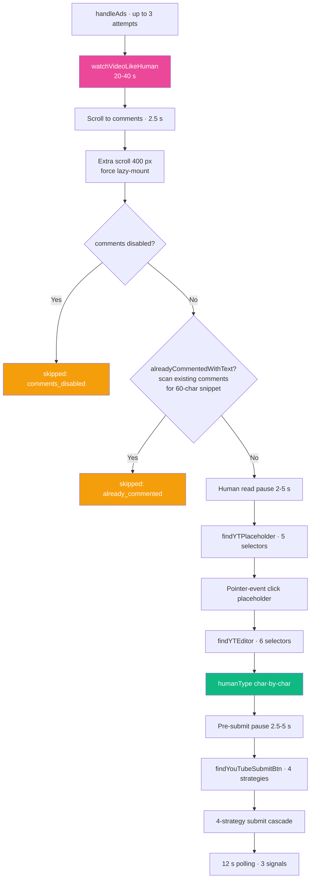

<div align="center">

# ▶️ Platform — YouTube

**Scrape · Comment · Like — with ad skip + human-like viewer simulation**


</div>

---

## 🔗 URL Patterns

| URL | Purpose |
|---|---|
| `https://www.youtube.com/results?search_query=<kw>` | Scrape |
| `https://www.youtube.com/watch?v=<id>` | Individual video (task target) |
| `https://www.youtube.com/shorts/<id>` | Shorts — marked `isShort: true` on Post |

---

## 🔍 Scraping

### Selectors
```ts
document.querySelectorAll(
  'ytd-video-renderer, ytd-rich-item-renderer, ytd-compact-video-renderer'
)
```

### Extracted fields
| Field | Source |
|---|---|
| `url` | `#video-title` or `a#video-title-link` (split on `&` to strip query params) |
| `title` | `titleEl.textContent` |
| `author` | `#channel-name a` or `ytd-channel-name a` |

### Keyword filter
```ts
keywords.some(kw => content.toLowerCase().includes(kw.toLowerCase()))
```

Returns up to 15 posts per scrape.

---

## 💬 Commenting

> [!IMPORTANT]
> YouTube is the slowest platform — comment flow includes **ad skip (up to 9 s) + human-like watch (20–40 s) + submit polling (12 s)** totalling 60–80 s. This is why YouTube gets its own 180 s task timeout in `background.js`, and the dashboard-approve timeout is 170 s.

### Full flow



### Ad handling (max 3 attempts)

```ts
// Detect ad
.ad-showing || .ytp-ad-player-overlay || .ytp-ad-text

// Skip button (5 selectors)
.ytp-ad-skip-button, .ytp-ad-skip-button-modern, .ytp-skip-ad-button,
[id*="skip-button"], button.ytp-ad-skip-button-text
// + text-match: "skip ad" / "skip ads" / "skip"

// Overlay banner close
.ytp-ad-overlay-close-button, [class*="ad-overlay"] [class*="close"]

// If no skip button → wait 3s and retry (max 3 attempts = 9s)
```

Was 6 attempts in older versions (18 s total), capped at 3 in v1.0.19 to fit the timeout budget.

### `watchVideoLikeHuman()` — 20-40s with micro-actions

```ts
const watchSeconds = 20 + Math.floor(Math.random() * 20);  // 20-40s
```

Splits into 10-25 s chunks. Between chunks, randomly does one of:
- Scroll down slightly (30%) — simulates reading description
- Scroll back up (20%) — simulates re-watching interest
- Hover over video player (10%) — triggers YouTube's UI
- Nothing (40%) — just keep watching

Was **45-80 s in v1.0.15** — reduced in v1.0.19 because it kept pushing total runtime past the 180 s task timeout on slow networks.

### Placeholder detection (5 selectors)

```ts
#placeholder-area
#simplebox-placeholder
ytd-commentbox #placeholder-area
ytd-commentbox #placeholder
ytd-comment-simplebox-renderer #placeholder-area
// + text-match: yt-formatted-string / [role="button"] containing
//   "add a comment" or "add a public comment"
```

Uses pointer-event click (not plain `.click()`) to open the composer.

### Editor detection (6 selectors — the tricky part)

YouTube A/B-tests composer variants. Cover all known:

```ts
#contenteditable-root
ytd-commentbox #contenteditable-root
ytd-commentbox [contenteditable="true"]
yt-formatted-string[contenteditable="true"]
div[contenteditable="true"][role="textbox"]
[contenteditable="true"][aria-label*="comment" i]
[contenteditable="true"]   // last resort
```

### DOM forensic snapshot on failure (v1.0.22)

If placeholder or editor isn't found, the error message includes a JSON snapshot so the next fix isn't a guess:

```js
{
  comments_elem: true,
  commentbox: false,
  simplebox: true,
  placeholder_area: false,
  simplebox_placeholder: true,
  contenteditable_count: 0,
  role_textbox_count: 0,
  comments_disabled_text_on_page: false,
  scrollY: 2340,
  videoHeight: 480,
  ytd_comment_tags: "ytd-comments#comments,ytd-comment-simplebox-renderer"
}
```

Paste that snapshot into a new issue → 1 selector-update commit brings it back.

### Submit button finder (4 strategies)

```ts
// A: aria-label + #submit-button button
#submit-button button[aria-label*="omment" i]
ytd-commentbox button[aria-label*="omment" i]
button[aria-label="Comment"] || button[aria-label="Reply"]
button[aria-label*="Post comment" i]

// B: direct button inside #submit-button
#submit-button button
ytd-commentbox #submit-button button

// C: ytd-button-renderer wrapper
ytd-button-renderer#submit-button button

// D: text-match scoped to composer
text === "comment" / "reply" / "post"
aria-label === "comment" / "reply" / "post comment"
(rejects disabled + aria-disabled=true)
```

### 4-strategy submit cascade

| t | Strategy |
|:-:|---|
| 0 s | Pointer-event click |
| 3 s | `form.requestSubmit()` |
| 6 s | Ctrl+Enter |
| 9 s | Re-click |

### 3 verification signals (12 s polling)

- Editor cleared (`findYTEditor()` returns null or empty)
- Snippet on page
- Submit button gone / disabled

---

## ❤️ Liking

> [!NOTE]
> No video-watching required for likes — separated in v1.0.4 because combining them caused 200 s timeouts.

```ts
// Selectors (6 fallbacks)
button[aria-label*="like this video" i]:not([aria-label*="dislike"])
ytd-toggle-button-renderer button[aria-label*="like" i]:not([aria-label*="dislike"])
#top-level-buttons-computed ytd-toggle-button-renderer:first-child button
like-button-view-model button
#segmented-like-button button
ytd-menu-renderer button[aria-label*="like" i]:not([aria-label*="dislike"])

// Already liked?
btn.aria-pressed === 'true'
```

Flow: handleAds (quick) → scroll to top → click → 1.5 s verify.

`verifyMethod: aria_pressed`

---

## 🚨 Known Failure Modes

| Symptom | Cause | Fix |
|---|---|---|
| "Task timed out after 180s" | Watch + ads + post exceeded budget | v1.0.19 shortened watch; should be <100 s now |
| "Comment placeholder not found — DOM snapshot: ..." | YouTube changed placeholder selector | Use snapshot to identify new selector, add to `findYTPlaceholder()` |
| "YouTube editor not found after placeholder click — DOM: ..." | Editor didn't mount | Check `contenteditable_sample` field — new ID needs to be added |
| `skipped: comments_disabled` | Video has comments off | No action — expected, logged cleanly |
| `skipped: already_commented` | Detected snippet in existing comments | Working as intended |
| Dashboard approve 45 s timeout | Old `autopost.js` timeout | v1.0.19 bumped to 170 s for YouTube |

---

## 🎛️ Settings That Affect YouTube

| Setting | Purpose | Default |
|---|---|---|
| `youtubeKeywords` | Search keywords | empty |
| `youtubeDailyLimit` | Max comments/day | 10 |
| `youtubeAutoPostThreshold` | AI score cutoff | 70 |
| `youtubeCooldownMinutes` | Gap | auto |
| `youtubeBrandMentionRate` | Brand cap | 2 |

---

## 📁 Related Files

| File | Role |
|---|---|
| `extension/content/youtube.js` | Scrape / comment / like / ad skip / watch (592 lines) |
| `extension/background.js` | 180 s task timeout for YouTube |
| `extension/content/autopost.js` | 170 s dashboard-approve timeout for YouTube |
| `src/app/api/youtube-status/route.ts` | Dashboard status |

---

## 🎬 Log Line Examples

```
[Extension] Scraping youtube for "SEO"
Scraped "SEO": 14 found, 6 new, 6 evaluated
Commented on youtube (1/10 today) — https://youtube.com/watch?v=dzUfIg0NDH0 [verified: editor_cleared]
Skipped comment on youtube (comments_disabled) — https://youtube.com/watch?v=...
Skipped comment on youtube (already_commented) — https://youtube.com/watch?v=...
Failed comment on youtube — https://youtube.com/watch?v=... | YouTube editor not found after placeholder click — DOM: {"placeholder_still_exists":true,"contenteditable_count":0,...}
Liked on youtube (2/10 today) — https://youtube.com/watch?v=... [verified: aria_pressed]
```

---

<div align="center">

**← [Quora](./quora.md)** · **[Back to index](../README.md)** · **Next: [Pinterest](./pinterest.md)** →

</div>
