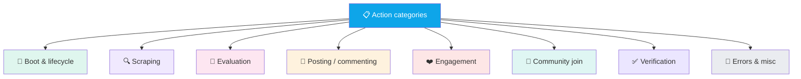

<div align="center">

# 📋 Reference — Activity Log Action Types

**Every `action` written to the `ActivityLog` collection, grouped by category**


</div>

---

## 📐 Log Entry Shape

Every entry in `ActivityLog` has this shape:

```ts
{
  userId: string                          // Clerk user ID
  platform: string                        // 'twitter' | 'reddit' | ... | 'general'
  level: 'info' | 'warn' | 'error' | 'success'
  action: string                          // from this reference
  message: string                         // human-readable line (rendered in dashboard)
  meta: Record<string, unknown>           // flexible, action-specific
  createdAt: Date                         // TTL 7 days
}
```

Source: `src/models/ActivityLog.ts` · Written by: `src/lib/activityLog.ts` · Read by `/dashboard/logs` + extension popup recent-activity tab.

---

## 🗺️ Action Categories



---

## 🚀 1 · Boot & Lifecycle

| Action | Level | Source | When fired | Meta |
|---|---|---|---|---|
| `extension_boot` | info | `extension/background.js:24` | Service worker starts for the first time after install/reload | `{ version, userAgent }` |
| `poll` | info | `background.js:1055` | Every 1 min when the task-polling alarm fires | `{ cycle: N }` |

---

## 🔍 2 · Scraping

| Action | Level | Source | When fired | Meta |
|---|---|---|---|---|
| `scrape_start` | info | content-script scrape begins | "Scraping youtube for 'SEO'" | `{ platform, keyword, group?, community? }` |
| `scrape_done` | success | content-script returns posts | "Scraped 'SEO': 15 found, 3 new, 3 evaluated" | `{ found, created, duplicates, evaluated }` |
| `scrape_empty` | warn | content script returns zero posts | "No posts found for 'X' — scanned 41 items: 32 no-links..." | `{ platform, keyword, stats: { items, noLinks, noUrl, shortContent, kwMiss, dupe, ok, sweptAnchors?, viaSweep?, sampleHref } }` |
| `scrape_error` | error | Content script threw or tab closed mid-load | "Tab closed mid-load (timeout)" | `{ platform, group?, keyword, error }` |
| `scrape_skip` | warn | No keywords configured / platform disabled | "No keywords for pinterest — skipping" | `{ platform }` |
| `extension_scrape` | info | Server-side receipt of scrape submission | "Extension scraped 6 new posts (9 dupes, 6 evaluated)" | `{ created, duplicates, evaluated }` |

### Per-platform scrape stats meta

For Facebook + Reddit, the `stats` object includes diagnostic counters:

```ts
{
  items: 41,              // total elements scanned
  noLinks: 32,            // matched but no <a> child
  noUrl: 9,               // had anchors but none matched permalink pattern
  shortContent: 0,        // body < 10 chars
  kwMiss: 0,              // didn't match any keyword
  dupe: 0,                // already in DB
  ok: 0,                  // kept
  sampleHref: 'https://...',   // first anchor seen (debug)
  sweptAnchors?: 128,     // FB only: size of global anchor sweep
  viaSweep?: 3,           // FB only: N posts recovered via sweep
}
```

---

## 🧠 3 · Evaluation

| Action | Level | Source | When fired | Meta |
|---|---|---|---|---|
| `posts_qualified` | info | Server after AI eval | "3 of 6 posts passed threshold (70) for twitter" | `{ qualified, total, threshold, platform }` |
| `no_relevant_posts` | warn | Server — no post cleared threshold | "14 posts evaluated for youtube but none scored above threshold (10)..." | `{ evaluated, threshold, highScore, lowScore }` |
| `evaluation_error` | error | OpenClaw threw + CLI fallback also failed | "OpenClaw HTTP failed, CLI also failed: ..." | `{ error, postId }` |

---

## 💬 4 · Posting (comments)

| Action | Level | Source | When fired | Meta |
|---|---|---|---|---|
| `post` | success | `background.js:1104` after extension confirms | "Commented on reddit (3/25 today) — https://... [verified: editor_cleared]" | `{ url, action, textPreview, platformCount, platformLimit, verifyMethod, verifiedAnswerUrl?, statsVerifyFailed? }` |
| `post_failed` | error | Extension returned success:false and not skipped/rate-limited | "Failed comment on reddit — https://... \| Comment not confirmed after 15s — tried: click,requestSubmit,ctrlEnter" | `{ url, action, error }` |
| `post_skipped` | info | Extension returned `skipped: true` | "Skipped comment on skool (banned) — https://... \| Skool community restriction: banned" | `{ url, action, reason }` |

### `verifyMethod` values (meta.verifyMethod)

Tells you exactly which signal confirmed the post:

| Value | Where it fires | Means |
|---|---|---|
| `url_changed` | any | Page redirected after submit — strongest signal |
| `editor_removed` | any | Composer DOM element vanished |
| `editor_cleared` | any | Text was cleared from editor |
| `submit_gone` | any | Submit button vanished / became disabled |
| `text_on_page` | any | Our snippet visible in page innerText |
| `text_in_comment` | Reddit | Snippet found in `shreddit-comment` shadow DOM |
| `snippet_match_80/60/40/25` | Quora | `/stats` matched our answer by N-char snippet |
| `top_row_recency` | Quora | `/stats` topmost row picked by timing (< 5min) |
| `final_author_match` | Quora | Post-verification grace-period match |
| `unlike_btn_visible` | Twitter | Like flipped |
| `aria_pressed` | YouTube | Like flipped |
| `ctrl_enter` | YouTube, Twitter | Posted via Ctrl+Enter fallback |
| `state_flipped` | Reddit upvote, Quora upvote | aria-pressed changed |
| `label_changed` | Quora upvote | aria-label changed |
| `svg_filled` | Reddit upvote | Fill icon appeared |
| `box_cleared` | Twitter | Reply box emptied |

### `reason` values (meta.reason, for post_skipped)

| Value | Platform | Means |
|---|---|---|
| `comments_disabled` | YouTube | Video has comments turned off |
| `already_commented` | YouTube | Detected our snippet in existing comments |
| `banned` | Skool | `"you have been banned"` on page |
| `muted` | Skool | `"you are muted"` on page |
| `not_member` | Skool | Join button only, no composer |
| `comments_disabled` | Skool | `"commenting is disabled"` |
| `pending_approval` | Skool | `"awaiting approval"` |
| `restricted` | Skool | `"you can't comment"` |
| `rate_limited` | Reddit | `"doing that too much"` / `"please slow down"` |
| `spam_filter` | Reddit | `"submission has been filtered"` / `"removed by reddit"` |
| `karma_gate` | Reddit | `"must have at least X karma"` |
| `reddit_error` | Reddit | `"something went wrong"` etc |
| `cloudflare_challenge` | Quora | Page title contains `"just a moment"` / `"attention required"` |

---

## ❤️ 5 · Engagement

| Action | Level | Source | When fired | Meta |
|---|---|---|---|---|
| `like` | success | `background.js:1112` | "Liked on twitter (7/10 today) — https://... [verified: unlike_btn_visible]" | `{ url, action, platformCount, verifyMethod }` |
| `upvote` | success | same, action='upvote' | "Upvoted on reddit (3/10 today) — https://... [verified: state_flipped]" | same |
| `like_failed` | warn | Like action failed (warn level — low-risk) | "Failed like on twitter — https://... \| Like button not found" | `{ url, action, error }` |
| `upvote_failed` | warn | Upvote failed | "Failed upvote on reddit — https://... \| state did not flip after 6s" | `{ url, action, error }` |
| `already_done` | info | Extension returned `alreadyLiked/alreadyUpvoted/alreadyCommented` | "Already upvoted on reddit — https://... [verified: state_flipped]" | `{ url, action, verifyMethod }` |

---

## 🤝 6 · Community Join

| Action | Level | Source | When fired | Meta |
|---|---|---|---|---|
| `join_subreddit` | info | Reddit scrape joined a new sub | "Joined r/GuestPost" | `{ subreddit }` |

Equivalent actions for FB groups and Skool communities happen inline inside the scrape flow and don't have their own log type — they're just part of `scrape_start` / `scrape_done`.

---

## ✅ 7 · Verification (Quora /stats)

| Action | Level | Source | When fired | Meta |
|---|---|---|---|---|
| `verify_start` | info | background.js before opening /stats | "Verifying Quora answer on /stats for https://..." | `{ url }` |

The result of verification is written into the `post` log's meta as `verifiedAnswerUrl` and `statsVerifyFailed`.

---

## 🚨 8 · Errors & Misc

| Action | Level | Source | When fired | Meta |
|---|---|---|---|---|
| `post_failed` | error | Dashboard-approve path errored | "Dashboard approve failed: Timeout — no response in 170s (youtube)" | `{ url, via: 'dashboard-approve' }` |
| `auth_error` | error | Session expired / account removed | "Twitter session expired — please reconnect" | `{ platform, accountId }` |

---

## 🎨 Level → Dashboard Color

| Level | Dashboard color | Popup color |
|---|---|---|
| `info` | Gray | Blue |
| `success` | Green | Green |
| `warn` | Amber | Amber |
| `error` | Red | Red |

---

## 🔎 Common Queries

### Last 20 errors across all platforms
```js
db.activitylogs.find({ level: 'error' })
  .sort({ createdAt: -1 }).limit(20)
```

### Successful comments on Reddit today
```js
db.activitylogs.find({
  platform: 'reddit',
  action: 'post',
  createdAt: { $gte: new Date(new Date().setHours(0,0,0,0)) }
}).count()
```

### All skip reasons this week
```js
db.activitylogs.aggregate([
  { $match: { action: 'post_skipped', createdAt: { $gte: new Date(Date.now() - 7*24*3600*1000) } } },
  { $group: { _id: '$meta.reason', n: { $sum: 1 } } },
  { $sort: { n: -1 } }
])
```

### Per-platform error rate (last 24h)
```js
db.activitylogs.aggregate([
  { $match: { createdAt: { $gte: new Date(Date.now() - 24*3600*1000) } } },
  { $group: {
      _id: { platform: '$platform', level: '$level' },
      n: { $sum: 1 }
  } },
  { $sort: { '_id.platform': 1 } }
])
```

---

## 🧰 How To Add a New Action Type

1. **Pick a name** — snake_case, verb-like (`scrape_done`, `post_failed`)
2. **In the extension** — call `GetMentionAPI.sendLog(platform, level, action, message, meta)`
3. **On the server** — call `logActivity({ userId, platform, level, action, message, meta })` from `src/lib/activityLog.ts`
4. **Document it here** under the appropriate category
5. **Consider if the dashboard needs a specific render** — check `src/app/dashboard/logs/page.tsx`

---

<div align="center">

**[Back to index](../README.md)**

</div>
