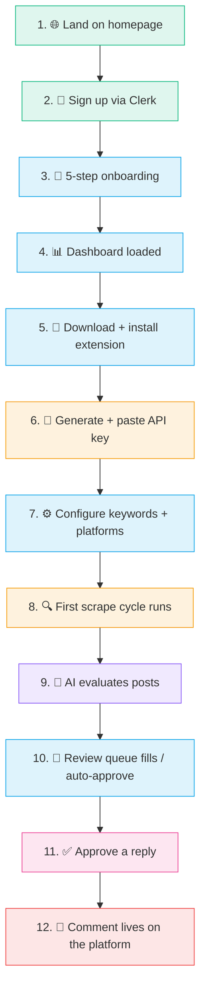
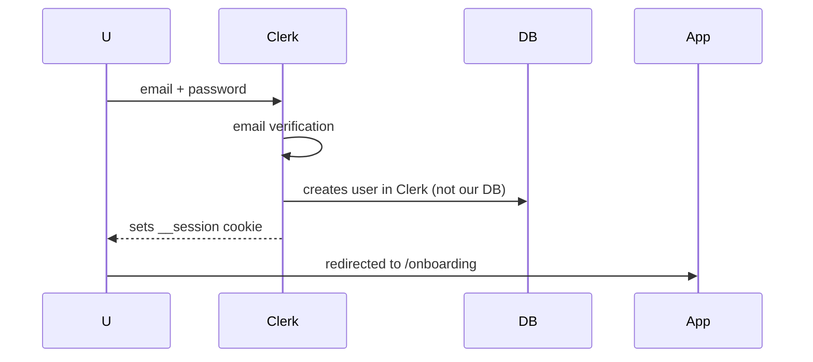
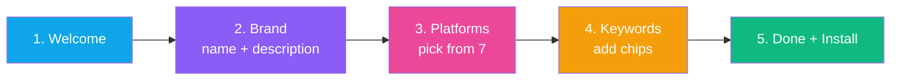
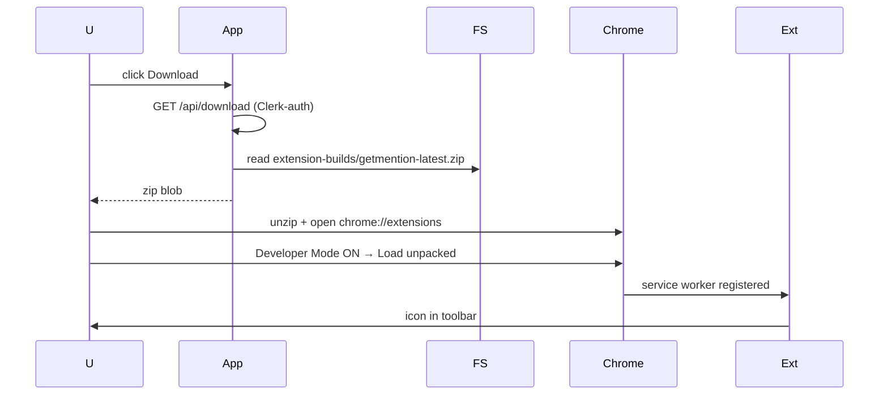
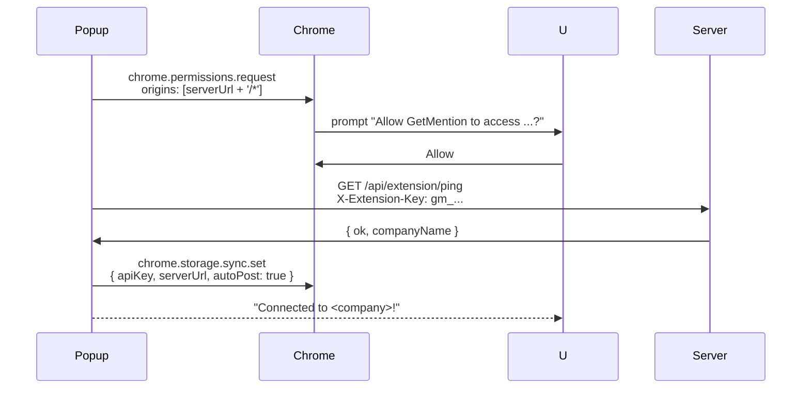
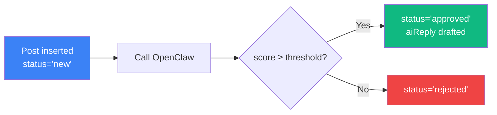
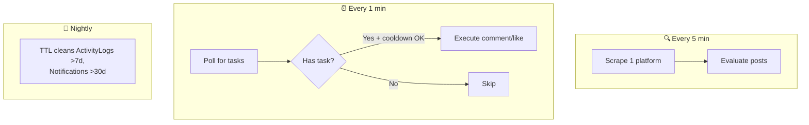

<div align="center">

# 🗺️ User Journey

**End-to-end: from sign-up to first AI-posted comment live on a platform**


</div>

---

## 🎬 The 12-Step Story



---

## 1 · 🌐 Land on Homepage

**What the user sees:** `http://88.222.214.19:3005/` — marketing landing page with rotating headline, demo card, 7-platform matrix, pricing.

**What happens on the server:**
- `src/app/page.tsx` server component runs
- `auth()` from Clerk — if logged in, redirects to `/dashboard`
- Landing page static-renders with all animations

**File:** `src/app/page.tsx`

---

## 2 · 📝 Sign Up via Clerk

User clicks **"Get Started"** → `/signup`.

**What happens:**


**Files:**
- `src/app/signup/page.tsx` — wraps Clerk's `<SignUp />`
- `src/middleware.ts` — catches the session cookie, proceeds

> [!NOTE]
> No User document is created in our MongoDB yet — only after `/api/auth/complete-onboarding` runs.

---

## 3 · 🧭 5-Step Onboarding

Middleware forces `/onboarding` because Clerk JWT claim `onboardingCompleted` is not yet set.



**On "Done" click:**
1. `POST /api/settings` with brand + keywords + platforms
2. `POST /api/auth/complete-onboarding` → sets Clerk claim + creates User + Settings docs
3. `ob_done` cookie set (24h grace so Clerk-claim propagation delay isn't a problem)
4. Redirect to `/dashboard`

**Files:**
- `src/app/onboarding/page.tsx` — client-state wizard
- `src/app/api/auth/complete-onboarding/route.ts`
- `src/app/api/settings/route.ts`

---

## 4 · 📊 Dashboard Loaded

User lands on `/dashboard` (main hub).

**What they see:**
- Quick stats (posts today, platform breakdown) — at this point all zeros
- Recent activity preview — empty
- "Install the Extension" card prominent

**What happens on load:**
- `GET /api/stats` → zeros
- `GET /api/posts?limit=10` → empty
- `GET /api/logs?limit=8` → empty

**Files:**
- `src/app/dashboard/page.tsx`
- `src/components/Dashboard.tsx`
- `src/components/ExtensionInstallCard.tsx`

---

## 5 · 🧩 Download + Install Extension

From `/dashboard/settings` → top card → **Download Extension**:



**What the user does:**
1. Click download → save zip
2. Unzip
3. Go to `chrome://extensions`
4. Toggle **Developer Mode** ON
5. Click **Load unpacked** → select unzipped folder
6. See the extension icon in toolbar

**File:** `src/app/api/download/route.ts`

---

## 6 · 🔑 Generate + Paste API Key

User clicks the extension icon → onboarding step 3 appears.

**Left side (dashboard):**
- Generate key button → `POST /api/extension/api-key`
- Server creates `gm_<random>` token, hashes it, stores on `Settings.extensionApiKey`
- Response returns plaintext token (only shown once)

**Right side (popup):**
- User pastes server URL (pre-filled with `http://88.222.214.19:3005`)
- User pastes API key
- Click **Connect**

**What happens in popup:**


**Files:**
- `src/app/api/extension/api-key/route.ts`
- `src/app/api/extension/ping/route.ts`
- `extension/popup/popup.js`
- `extension/utils/api.js`

---

## 7 · ⚙️ Configure Keywords + Platforms

Back in `/dashboard/settings`, user can fine-tune:

- Per-platform daily limits
- Per-platform auto-post threshold (0-100)
- Per-platform cooldown minutes
- Brand mention rate (e.g. 2/day max)
- Cron schedule: timezone + start/end hours + interval

**What happens:**
- Debounced `PUT /api/settings` on every change
- Plan-limit check via `src/lib/featureGate.ts` — Free plan capped at 1 platform + 5 keywords

---

## 8 · 🔍 First Scrape Cycle Runs

Extension service worker is now alive. Alarms:
- `scrapeLoop` — every 5 min
- `pollTasks` — every 1 min
- `cleanupTabs` — every 1 min

```mermaid
sequenceDiagram
    A as chrome.alarms
    Ext as background.js
    Plat as Platform tab
    Srv as Server

    A->>Ext: scrapeLoop fires
    Ext->>Srv: GET /api/extension/settings
    Srv-->>Ext: platforms + keywords
    Ext->>Ext: pick platform (round-robin)
    Ext->>Plat: createBackgroundTab<br/>(search URL)
    Plat->>Ext: SCROLL_DOWN
    Ext->>Plat: SCRAPE_POSTS
    Plat-->>Ext: { posts: [...], stats }
    Ext->>Srv: POST /api/extension/scrape
    Srv->>DB: insert Posts (unique url)
    Srv->>AI: fire evaluation (async)
    Srv-->>Ext: { created: N }
```

**First scrape typically finds 5-15 posts.** Duplicates (if user runs it twice in a row on same keyword) get deduped by the `(userId, url)` unique index.

**Files:**
- `extension/background.js` — `scrapeOnePlatform()`
- `extension/content/<platform>.js` — `scrapePosts()` per platform
- `src/app/api/extension/scrape/route.ts`

---

## 9 · 🧠 AI Evaluates Posts

For each newly-inserted Post, the server fires `POST /api/evaluate`:



OpenClaw returns:
- `score` (0-100)
- `suggestedReply` (drafted in one of 5 tones)
- `tone`
- `reasoning`

**Files:**
- `src/app/api/evaluate/route.ts`
- `src/lib/openclaw.ts`

See [features/ai-evaluation.md](./features/ai-evaluation.md) for the full pipeline.

---

## 10 · 🧐 Review Queue Fills

User visits `/dashboard/review`. Depending on auto-post setting:

**Auto-post ON** — approved posts go straight to extension task queue. Review page only shows posts caught by plan limits or below threshold.

**Auto-post OFF** — every approved post waits for manual approval here.

User sees:
- AI relevance score (gauge)
- Draft reply (editable)
- **Approve** / **Reject** buttons

**File:** `src/app/dashboard/review/page.tsx`

---

## 11 · ✅ Approve a Reply

User clicks **Approve** on one post.

```mermaid
sequenceDiagram
    D as Dashboard
    B as background.js
    A as autopost.js
    C as Content Script
    S as Server

    D->>D: open platform URL with<br/>#gm_task=<postId>
    note right of D: New tab opens<br/>e.g. reddit.com/r/...
    A->>B: EXECUTE_DASHBOARD_TASK<br/>taskId
    B->>S: GET /api/extension/immediate<br/>?taskId=...
    S-->>B: { task: { platform, action, text, url } }
    B-->>A: task details
    A->>C: RELAY_EXECUTE_TASK
    C->>C: find editor, humanType,<br/>click submit
    C-->>A: { success, postUrl, verifyMethod }
    A->>B: REPORT_TASK_RESULT
    B->>S: POST /api/extension/immediate<br/>{ taskId, success, postUrl }
    S->>DB: Post.status = 'posted'<br/>replyUrl = postUrl
```

For Quora, there's one extra step — `verifyQuoraOnStats()` opens `/stats` after success to match the answer URL. Updates `verifiedAnswerUrl`.

**Files:**
- `extension/content/autopost.js`
- `extension/content/<platform>.js` — per-platform `postComment()`
- `src/app/api/extension/immediate/route.ts`
- `extension/background.js` — `verifyQuoraOnStats()`

---

## 12 · 💬 Comment Lives on the Platform

User opens the original post in another tab → sees their reply with their account's handle.

**Dashboard reflects this:**
- `/dashboard/logs` shows:
  ```
  Commented on reddit (1/25 today) — https://reddit.com/r/.../comment/... [verified: editor_cleared]
  ```
- `/dashboard/posts` shows the Post with status **posted** and clickable "View reply →" link
- Extension popup's **Comments today** counter increments

---

## ⏱️ Timing Recap

| Step | Time |
|---|---|
| Signup + onboarding | ~3 min |
| Extension install + connect | ~5 min |
| First scrape cycle (wait for alarm) | ~5 min |
| AI evaluation | ~30 sec |
| Approve + post | ~10 sec (plus platform's human-like delays: 20-40s watch for YouTube, 5s human read pauses elsewhere) |
| **Total to first live comment** | **~15-20 min** |

---

## 🔄 What Happens On Repeat

Once set up, the loop runs continuously:



---

## 🎯 Failure Modes the User Might Hit

| Moment | Symptom | Most likely cause | Where to look |
|---|---|---|---|
| 2 (signup) | Email never arrives | Clerk dev mode bounces emails | Clerk dashboard logs |
| 6 (connect) | "Host permission denied" | User clicked Deny in Chrome prompt | Re-click Connect, Allow |
| 6 (connect) | "Invalid API key (HTTP 403)" | Key copied wrong or regenerated | Regenerate + paste |
| 8 (scrape) | "No posts found" | Keywords too narrow / platform doesn't have matching content | Try broader keywords |
| 9 (eval) | "OpenClaw HTTP failed" | AI service down → CLI fallback | See `/dashboard/logs` for fallback success |
| 11 (approve) | "Editor not found" | Platform DOM changed | Content script needs selector update (see [troubleshooting.md](./troubleshooting.md)) |
| 12 (verify) | "Comment not confirmed" | Rate limit / shadow ban | Logs show `skipped: rate_limited` or similar |

---

## 🔁 What the User Does Day 2+

Once configured, the user's ongoing workflow is:
1. **Morning:** open `/dashboard/logs` → scan yesterday's activity
2. If auto-post is ON → just monitor
3. If auto-post is OFF → batch-approve in `/dashboard/review` (usually 5-10 min)
4. Check `/dashboard/posts` occasionally to see engagement on their bot-posted comments

---

<div align="center">

**[Back to index](./README.md)**

</div>
